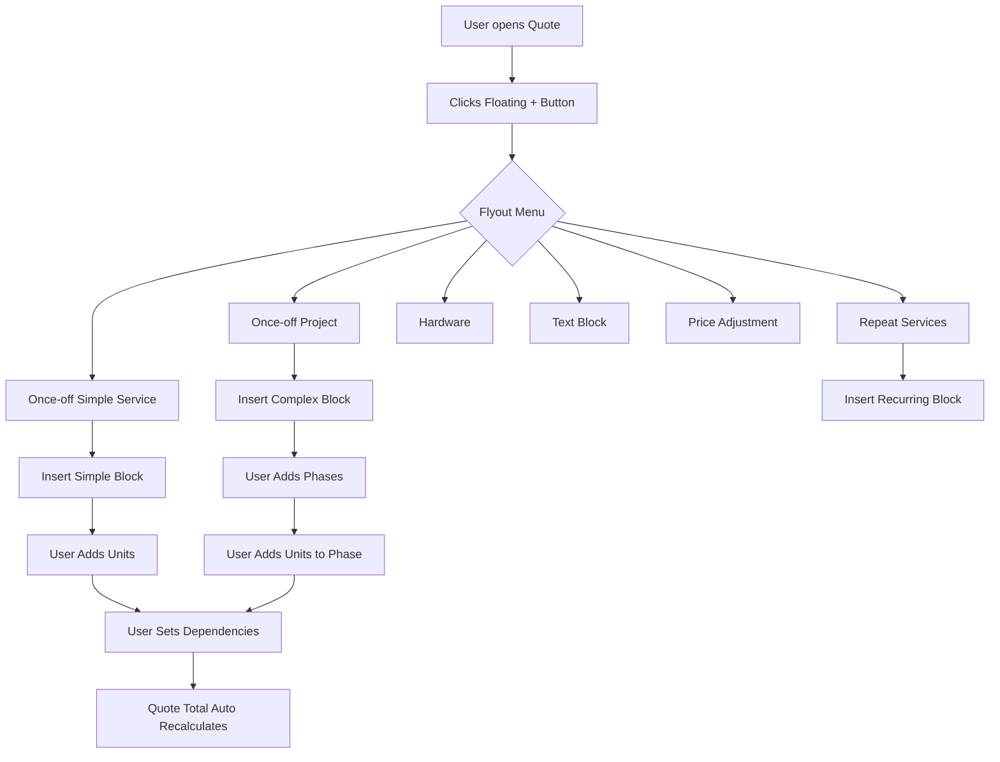

# PET Visual 01 — Quote User Interaction Flow

```mermaid
flowchart TD

A[User opens Quote] --> B[Clicks Floating + Button]
B --> C{Flyout Menu}

C --> D[Once-off Simple Service]
C --> E[Once-off Project]
C --> F[Repeat Services]
C --> G[Hardware]
C --> H[Text Block]
C --> I[Price Adjustment]

D --> J[Insert Simple Block]
E --> K[Insert Complex Block]
F --> L[Insert Recurring Block]

J --> M[User Adds Units]
K --> N[User Adds Phases]
N --> O[User Adds Units to Phase]

M --> P[User Sets Dependencies]
O --> P

P --> Q[Quote Total Auto Recalculates]
```
