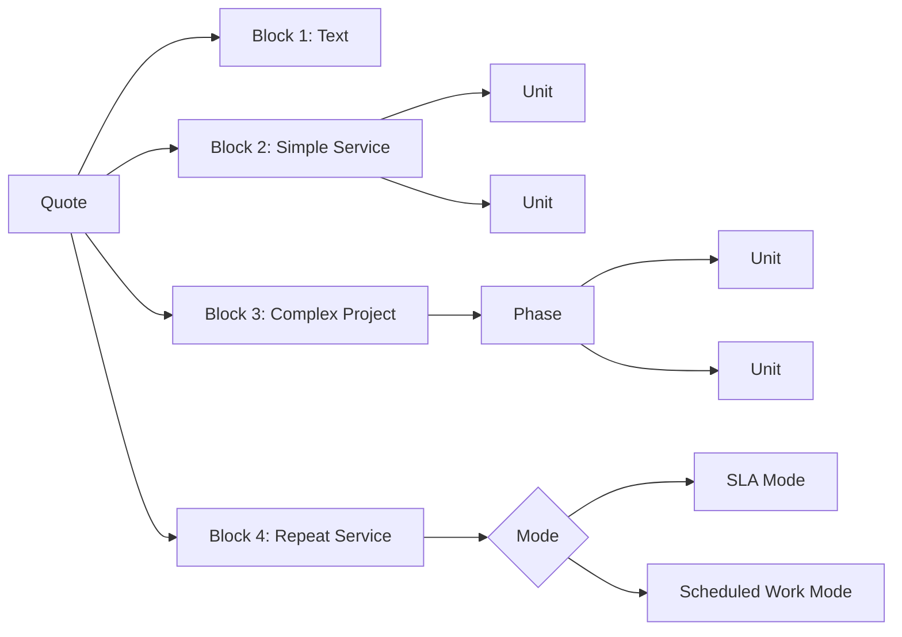

# PET Visual 02 — Block Hierarchy Model

```mermaid
flowchart LR

Q[Quote]
Q --> B1[Block 1: Text]
Q --> B2[Block 2: Simple Service]
Q --> B3[Block 3: Complex Project]
Q --> B4[Block 4: Repeat Service]

B2 --> U1[Unit]
B2 --> U2[Unit]

B3 --> PH1[Phase]
PH1 --> U3[Unit]
PH1 --> U4[Unit]

B4 --> MODE{Mode}
MODE --> SLA[SLA Mode]
MODE --> SCH[Scheduled Work Mode]
```
