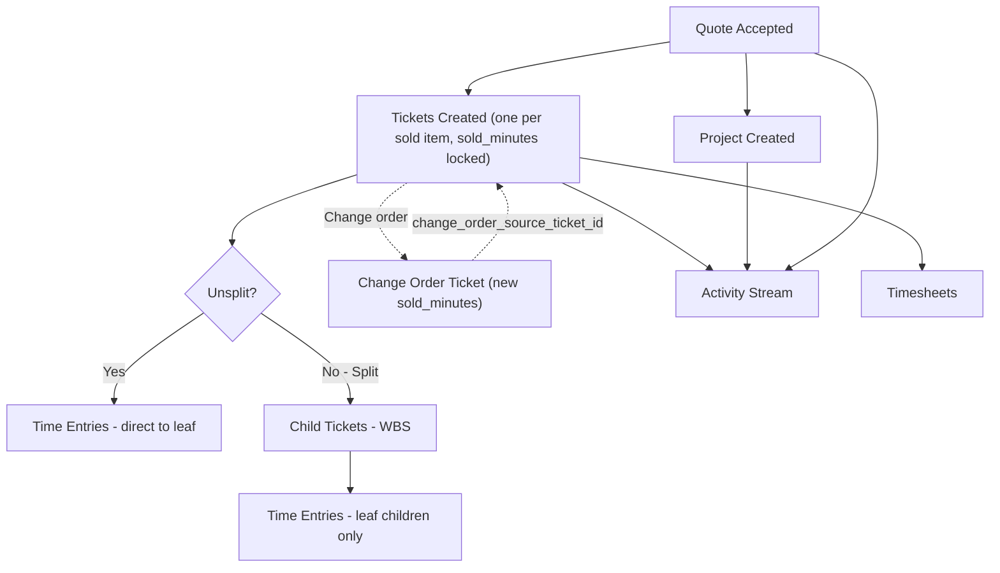

# PET Visual 03 — Quote Acceptance to Delivery Topology

```mermaid
flowchart TD

QA[Quote Accepted]

QA --> PRJ[Project Created]
QA --> TK["Tickets Created (one per sold item, sold_minutes locked)"]

TK --> LEAF{Unsplit?}
LEAF -->|Yes| TE1[Time Entries - direct to leaf]
LEAF -->|No - Split| CH[Child Tickets - WBS]
CH --> TE2[Time Entries - leaf children only]

TK -.->|Change order| CO["Change Order Ticket (new sold_minutes)"]
CO -.->|change_order_source_ticket_id| TK

TK --> ACT[Activity Stream]
TK --> TS[Timesheets]
PRJ --> ACT
QA --> ACT
```
