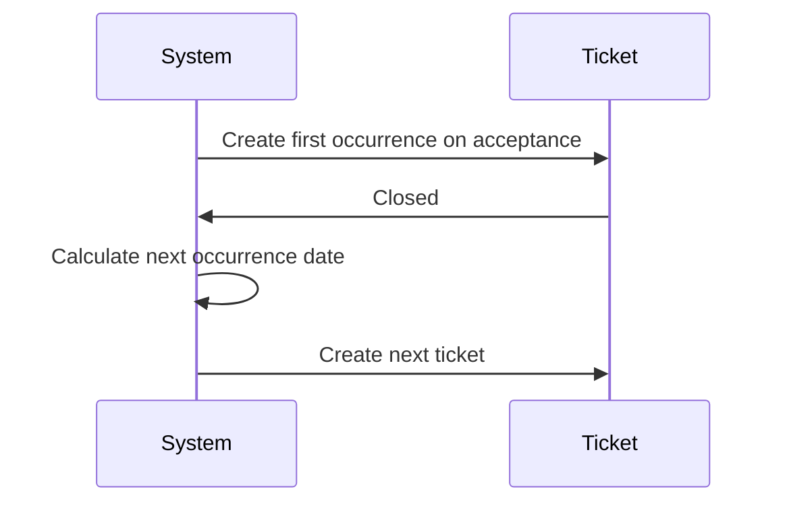

# PET Visual 04 — Scheduled Recurring Work Lifecycle

```mermaid
sequenceDiagram

participant System
participant Ticket

System->>Ticket: Create first occurrence on acceptance
Ticket->>System: Closed
System->>System: Calculate next occurrence date
System->>Ticket: Create next ticket
```
