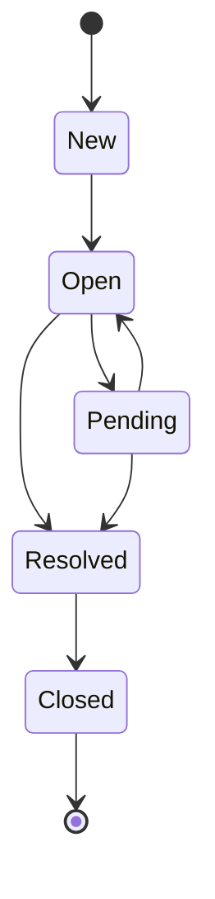
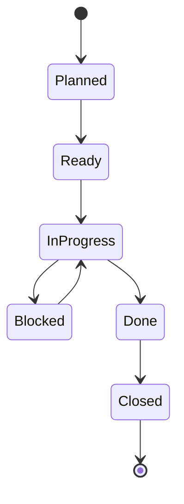
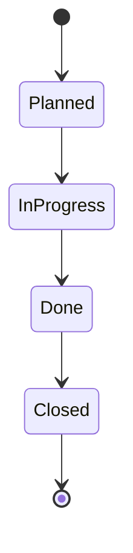

# PET Visual 06 — Ticket State Machine

## Support (lifecycle_owner='support')

## Project (lifecycle_owner='project')

Note: `baseline_locked` is NOT a status. It is an orthogonal boolean property (`is_baseline_locked`) on the ticket.

## Internal (lifecycle_owner='internal')

