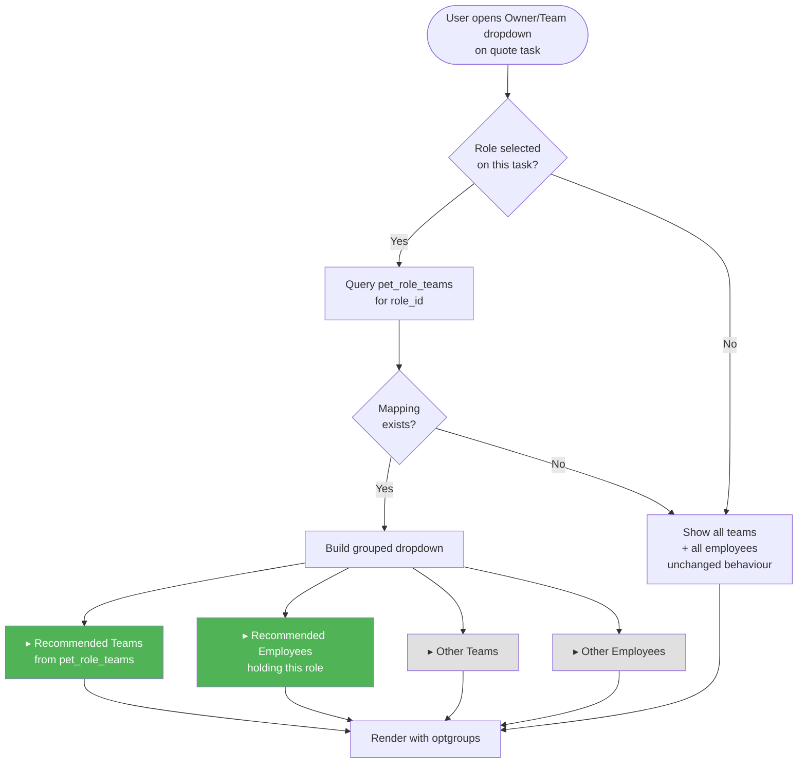
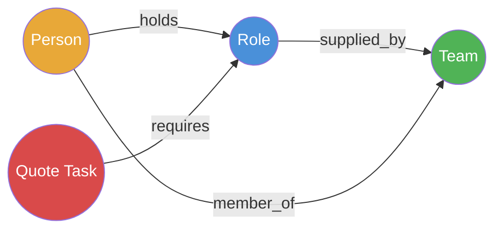
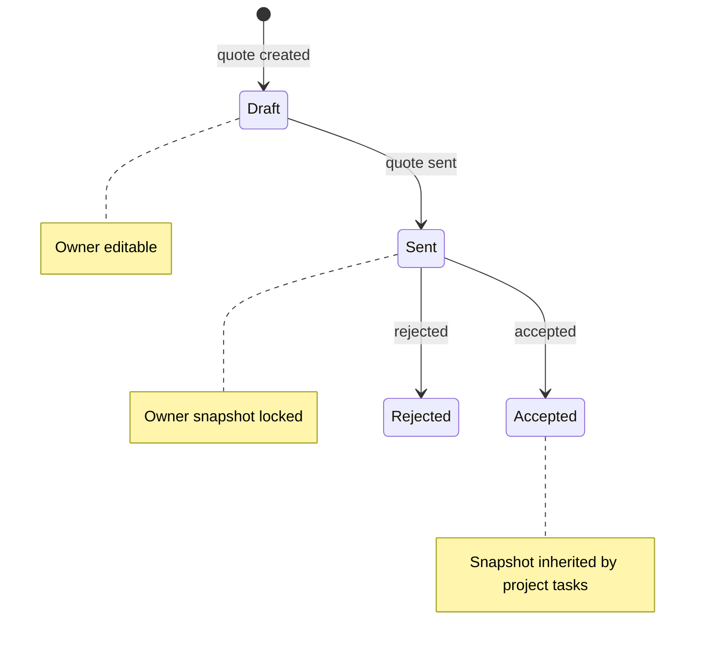
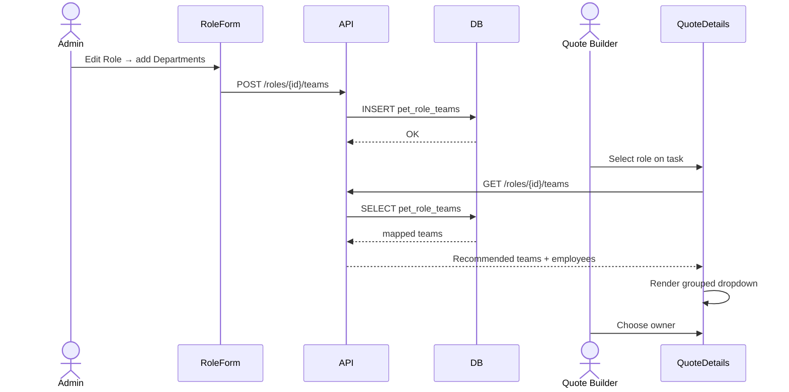

# PET Visual 08 — Role-Aware Quote Assignment Flow

## Dropdown Decision Logic

```mermaid
flowchart TD
    START([User opens Owner/Team dropdown<br>on quote task]) --> CHECK{Role selected<br>on this task?}

    CHECK -->|Yes| LOOKUP[Query pet_role_teams<br>for role_id]
    CHECK -->|No| FALLBACK[Show all teams<br>+ all employees<br>unchanged behaviour]

    LOOKUP --> HAS{Mapping<br>exists?}

    HAS -->|Yes| BUILD[Build grouped dropdown]
    HAS -->|No| FALLBACK

    BUILD --> G1["▸ Recommended Teams<br>from pet_role_teams"]
    BUILD --> G2["▸ Recommended Employees<br>holding this role"]
    BUILD --> G3["▸ Other Teams"]
    BUILD --> G4["▸ Other Employees"]

    G1 --> SHOW[Render with optgroups]
    G2 --> SHOW
    G3 --> SHOW
    G4 --> SHOW
    FALLBACK --> SHOW

    style G1 fill:#50b356,color:#fff
    style G2 fill:#50b356,color:#fff
    style G3 fill:#e0e0e0,color:#333
    style G4 fill:#e0e0e0,color:#333
```

## Four Relationships Model

```mermaid
graph LR
    R((Role)) -->|supplied_by| T((Team))
    P((Person)) -->|holds| R
    P -->|member_of| T
    QT((Quote Task)) -->|requires| R

    style R fill:#4a90d9,color:#fff
    style T fill:#50b356,color:#fff
    style P fill:#e8a838,color:#fff
    style QT fill:#d94a4a,color:#fff
```

## Ownership Snapshot Lifecycle

```mermaid
stateDiagram-v2
    [*] --> Draft: quote created
    Draft --> Sent: quote sent
    Sent --> Accepted: accepted
    Sent --> Rejected: rejected

    note right of Draft: Owner editable
    note right of Sent: Owner snapshot locked
    note right of Accepted: Snapshot inherited by project tasks
```

## End-to-End Setup and Usage

```mermaid
sequenceDiagram
    actor Admin
    participant RoleForm
    participant API
    participant DB

    Admin->>RoleForm: Edit Role → add Departments
    RoleForm->>API: POST /roles/{id}/teams
    API->>DB: INSERT pet_role_teams
    DB-->>API: OK

    actor Builder as Quote Builder
    participant QuoteUI as QuoteDetails

    Builder->>QuoteUI: Select role on task
    QuoteUI->>API: GET /roles/{id}/teams
    API->>DB: SELECT pet_role_teams
    DB-->>API: mapped teams
    API-->>QuoteUI: Recommended teams + employees
    QuoteUI->>QuoteUI: Render grouped dropdown
    Builder->>QuoteUI: Choose owner
```
