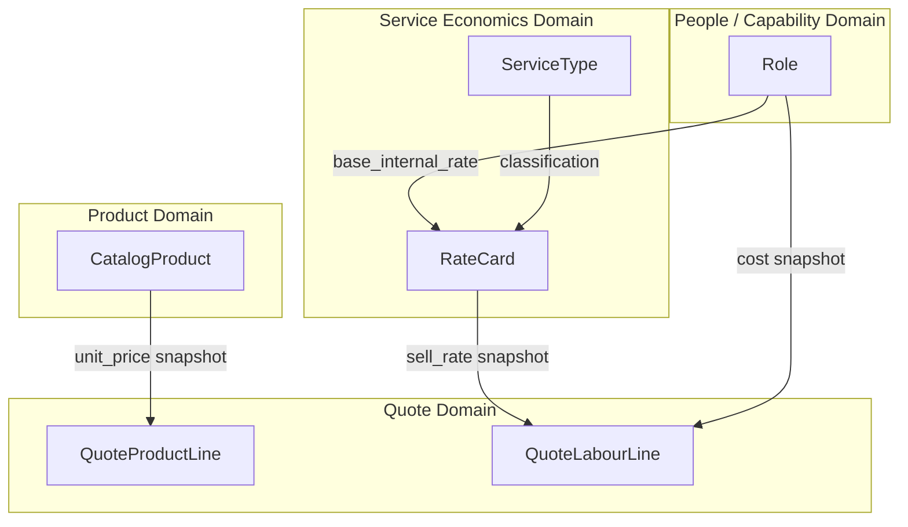
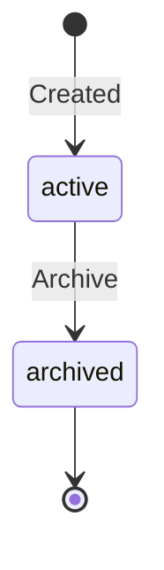
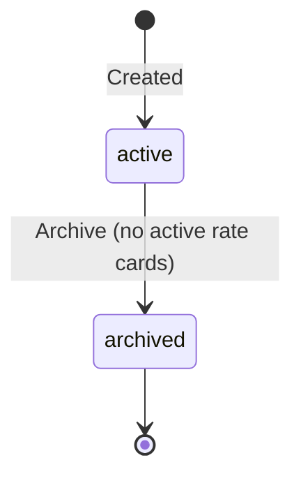
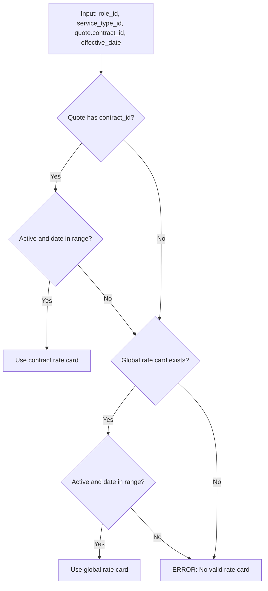
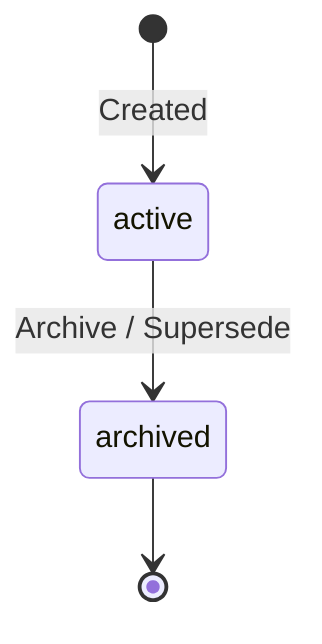
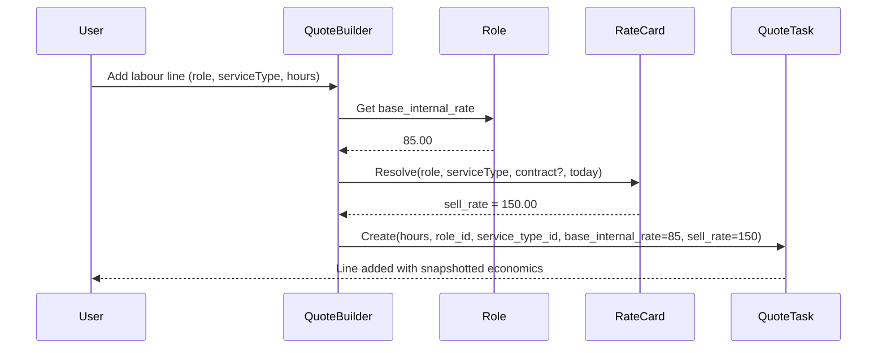
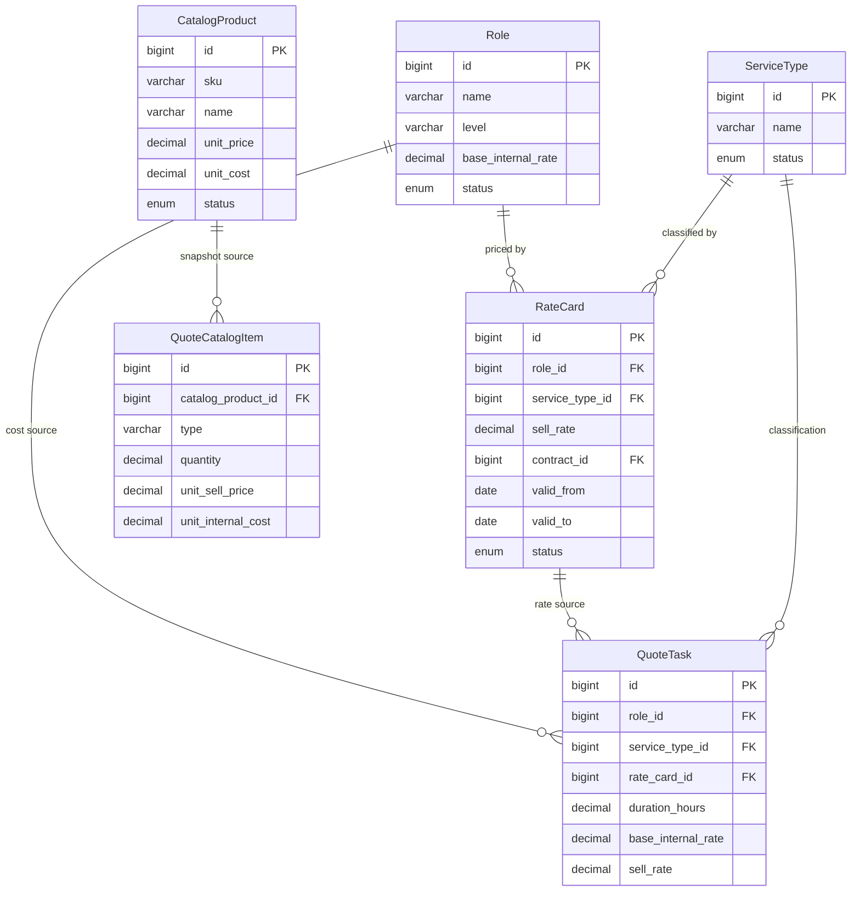
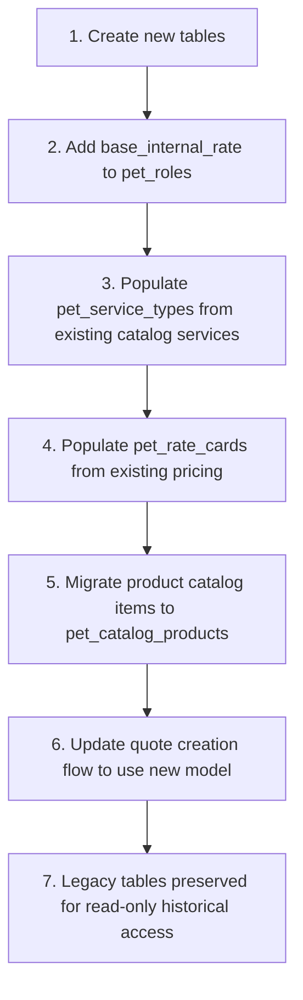

STATUS: AUTHORITATIVE — IMPLEMENTATION REQUIRED
SCOPE: Commercial Domain Model Refactor
VERSION: v2
SUPERSEDES: 06_Catalog_Roles_Rates_and_Snapshots_v1.md

# Products, Roles, Service Types, and Rate Cards (v2)

This document is the authoritative specification for PET's commercial pricing model. It replaces the previous single-catalog approach (v1) with a domain-correct separation of products from labour economics.

## Why This Change

The v1 model placed both products and services in a single `CatalogItem` entity with a `type` discriminator. This produced:

- Duplicate sources of pricing truth (catalog rates vs hardcoded quote rates)
- Roles that carry competency data but no cost information
- No ability to model contract-specific or service-type-specific pricing
- Services treated as products, violating domain boundaries

The refactored model separates **what we sell** (products) from **who does the work** (roles), **what kind of work** (service types), and **at what price** (rate cards).



---

# §1 Structural Specification

## 1.1 Entity: CatalogProduct

**Domain:** Commercial
**Purpose:** Sellable physical or licensed items only. No labour.

### Fields

- `id` — BIGINT, PK, auto-increment
- `sku` — VARCHAR(50), nullable, unique when present
- `name` — VARCHAR(255), required
- `description` — TEXT, nullable
- `category` — VARCHAR(100), nullable
- `unit_price` — DECIMAL(14,2), required (sell price per unit)
- `unit_cost` — DECIMAL(14,2), required (purchase/cost price per unit)
- `status` — ENUM('active', 'archived'), default 'active'
- `created_at` — DATETIME, immutable
- `updated_at` — DATETIME

### Invariants

- `unit_price >= 0`
- `unit_cost >= 0`
- No `type` discriminator — this entity is products only
- Status transitions: `active → archived` (one-way; archived items cannot be re-activated, only cloned)
- SKU must be unique across active products when non-null

### State Transitions



### Events

- `CatalogProductCreated { productId, name, sku, unitPrice, unitCost }`
- `CatalogProductUpdated { productId, changedFields }`
- `CatalogProductArchived { productId }`

### Persistence

- Table: `pet_catalog_products`
- Replaces `pet_catalog_items` for product rows
- Migration creates new table; existing product-type catalog items migrated

### API

- `GET /pet/v1/catalog/products` — list active products
- `POST /pet/v1/catalog/products` — create product
- `PUT /pet/v1/catalog/products/{id}` — update product
- `POST /pet/v1/catalog/products/{id}/archive` — archive product

---

## 1.2 Entity: Role (Extended)

**Domain:** Work (People / Capability)
**Purpose:** Defines competency, level, and internal cost of labour.

### Fields (additions to existing)

Existing fields unchanged: `id`, `name`, `version`, `status`, `level`, `description`, `success_criteria`, `required_skills`, `created_at`, `published_at`.

**New field:**

- `base_internal_rate` — DECIMAL(12,2), nullable (required for published roles)

### Invariants

- `base_internal_rate` must be > 0 for published roles
- `base_internal_rate` may be null for draft roles (not yet costed)
- `base_internal_rate` represents the hourly internal cost of a person in this role
- Roles do NOT hold sell rates — sell pricing is RateCard's responsibility
- Published roles are immutable (existing rule) — rate changes require a new version

### Events (new)

- `RoleRateSet { roleId, baseInternalRate }` — emitted when rate first set or updated on draft role

### Persistence

- Table: `pet_roles` — add column `base_internal_rate DECIMAL(12,2) NULL`
- Existing roles receive NULL for `base_internal_rate` (must be populated before use in quotes)

### API

- Existing role endpoints extended to accept/return `base_internal_rate`
- `PUT /pet/v1/roles/{id}` — updated to include `baseInternalRate` field

---

## 1.3 Entity: ServiceType (NEW)

**Domain:** Commercial (Service Economics)
**Purpose:** Classification of labour categories. Enables pricing differentiation by type of work.

### Fields

- `id` — BIGINT, PK, auto-increment
- `name` — VARCHAR(255), required, unique
- `description` — TEXT, nullable
- `status` — ENUM('active', 'archived'), default 'active'
- `created_at` — DATETIME, immutable
- `updated_at` — DATETIME

### Examples

- Consulting
- Support
- Training
- Project Management
- Implementation

### Invariants

- Name must be unique across active service types
- Cannot archive a service type if active rate cards reference it (must archive rate cards first)
- Service types are classification-only — they hold no pricing data

### State Transitions



### Events

- `ServiceTypeCreated { serviceTypeId, name }`
- `ServiceTypeArchived { serviceTypeId }`

### Persistence

- Table: `pet_service_types`
- New table

### API

- `GET /pet/v1/service-types` — list active service types
- `POST /pet/v1/service-types` — create
- `PUT /pet/v1/service-types/{id}` — update
- `POST /pet/v1/service-types/{id}/archive` — archive

---

## 1.4 Entity: RateCard (NEW)

**Domain:** Commercial (Service Economics)
**Purpose:** Defines the sell rate for a specific combination of role, service type, and optionally a contract.

### Fields

- `id` — BIGINT, PK, auto-increment
- `role_id` — BIGINT, FK → `pet_roles`, required
- `service_type_id` — BIGINT, FK → `pet_service_types`, required
- `sell_rate` — DECIMAL(12,2), required (hourly sell rate)
- `contract_id` — BIGINT, FK → `pet_contracts`, nullable (null = default/global rate)
- `valid_from` — DATE, nullable (null = open start / no lower bound)
- `valid_to` — DATE, nullable (null = open end / no expiry)
- `status` — ENUM('active', 'archived'), default 'active'
- `created_at` — DATETIME, immutable
- `updated_at` — DATETIME

### Invariants

- `sell_rate > 0`
- `valid_from <= valid_to` when both are non-null
- NULL `valid_from` = open start (effective from the beginning of time)
- NULL `valid_to` = open end (no expiry)
- For a given (role_id, service_type_id, contract_id) combination, ACTIVE rate cards must not have overlapping effective date ranges. Overlap enforcement is performed at the application layer under a transaction/lock to prevent race inserts.
- Contract-specific rate cards take precedence over global (null contract_id) rate cards
- Rate cards are never edited once used in a quote — new rate card created instead

### Resolution Algorithm

**Architectural note:** The `RateCardResolver` lives in the **Application layer** (`src/Application/Commercial/Service/RateCardResolver.php`), not Domain, because it depends on repository access. It accepts `DateTimeImmutable` for the effective date.

The resolver uses the **Quote's `contract_id`** (set at quote creation) to determine whether to attempt contract-specific resolution. If the quote has no contract, only global rate cards are considered.

When building a quote line for a (role, service_type, quote.contract_id):



Resolution priority:
1. Active contract-specific rate card where `effective_date` is within `[valid_from, valid_to]`
2. Active global rate card (contract_id IS NULL) where `effective_date` is within range
3. Error — no rate available, quote line cannot be created

### State Transitions



### Events

- `RateCardCreated { rateCardId, roleId, serviceTypeId, sellRate, contractId, validFrom, validTo }`
- `RateCardArchived { rateCardId }`

### Persistence

- Table: `pet_rate_cards`
- New table
- Composite index on `(role_id, service_type_id, contract_id, valid_from)` for resolution queries

### API

- `GET /pet/v1/rate-cards` — list with filters (role_id, service_type_id, contract_id, status)
- `POST /pet/v1/rate-cards` — create
- `POST /pet/v1/rate-cards/{id}/archive` — archive
- `GET /pet/v1/rate-cards/resolve?roleId=&serviceTypeId=&contractId=&date=` — resolve best matching rate

---

## 1.5 Quote Line Model (Revised)

Quotes use a **unified line abstraction** with a `type` discriminator:

```
QuoteLine
  type = PRODUCT | LABOUR
```

### QuoteCatalogItem (Product Lines)

Used when `type = PRODUCT`. Represents a snapshotted product from the catalog.

**Fields:**

- `id` — BIGINT, PK
- `component_id` — BIGINT, FK → quote_components
- `catalog_product_id` — BIGINT, FK → pet_catalog_products, nullable (null if manual/ad-hoc)
- `type` — 'product' (always)
- `description` — VARCHAR(255)
- `sku` — VARCHAR(50), nullable
- `quantity` — DECIMAL(12,2)
- `unit_sell_price` — DECIMAL(14,2) (snapshot)
- `unit_internal_cost` — DECIMAL(14,2) (snapshot)

### QuoteTask (Labour Lines)

Used for implementation/project labour. Represents snapshotted role + rate card economics.

**Fields (revised):**

- `id` — BIGINT, PK
- `milestone_id` — BIGINT, FK → quote_milestones
- `title` — VARCHAR(255)
- `description` — TEXT, nullable
- `duration_hours` — DECIMAL(8,2)
- `role_id` — BIGINT, FK → pet_roles
- `service_type_id` — BIGINT, FK → pet_service_types (NEW)
- `rate_card_id` — BIGINT, FK → pet_rate_cards, nullable (NEW — reference to source rate card)
- `base_internal_rate` — DECIMAL(12,2) (snapshot from Role.base_internal_rate)
- `sell_rate` — DECIMAL(12,2) (snapshot from RateCard.sell_rate)
- `department_snapshot` — VARCHAR(255), nullable

### Snapshot Rules

At quote creation / line addition:

1. **Product line:** snapshot `unit_price` and `unit_cost` from `CatalogProduct`
2. **Labour line:** snapshot `base_internal_rate` from `Role`, resolve `sell_rate` via RateCard resolution algorithm, store both as immutable snapshots
3. After quote acceptance, ALL snapshot fields are frozen and never change — even if source entities are updated



---

## 1.6 Domain Model Overview



---

# §2 Lifecycle Integration Contract

## 2.1 Render Rules

### CatalogProduct
- Active products appear in product selector when building quotes
- Archived products are hidden from selectors but visible in historical quotes
- Product lines on existing accepted quotes always show the snapshotted values, not current catalog values

### Role
- Only published roles with a non-null `base_internal_rate` appear in labour line role selectors
- Draft roles are invisible to quote builders
- Role name/level displayed on quote lines comes from the snapshot, not the current role

### ServiceType
- Active service types appear in service type selectors when adding labour lines
- Archived service types are hidden from selectors but visible in historical quotes

### RateCard
- Rate cards are not directly visible in the UI — they are resolved automatically when a role + service type is selected
- The resolved sell rate is displayed to the user before confirming the line
- If no valid rate card exists for the selected combination, the UI must show a clear error and prevent line creation

## 2.2 Creation Rules

### CatalogProduct
- Created via admin UI or API
- Requires at minimum: name, unit_price, unit_cost
- SKU is optional but must be unique when provided

### Role (rate extension)
- `base_internal_rate` can be set on draft roles
- Must be set before a role is used in any quote labour line
- Rate is locked when role is published — changes require new version

### ServiceType
- Created via admin UI or API
- Requires: name (unique)
- Immediately available for rate card association

### RateCard
- Created via admin UI or API
- Requires: role_id, service_type_id, sell_rate
- valid_from is optional (null = open start); valid_to is optional (null = open end)
- contract_id is optional (null = global/default rate)
- System validates no overlapping date ranges for the same (role, serviceType, contract) tuple — enforced at application layer under transaction/lock

### Quote Product Lines
- Created by selecting a CatalogProduct and entering quantity
- unit_sell_price and unit_internal_cost snapshotted from CatalogProduct at creation time
- Manual / ad-hoc product lines allowed (no catalog_product_id)

### Quote
- Quote has an explicit nullable `contract_id` selected at creation time
- If contract_id is NULL, rate resolution uses global rate cards only
- If contract_id is set, resolver tries contract-specific first, then global fallback

### Quote Labour Lines (QuoteTask)
- Created by selecting a Role + ServiceType + entering hours
- System resolves RateCard automatically using the quote's `contract_id` for context
- base_internal_rate snapshotted from Role
- sell_rate snapshotted from resolved RateCard
- rate_card_id stored as provenance reference
- service_type_id stored on the line
- **No manual rate entry or overrides in normal quoting** — if a discount is required, it must be represented as a Commercial Adjustment (evented, explicit, separate from the snapshot)

## 2.3 Mutation Rules

### CatalogProduct
- Active products: all fields mutable except `id`, `created_at`
- Archived products: immutable
- Changes to active products do NOT affect any existing quote lines (snapshot isolation)

### Role
- Draft roles: `base_internal_rate` mutable
- Published roles: immutable — new version required for rate changes
- Role versioning already enforced by existing publish/version mechanism

### ServiceType
- Active: name and description mutable
- Archived: immutable

### RateCard
- Active rate cards that have NOT been referenced by any quote: all fields mutable
- Active rate cards referenced by at least one quote: immutable — archive and create new
- This prevents retroactive commercial changes

### Quote Lines (post-acceptance)
- ALL snapshot fields are immutable after QuoteAccepted
- No field on any accepted quote line may be changed
- Changes require a delta quote or change order (per invariant I-04)

---

# §3 Negative Guarantees (Prohibited Behaviours)

### P-01: No Service Items in Product Catalog
The `pet_catalog_products` table must NEVER contain labour/service entries. Services are priced via Role + RateCard. Any attempt to create a catalog product with service-like semantics must be rejected at the domain layer.

### P-02: No Sell Rate on Role
Roles must NEVER carry a `sell_rate` or `recommended_sell_rate` field. Sell pricing is exclusively the domain of RateCard. The only rate on a Role is `base_internal_rate` (internal cost).

### P-03: No Rate Overrides in Normal Quoting
Quote labour lines must NEVER use hardcoded, manually-entered, or overridden rates that bypass the RateCard resolution mechanism. Every sell_rate snapshot must trace back to a resolved RateCard (stored via `rate_card_id`). If a discount or variance is required, it must be represented as a **Commercial Adjustment** — an explicit, evented entity separate from the quote line snapshot. The snapshot itself remains unchanged.

**Legacy:** Existing quotes created before the refactor retain their hardcoded snapshots. This prohibition applies to all NEW quotes created after the refactor.

### P-04: No Retroactive Rate Card Mutation
A RateCard that has been referenced by any QuoteTask (via `rate_card_id`) must NEVER be edited. It must be archived and a new RateCard created. This preserves the integrity of the provenance chain.

### P-05: No Quote Line Without Rate Resolution
A labour line must NEVER be saved to a quote if the RateCard resolution algorithm returns no result. The system must reject the line and surface a clear error ("No valid rate card for [Role] + [ServiceType]").

### P-06: No Snapshot Drift
Quote line snapshots must NEVER be recalculated or refreshed from current source data after initial creation. The snapshot represents the commercial truth at the time of line creation. Changing source rates does not affect existing lines.

### P-07: No Overlap in Rate Card Date Ranges
For a given (role_id, service_type_id, contract_id) combination, active rate cards must NEVER have overlapping effective date ranges. NULL valid_from = open start; NULL valid_to = open end. Overlap detection must account for open-ended ranges. The system must reject creation of overlapping rate cards at the **application layer** under a transaction/lock to prevent race inserts.

### P-08: No Unpublished Role in Quote
A Role that is not in `published` status, or that has a NULL `base_internal_rate`, must NEVER appear in a quote labour line. The quote builder must filter to eligible roles only, and the domain layer must validate on save.

### P-09: No Deletion of Referenced Entities
CatalogProducts, Roles, ServiceTypes, and RateCards that are referenced by any quote line must NEVER be hard-deleted. They may only be archived. This aligns with invariant I-03.

### P-10: No Mixed-Type Quote Lines
A QuoteCatalogItem with `type = 'product'` must NEVER carry `role_id`, `service_type_id`, or `rate_card_id`. A QuoteTask must NEVER carry `sku` or `catalog_product_id`. The two line types are structurally distinct.

---

# §4 Stress-Test Scenarios

These scenarios validate cross-boundary lifecycle correctness. Each must pass before the refactor is considered complete.

## ST-01: Rate Card Expiry During Quote Drafting

**Setup:** Create a RateCard (Role=Senior Engineer, ServiceType=Consulting, sell_rate=150, valid_to=2025-03-01). Start drafting a quote on 2025-02-28.

**Action:** Add a labour line on 2025-02-28 (succeeds). Advance system date to 2025-03-02. Attempt to add another labour line for the same role + service type.

**Expected:** First line retains its snapshot (sell_rate=150). Second line creation fails with "No valid rate card" error unless a new rate card covers the date range.

## ST-02: Role Rate Change Between Quote Versions

**Setup:** Role "Consultant" has base_internal_rate=85. Create Quote v1 with a labour line snapshotting cost=85.

**Action:** Create a new role version with base_internal_rate=95. Clone Quote as v2 and add a new labour line.

**Expected:** v1 line retains cost_snapshot=85. v2 new line snapshots cost=95. Both are correct and co-exist.

## ST-03: Contract-Specific Rate Override

**Setup:** Global RateCard (Senior Engineer, Consulting) = 160/hr. Contract-specific RateCard for Customer A = 140/hr.

**Action:** Create a quote for Customer A (with contract). Add labour line. Then create a quote for Customer B (no contract). Add same role + service type.

**Expected:** Customer A quote line: sell_rate_snapshot=140. Customer B quote line: sell_rate_snapshot=160. Resolution algorithm respects contract specificity.

## ST-04: Archive Cascade Protection

**Setup:** ServiceType "Training" is used in 3 active RateCards.

**Action:** Attempt to archive ServiceType "Training".

**Expected:** Archive is blocked with error "Cannot archive: 3 active rate cards reference this service type". User must archive rate cards first.

## ST-05: Quote Acceptance Snapshot Immutability

**Setup:** Create quote with labour line (sell_rate=150, base_internal_rate=85). Accept quote.

**Action:** Update the source RateCard sell_rate to 170. Update the Role base_internal_rate to 95. Query the accepted quote.

**Expected:** Accepted quote line still shows sell_rate=150, base_internal_rate=85. Source changes have zero effect.

## ST-06: Overlapping Rate Card Rejection

**Setup:** Create RateCard (Senior Engineer, Consulting, global, valid_from=2025-01-01, valid_to=2025-12-31).

**Action:** Attempt to create another RateCard (Senior Engineer, Consulting, global, valid_from=2025-06-01, valid_to=2026-06-30).

**Expected:** Creation rejected: "Overlapping date range with existing rate card [id]".

## ST-07: Migration Integrity — Legacy Quote Preservation

**Setup:** Existing database with old-model quotes containing hardcoded rates and catalog items of type 'service'.

**Action:** Run migration. Query legacy accepted quotes.

**Expected:** All legacy quote lines retain their original snapshot values. Legacy quotes are read-only. No data loss. `catalog_item_id` references in legacy `quote_catalog_items` rows remain intact (old table preserved or mapped).

## ST-08: Full Quote Build Lifecycle (End-to-End)

**Setup:**
- CatalogProduct: "Dell Server" (sku=DELL-R750, unit_price=8500, unit_cost=6200)
- Role: "Senior Engineer" (base_internal_rate=85)
- ServiceType: "Implementation"
- RateCard: (Senior Engineer, Implementation, global, sell_rate=160, valid_from=2025-01-01)

**Action:**
1. Create quote
2. Add product line: Dell Server × 2
3. Add labour line: Senior Engineer, Implementation, 40 hours
4. Verify totals: Product sell = 17000, Labour sell = 6400, Labour cost = 3400
5. Accept quote
6. Verify all snapshots frozen

**Expected:** Quote totals correct. All snapshot fields match source at time of creation. Post-acceptance, no field is mutable.

## ST-09: No Valid Rate Card — Graceful Failure

**Setup:** Role "Junior Developer" exists (published, base_internal_rate=55). ServiceType "Consulting" exists. No RateCard exists for this combination.

**Action:** Attempt to add a labour line to a quote with role=Junior Developer, serviceType=Consulting.

**Expected:** Line creation fails with clear error: "No valid rate card for Junior Developer + Consulting". Quote remains in valid state. No partial data saved.

## ST-10: Product Catalog Isolation from Labour

**Setup:** Only product-type items in `pet_catalog_products`. No service-type entries.

**Action:** Query catalog products API. Verify no labour/service items returned. Attempt to create a catalog product with base_internal_rate or sell_rate fields.

**Expected:** API returns only products. Any attempt to include rate fields on a catalog product is ignored or rejected. Catalog is products-only.

---

# Migration Strategy

## Approach

Migration is additive-first, destructive-last. Existing quotes are never touched.



### Step 1 — Create New Tables
- `pet_service_types`
- `pet_rate_cards`
- `pet_catalog_products`

### Step 2 — Extend pet_roles
- Add `base_internal_rate` column (nullable)
- Populate from existing hardcoded values in seed data or manual entry

### Step 3 — Seed Service Types
Map existing service catalog items to service types:
- "Consulting Hour" → ServiceType "Consulting"
- "Support Hour" → ServiceType "Support"
- "Training Day" → ServiceType "Training"

### Step 4 — Seed Rate Cards
For each existing service catalog item with pricing, create a RateCard:
- Extract role + service type mapping
- Set sell_rate from existing catalog item unit_price
- Set valid_from = migration date, valid_to = null

### Step 5 — Migrate Products
- Copy product-type rows from `pet_catalog_items` to `pet_catalog_products`
- Preserve IDs where possible for referential integrity

### Step 6 — Update Quote Flow
- Quote builder uses new entities
- Product lines source from `pet_catalog_products`
- Labour lines resolve via RateCard

### Step 7 — Preserve Legacy
- `pet_catalog_items` retained for historical read access
- Old `quote_catalog_items` rows with type='service' remain valid
- No deletion of historical data

---

**Authority**: Normative

This document defines PET's commercial pricing model. It supersedes all previous catalog/role/rate specifications.
