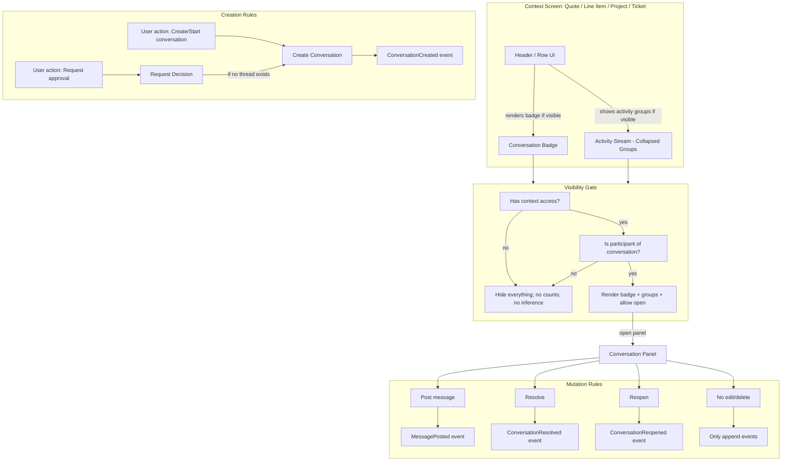
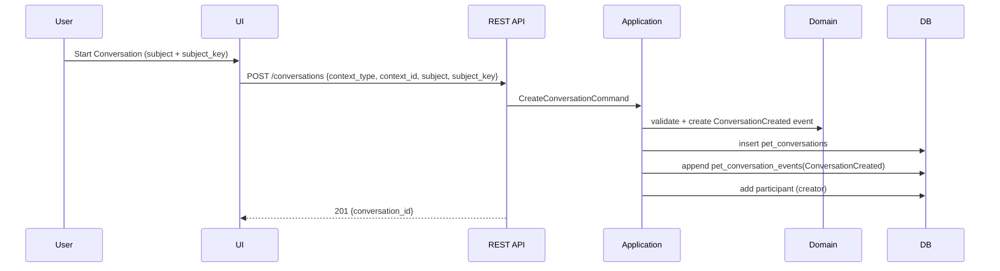
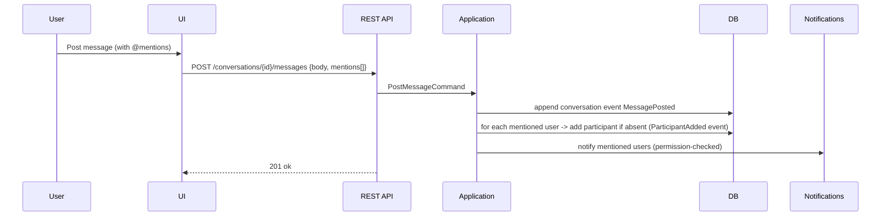
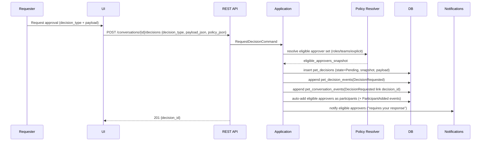
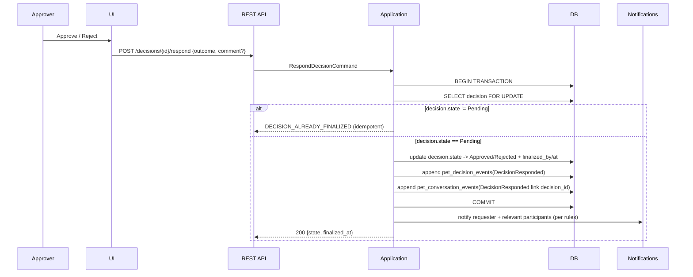

# PET Conversations & Approvals — Comprehensive Process Flows (v1.0)

**Date:** 2026-02-23  
**Scope:** Internal-only conversations + in-stream decisions (approvals).  
**Note:** These flows are **process views**. They do not override the structural/domain specs; they make lifecycle + negative guarantees explicit.

---

## 0) Legend

- **Context** = anchor object (Quote / Quote Line Item / Project / Ticket).
- **Conversation** = thread anchored to exactly one context.
- **Decision** = approval request linked to a conversation (separate aggregate recommended).
- **Participant-scoped visibility** = user must have context access AND be a participant to see.

---

## 1) Lifecycle Integration — Render / Create / Mutate (per context)



---

## 2) Entry Points → Conversation Panel (deep links)

```mermaid
flowchart LR
  N[Notification click] --> DL[Deep link: context + conversation + event]
  A[Activity stream click] --> DL
  B[Inline badge click] --> DL

  DL --> PERM[Permission check]
  PERM -->|fail| F[Generic forbidden; no existence leak]
  PERM -->|pass| P[Conversation Panel opens]
  P --> S[State Summary (default)]
  P --> T[Timeline (paged)]
```

---

## 3) Conversation Creation (anchored to one context)



---

## 4) Posting a Message (mentions + auto-add)



---

## 5) Subject Collapsing in Activity Stream (by subject_key)

```mermaid
flowchart TB
  subgraph Input[Conversation set for a context]
    C1[Conversation A subject_key=K1]
    C2[Conversation B subject_key=K1]
    C3[Conversation C subject_key=K2]
  end

  subgraph Grouping[Activity grouping]
    G1[Group K1 (collapsed)]
    G2[Group K2 (collapsed)]
  end

  C1 --> G1
  C2 --> G1
  C3 --> G2

  subgraph Output[Group card fields]
    F1[latest_snippet + latest_time]
    F2[unread_count per user]
    F3[pending_decision_count]
    F4[requires_my_approval_count]
  end

  G1 --> Output
  G2 --> Output
```

---

## 6) Decision Request (approval) — creates decision + links into conversation + auto-add approvers



---

## 7) Decision Response (Approve/Reject) — concurrency-safe, idempotent



---

## 8) Hard-Block Gate — “Send Quote to Customer” (minimum v1)

```mermaid
flowchart TB
  ACT[User triggers: Send Quote to Customer] --> APP[Application Handler]
  APP --> LOOKUP[Lookup required decision types for this action/context]
  LOOKUP --> CHECK[Check decisions state for quote version/context]

  CHECK -->|Any required decision != Approved| BLOCK[Hard error ACTION_GATED_BY_DECISION]
  BLOCK --> LINK[Return remediation: open conversation/decision]

  CHECK -->|All required decisions Approved| OK[Proceed with send]
  OK --> EVT[Append event: QuoteSentToCustomer (existing PET pattern)]
```

---

## 9) Unread Tracking (last_seen_event_id)

```mermaid
flowchart LR
  LOAD[User opens conversation] --> LATEST[Load latest event_id]
  LATEST --> MARK[POST /conversations/{id}/seen {last_seen_event_id}]
  MARK --> RS[(pet_conversation_read_state)]
  RS --> COUNT[Unread = events where event_id > last_seen_event_id]
```

---

## 10) Prohibited Behaviours (negative guarantees) — process guardrails

```mermaid
flowchart TB
  P1[Must NOT auto-create conversations on parent creation]:::bad
  P2[Must NOT broaden visibility beyond participants by default]:::bad
  P3[Must NOT allow edit/delete of messages/decisions]:::bad
  P4[Must NOT reuse approvals across quote versions]:::bad
  P5[Must NOT leak existence/counts without access]:::bad
  P6[Must NOT bypass action gates in UI]:::bad
  P7[Must NOT infer subject_key unless explicitly specified/deterministic]:::bad
  P8[Must NOT auto-add participants except explicit/mention/policy-driven]:::bad

  classDef bad fill:#ffe6e6,stroke:#cc0000,stroke-width:1px;
```



---

## 11) End-to-end “Typical” flows (at a glance)

### 11.1 Discount approval on quote line item
```mermaid
flowchart LR
  LI[Quote Line Item] -->|Start thread| C[Conversation subject_key=discount:line_item:{id}]
  C -->|Request Decision| D[Decision Pending]
  D -->|Approver approves| A[Decision Approved]
  A -->|Quote action proceeds| Q[Send quote allowed if gate satisfied]
```

### 11.2 Product validation on ticket
```mermaid
flowchart LR
  T[Ticket] --> C[Conversation subject_key=product_validation:ticket:{id}]
  C --> D[Decision Pending]
  D -->|Reject| R[Decision Rejected]
  R -->|User adjusts plan| M[New message / new decision]
```
