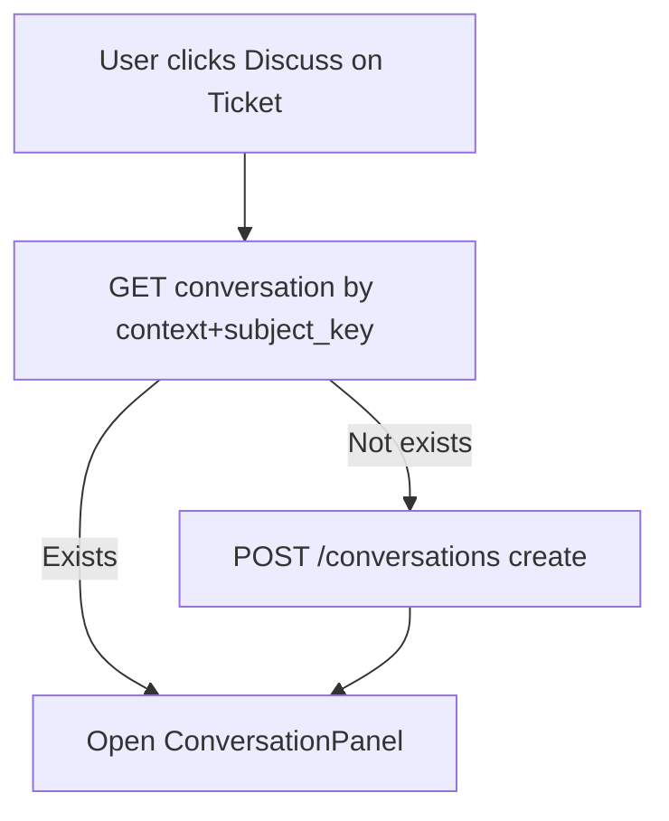
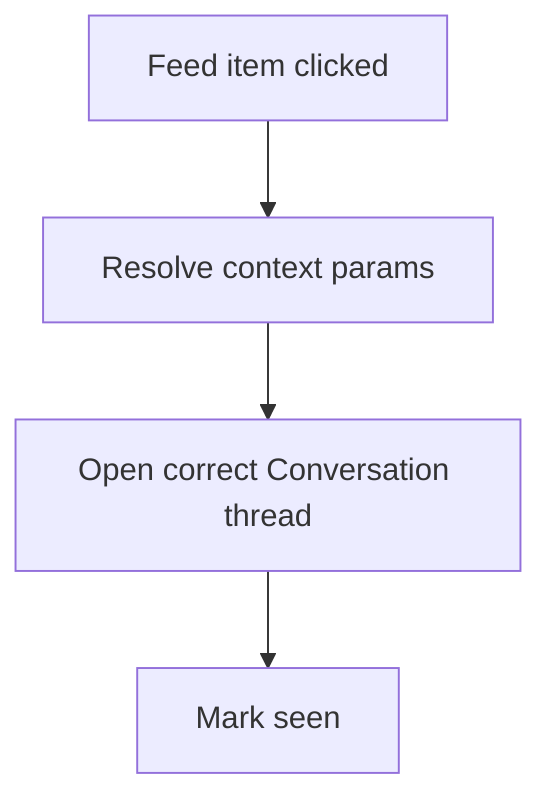

# PET Conversations Deployment Extension — Tickets, Projects, Knowledge
Version: v1.0  
Generated: 2026-02-24 16:29:02 UTC  
Scope: **Entity-attached threads only** (no cross-entity conversations)

---

## 1. Objective

Extend the existing PET Conversations system (messages, single-level replies, message reactions, approvals/decisions, paging, activity projection) to be **available** and **consistent** on:

- **Tickets** (primary next target)
- **Projects**
- **Knowledge Articles**

While preserving PET invariants:

- Append-only, auditable history (no edit/delete)
- Participant-scoped visibility (no existence leakage)
- Single authoritative context anchor per conversation
- Threading via `subject_key` (not new context types)
- Backward compatibility (versionless contexts allowed)

---

## 2. Context Anchors & Thread Keys

### 2.1 Context Types (additive)

| Entity | context_type | context_id | context_version |
|---|---|---:|---|
| Ticket | `ticket` | ticket_id | NULL (v1) |
| Project | `project` | project_id | NULL (v1) |
| Knowledge Article | `knowledge_article` | article_id | NULL (v1) |

> Quotes remain versioned and MUST pass `context_version`. Tickets/Projects/Knowledge are versionless for now.

### 2.2 Subject Key Conventions

| Entity | Scope | subject_key | subject label |
|---|---|---|---|
| Ticket | General | `ticket:{ticket_id}` | "Ticket discussion" |
| Ticket | SLA (optional) | `ticket_sla:{ticket_id}` | "SLA discussion" |
| Ticket | Internal (optional) | `ticket_internal:{ticket_id}` | "Internal discussion" |
| Project | General | `project:{project_id}` | "Project discussion" |
| Project | Milestone (optional) | `project_milestone:{milestone_id}` | "Milestone discussion" |
| Knowledge | Article | `kb:{article_id}` | "Article discussion" |

Rule: subject_key splits threads under the same anchor; it does NOT create new contexts.

---

## 3. Participant Model (per entity)

Participant checks MUST be enforced server-side on every read/mutation.

### 3.1 Ticket participants (v1)
Participants are:
- Assigned agent (if any)
- Assigned team members (if team-assigned)
- Managers per PET managerial visibility rules
- (Optional later) requester/contact portal users

### 3.2 Project participants (v1)
Participants are:
- Project owner/manager
- Project team members
- Explicit stakeholders (if model exists)

### 3.3 Knowledge participants (v1)
Default: **internal-only** (employees/roles). Public/customer-visible is out of scope unless KB access model already exists.

---

## 4. UI Deployment Requirements

### 4.1 Tickets
Placement:
- Ticket detail view: header “Discuss” button + badge
- Ticket list: speech icon + unread indicator
- Optional: SLA widget link to `ticket_sla:{ticket_id}`

Behavior:
- Lazy-create only on first message
- Load last 50; “Load earlier messages”
- Replies + reactions enabled

### 4.2 Projects
Placement:
- Project detail: header “Discuss” + badge
- Optional: milestone row icon (subject_key `project_milestone:{milestone_id}`)

### 4.3 Knowledge Articles
Placement:
- Article view: “Discuss” panel (internal)
- No implicit conversation creation on view

---

## 5. REST/API Contract (additive)

Fetch thread:
`GET /conversations?context_type=&context_id=&context_version=&subject_key=`
- For Tickets/Projects/Knowledge: context_version omitted/null; subject_key required.

Post message:
`POST /conversations/{uuid}/messages` with `body` and optional `reply_to_message_id`.

Reactions:
- `POST /conversations/{uuid}/reactions/add`
- `POST /conversations{uuid}/reactions/remove`

Mark seen:
`POST /conversations/{uuid}/mark-seen` with `last_seen_event_id`.

---

## 6. Activity Integration Requirements

Conversation narrative MUST appear in Activity for all context types.

Projected:
- MessagePosted -> conversation_message (collapsible bursts per thread)
- DecisionRequested -> decision_requested (prominent)
- DecisionResponded -> decision_responded (completes/blue)

Collapse key:
`(context_type, context_id, context_version, subject_key)`

Deep link params:
context_type, context_id, context_version (nullable), subject_key (and uuid if available).

---

## 7. Process Flows (Mermaid)

### 7.1 Ticket: open or create thread

### 7.2 Activity -> thread

---

## 8. Tests (Integration-level, minimum)

Tickets:
- Participant can fetch by context+subject_key
- Non-participant gets 404 (no leakage)
- Posting message projects to Activity (collapsed)
- Mark-seen clears unread consistently

Projects:
- Participant model enforced
- Message projects to Activity
- No implicit creation on view

Knowledge:
- Internal-only access enforced
- Message projects to Activity (internal feed)

---

## 9. Rollout Sequence (safe)

1) Tickets
2) Projects
3) Knowledge

Each step: UI entry point + participant policy + activity projection + leakage tests.

---

## 10. Prohibited Behaviours

- Must not create conversations on entity view.
- Must not allow non-participants to infer existence.
- Must not introduce cross-entity threads.
- Must not bypass participant checks via shortcode/UI.
