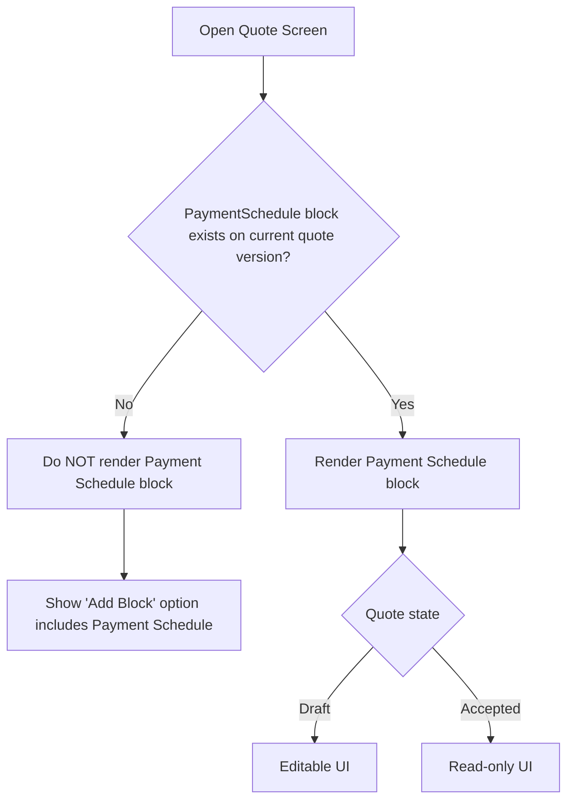
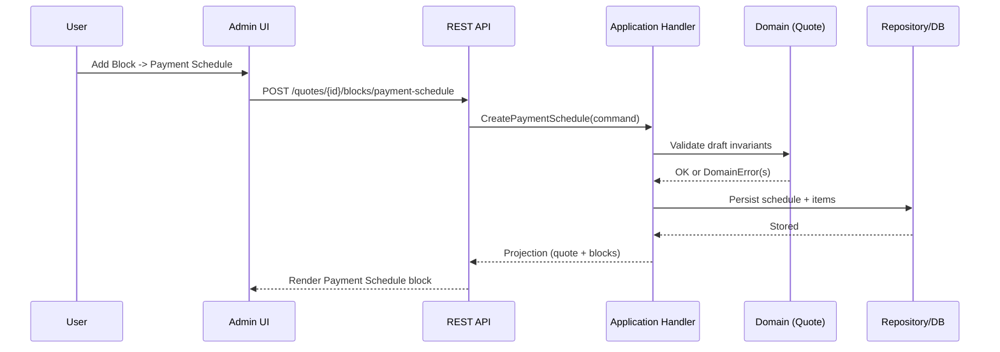
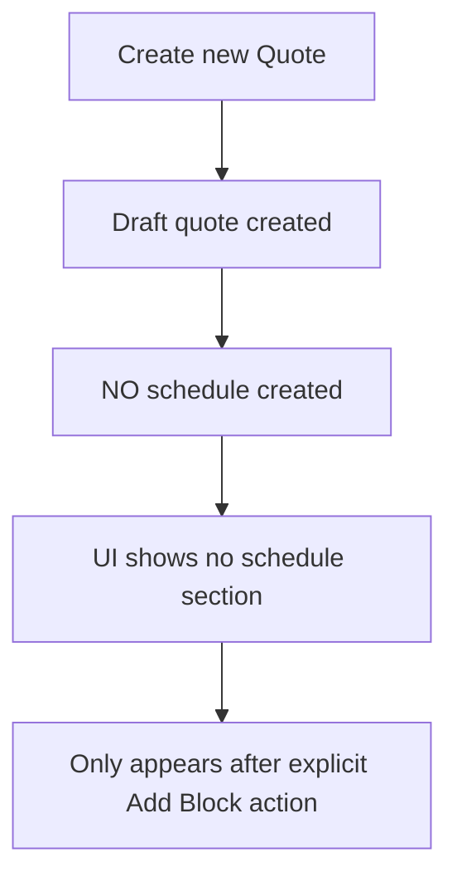

# PET Payment Schedule — Integration Contract (v1.2)

**Repo target path:** `plugins/pet/docs/04_quotes/PET_Payment_Schedule_Integration_Contract_v1_2.md`

## 1. Purpose

Define **exactly when** the Payment Schedule block exists in the Quote lifecycle, how it is created, how it renders, and what mutations are allowed. This contract is intended to prevent “helpful defaults” (auto-create / unconditional render).

This contract is **binding** for implementation and tests.

---

## 2. Scope

Applies to:
- Quote draft creation
- Quote editing UI
- Quote acceptance readiness gating
- Quote cloning / versioning
- API payload shapes for schedule block mutation
- Projection shaping for read models

Does not define:
- Finance allocation / partial payments (future)
- Automatic invoice creation rules (future)
- Multi-currency (future)

---

## 3. Lifecycle Integration Rules (authoritative)

### 3.1 Existence
- A Payment Schedule is a **Quote Block**.
- It is **optional**: `0..1` per quote version.
- It **does not exist by default** on new quotes.

### 3.2 Creation (only one allowed creation path)
Payment Schedule may only be created via:
- Explicit user action: **Add Block → Payment Schedule**
- Implemented as: `POST /pet/v1/quotes/{quoteId}/blocks/payment-schedule` for the **current draft quote version**

No other system action may create it (templates, implicit initializers, read-model injectors).

### 3.3 Rendering (UI contract)
- The quote screen **must not render** a Payment Schedule section unless the current quote version contains a Payment Schedule block.
- The UI may render an “Add Payment Schedule” affordance (button/menu item) but must not render the block itself until created.

### 3.4 Mutation
- Draft quotes: schedule block is editable via whole-block replacement.
- Accepted quotes: schedule block is **read-only** and **immutable**.

### 3.5 Acceptance gating (domain truth)
- If schedule exists: acceptance must hard-block unless schedule reconciles exactly to quote grand total (per spec).
- If schedule does not exist: acceptance proceeds subject to other readiness gates.

### 3.6 Versioning / cloning
- Any change to schedule terms after acceptance requires:
  - Clone accepted quote → new draft version
  - Edit schedule on the draft version only
- Accepted version remains unchanged.

---

## 4. Integration Flows (Mermaid)

### 4.1 UI render decision



### 4.2 Creation flow (explicit user action)



### 4.3 Prohibited auto-create flow (must never happen)



### 4.4 Acceptance integration

```mermaid
flowchart TD
  A[User clicks Accept Quote] --> B[Quote.accept()]
  B --> C{Schedule exists?}
  C -- No --> D[Continue other readiness checks]
  C -- Yes --> E[Validate schedule reconciles exactly]
  E -- Fail --> F[Hard-block acceptance with explicit error]
  E -- Pass --> G[Accept quote]
  G --> H[Emit due events for ON_ACCEPTANCE items]
```

---

## 5. REST Integration Contract (projection and mutation)

### 5.1 Create / replace (draft only)
- POST creates schedule block for current draft version
- PUT replaces entire schedule block (draft only)

The server must:
- Reject POST/PUT on accepted quotes (`QUOTE_IMMUTABLE_ACCEPTED`)
- Reject if quote version not draft / not current draft

### 5.2 Read model guarantee
- GET quote must only include schedule block if it exists.
- It must not inject a synthetic “Full Payment on acceptance” schedule row.

---

## 6. Installment series anchoring (integration-specific)
If installment series is used:
- projected_finish_date must be available at acceptance time
- derived if implementation plan provides it, otherwise manually captured on schedule block
- server materializes installment items before acceptance

---

## 7. Acceptance criteria (integration)
- New quote: no schedule is rendered; no schedule exists in GET payload.
- Adding schedule: schedule appears only after POST/PUT and persists.
- Accepted quote: schedule appears read-only; mutation endpoints hard-fail.
- No code path exists that auto-inserts schedule on quote create or quote load.
