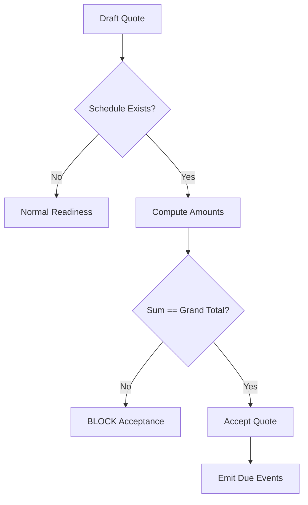
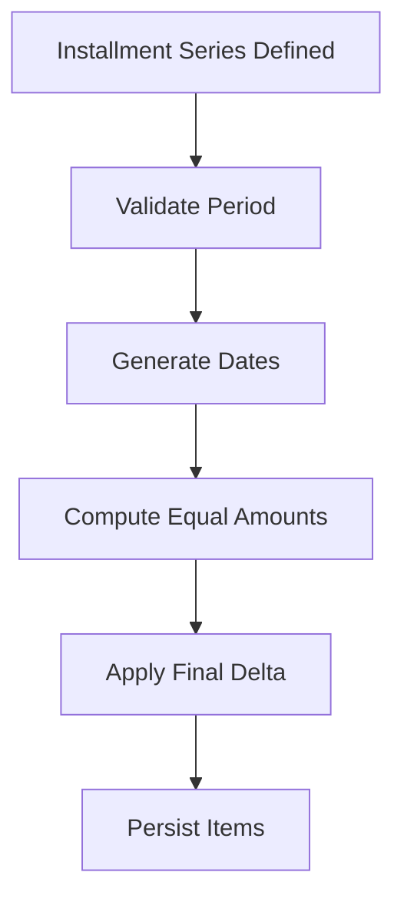

# PET Quote Payment Schedule Block Specification (v1.1)

## Architectural Position
Payment Schedule is a dedicated Quote Block (0..1 per quote version).
Immutable after acceptance.
Additive corrections only.

Basis: QUOTE_GRAND_TOTAL only.

## Amount Modes
- FIXED
- PERCENT_OF_BASIS
- EQUAL_INSTALLMENTS_OVER_PERIOD

## Trigger Types
- ON_ACCEPTANCE
- ON_DATE
- ON_DOMAIN_EVENT
- ON_INSTALLMENT_SERIES

## Installment Series Rules
- Requires projected_finish_date (derived or manual)
- Materialize concrete installment items before acceptance
- 2-decimal rounding
- Final installment may include deterministic rounding delta

## Acceptance Hard Block
- Sum(computed_amounts) == Quote.grand_total exactly
- Fail-fast for percent mismatch
- Installment series must reconcile exactly

## Domain Events
- PaymentScheduleDefinedEvent
- PaymentScheduleItemBecameDueEvent

## Persistence
Custom tables only.
Forward-only migrations.
Backward compatible.

## Mermaid — Acceptance Flow

## Mermaid — Installment Materialization

