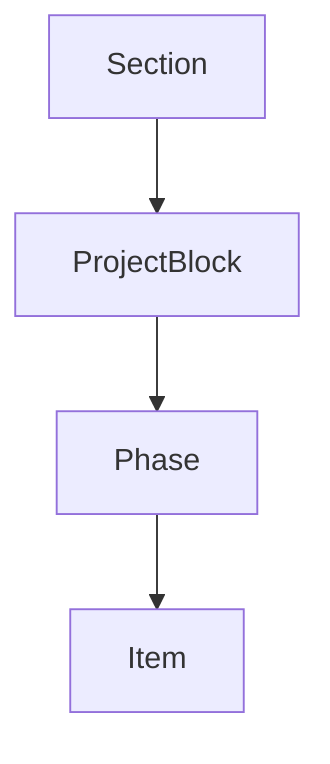

# PET Quote Section & Block UX Specification (v3.0)

Global "+" (bottom-right) → Add Section.

Within each Section:
- Section-level "+" below last block → Add Block.

Block Types:
- Once-off Product
- Once-off Simple Services
- Once-off Project
- Repeat Product
- Repeat Services
- Price Adjustment
- Payment Plan
- Text Block

Project Block Structure:

Rules:
- ProjectBlock atomic.
- Phases cannot leave ProjectBlock.
- Items inside phase cannot leave ProjectBlock.
