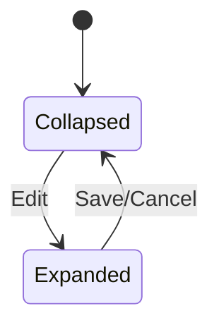
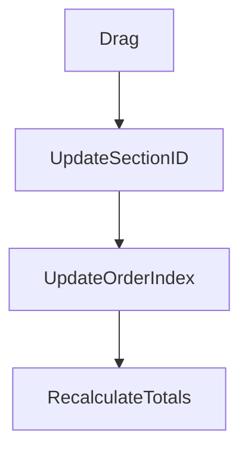
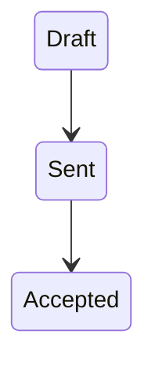
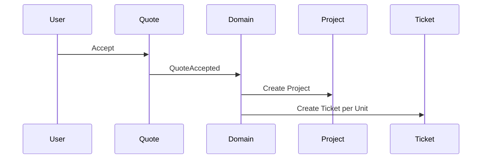

# PET Quote System — Master Baseline (v3.0)

Status: Authoritative Execution Baseline  
Scope: Sections + Composable Blocks + Inline Edit + Enterprise UX Enhancements

---

# 1. Structural Model

```mermaid
flowchart TD
    Q[Quote]
    Q --> S1[Section]
    Q --> S2[Section]
    Q --> RB[Root Block (optional)]

    S1 --> B1[Block]
    B1 --> PH[Phase (if Project)]
    PH --> U[Unit]
```

Rules:
- Sections are NOT nestable.
- Blocks may exist outside Sections.
- Project blocks are atomic at Section level.
- Phases exist only inside Project blocks.
- Sections are presentation-only (no delivery impact).

---

# 2. Section UX Model

Section Header:
- Full-width black bar.
- Inline editable title (default: "New Section").
- Drag handle on left.
- Totals right-aligned.
- Collapse chevron.
- "⋯" menu for toggles.

Toggles:
- show_total_value (default ON)
- show_item_count (default OFF)
- show_total_hours (default OFF)

Totals Display Rules:
- If only once-off → show once-off total.
- If recurring exists → show:
    Once-off total
    Recurring total (/period)
- Never mix recurring into once-off total.

Enhancements:
- Section-level margin indicator (small % next to once-off total).
- Visual warning if section margin below threshold.
- Section template save (future-ready).

Deletion:
- Cannot delete Section containing blocks.
- Must move or delete blocks first.

---

# 3. Inline Item Editing Model



Rules:
- Only ONE item expanded at a time.
- Expanding auto-collapses any other expanded item.
- Inline only (no modal).
- Drag disabled unless using drag handle.
- Delete disabled while editing.
- No full page refresh.

Expanded Layout (Top → Bottom Logical Flow):

1. Service selector
2. Description
3. Department
4. Assigned to
5. Effort / Qty inputs
6. Cost shaping inputs

---------------------------------

Commercial Summary (BOTTOM):
- Cost
- Margin
- Sell price
- Qty
- Total

Enhancements:
- Live recalculation with subtle animation.
- Sticky commercial summary if expanded content exceeds viewport.
- Margin color indicator (green/amber/red).
- Unsaved changes badge.
- Keyboard shortcuts: Enter=Save, Esc=Cancel.

Collapsed View:
Service | Owner | Qty | Value

---

# 4. Drag & Ordering Model

Persistence:

- quote_sections.order_index (sparse increments)
- quote_blocks.section_id (nullable)
- quote_blocks.order_index scoped by section_id



Capabilities:
- Reorder Sections.
- Reorder Blocks.
- Drag Blocks between Sections.
- Clone Section (clones all children).
- Clone Block.
- Project blocks move atomically.

Enhancements:
- Dedicated drag handles only.
- Explicit drop zones.
- No cascading reindexing.

---

# 5. Adjustment Scope Rules

If Adjustment inside Section:
- If other blocks exist → applies to that Section.
- If only block → applies to whole Quote.

Quote total =
    Sum(section totals)
    + root-level blocks
    + quote-level adjustments

Section total =
    Sum(block totals inside section)
    + section-scoped adjustments

Recurring always separate.

---

# 6. Quote Status Restrictions



Draft:
- Fully editable.

Sent:
- Structure locked.
- No reorder.
- No new sections.
- No delete.

Accepted:
- Fully read-only.

---

# 7. Acceptance & Delivery (Unchanged)



Sections do NOT influence delivery topology.

---

# 8. Validation & Enterprise Signals

Add Validation Banner (top of quote):
- Missing owner
- Zero margin
- Empty section
- No payment plan
- Recurring without frequency

Mode Toggle (future enhancement):
- Commercial View
- Delivery View

---

END BASELINE

