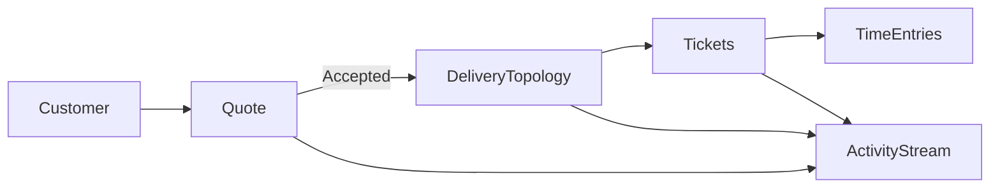
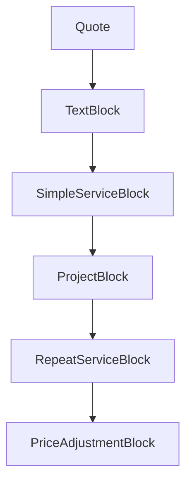
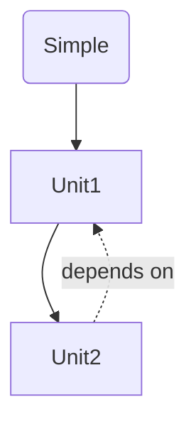
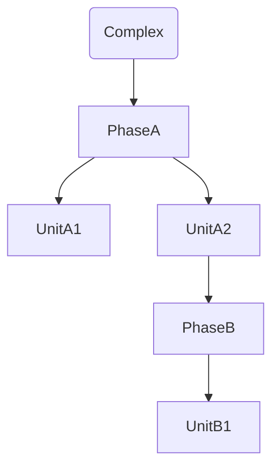
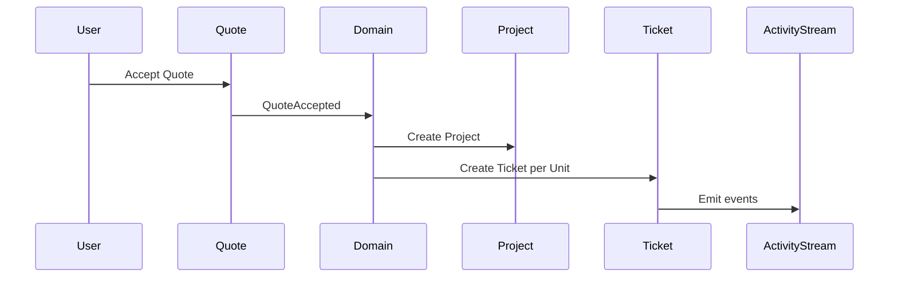
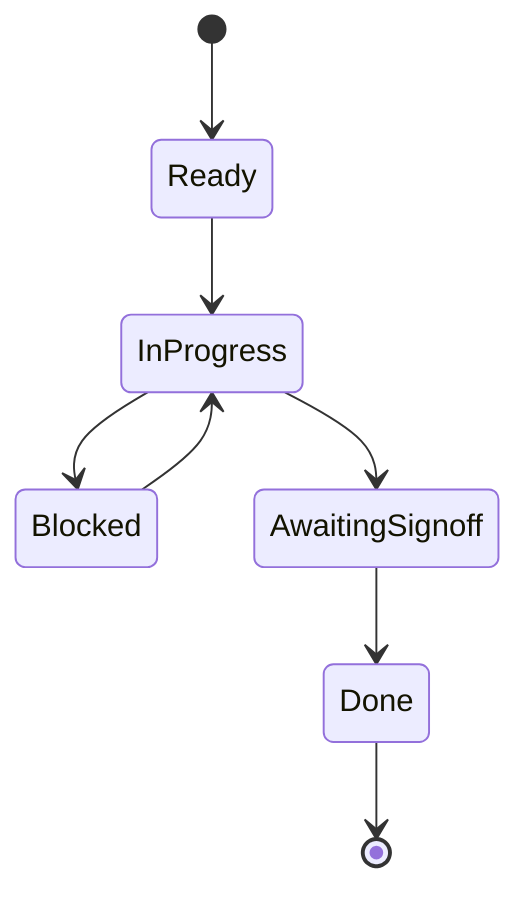
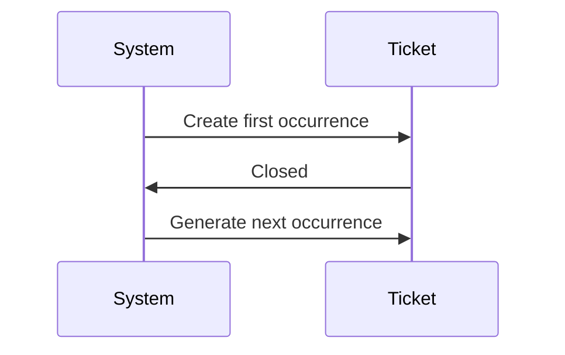
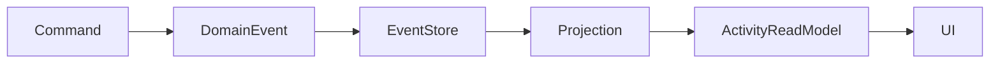

# PET Visual Architecture Overview (v1.0)

Status: Demo-Ready Architecture Summary  
Purpose: Board-ready overview of how Quotes, Delivery, Tickets, Activity, and Timesheets integrate.

---

# 1. System Philosophy

PET is:

- Domain-driven
- Event-backed
- Immutable-history focused
- Delivery-topology aware

Quotes are commercial intent.  
Acceptance creates operational truth.

---

# 2. High-Level System Flow

---

# 3. Quote as Composable Document

- Ordered block model
- Drag/drop reordering
- Totals derived from priced blocks
- No modal trees
- Scalable for future block types

---

# 4. Delivery Topology Model

## Simple Once-off Service

## Complex Project

Units are atomic governed work items.

---

# 5. Acceptance Creates Operational Truth

No delivery exists before acceptance.

---

# 6. Ticket Governance Model

Each Ticket includes:

- Owner (team)
- Assignee (optional)
- Due date
- State machine
- Dependencies
- Acceptance criteria
- Append-only history
- Time entries
- Comment + attachment support

---

# 7. Recurring Service Model

Two modes:

- SLA Mode (reactive)
- Scheduled Work Mode (proactive)

Only next occurrence generated (no ticket explosion).

---

# 8. Activity Projection Architecture

Managers see complete operational truth.

---

# 9. Key Architectural Guarantees

- Commercial pricing lives at unit level
- Phase totals derived only
- History immutable
- Activity stream event-projected
- Quote → Delivery transition explicit and auditable
