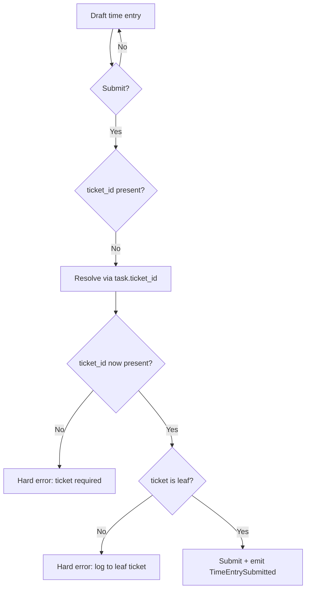

STATUS: AUTHORITATIVE — IMPLEMENTATION REQUIRED
SCOPE: Ticket Backbone Correction
VERSION: v1

# Time Entry — Ticket Enforcement (v1)

## Goal

Enforce:

- Every submitted/approved/locked time entry has a `ticket_id`.
- Draft timers may exist temporarily without `ticket_id`, but must be assigned before submission.

## Required schema changes

- Add `ticket_id` to `wp_pet_time_entries` (nullable).
- Keep `task_id` for backward compatibility, but do not allow submission without ticket_id.

## Domain rules (authoritative)

### Creation (draft)
- `ticket_id` MAY be NULL.
- If `task_id` is provided and task has `ticket_id`, the system SHOULD populate `ticket_id` automatically.

### Submission boundary
On `TimeEntry.submit()` (or SubmitTimeEntryHandler):
- If `ticket_id` is NULL:
  - Attempt resolve via `task_id` → `task.ticket_id`.
  - If still NULL: hard error (cannot submit).
- If ticket is `is_rollup=1`: hard error (must log against leaf).
- If ticket is baseline-locked and has children: hard error (log against execution leaf).

### Lock boundary
On “locked/approved” transition:
- Same checks as submission.
- Capture commercial context snapshot as needed (billable, rate plan, agreement drawdown metadata).

## Backfill strategy (safe)

- After introducing `time_entries.ticket_id`, run an idempotent backfill:
  - For each time entry with NULL ticket_id:
    - Find task by `task_id`
    - If task.ticket_id present: set it
    - Else leave NULL and flag for reconciliation (malleable_data note)

Never change start/end/duration/history.

## Reporting rules

- Ticket is the primary join for all work reporting.
- Task remains compatibility join for old UIs; it must not be the authoritative work unit.

## Mermaid

