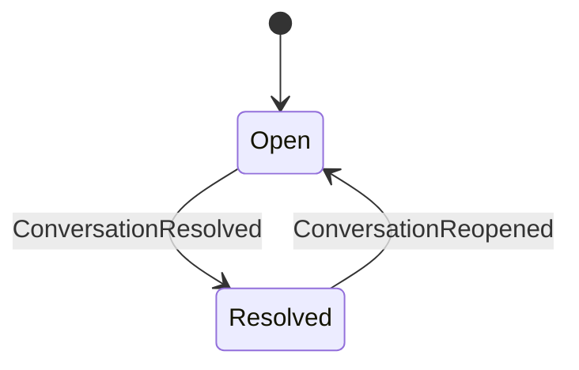
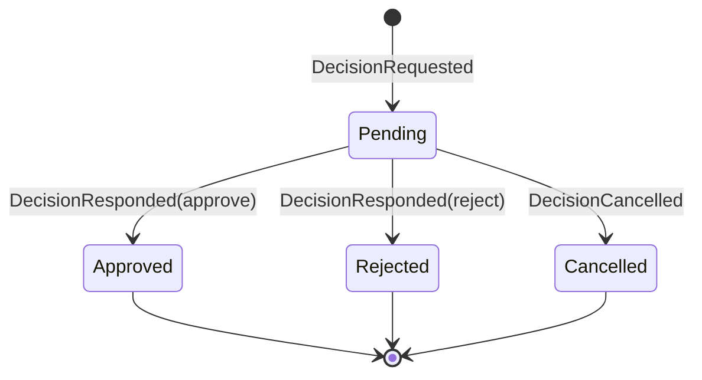

# PET Conversations & Approvals — Domain + Data Spec (v1.0)

**Status:** Draft (implementation-ready)  
**Date:** 2026-02-23  
**Constraints:** PET DDD layering; custom tables only; forward-only migrations.

## 1) Core concepts
- **Conversation**: anchored thread with subject/subject_key, participants, state (open/resolved), and an append-only event stream.
- **Decision**: governance artifact requested within a conversation, with policy + state machine.

## 2) Anchoring
Conversation has exactly one anchor:
- `context_type`: `quote | ticket | project | knowledge_article | lead | sla | ...`
- `context_id`: entity primary key
- `subject_key`: thread discriminator within the context (e.g. `quote:42`, `quote_line:15`, `quote_section:7`)

**Important:** Quote line items do NOT use a separate `context_type`. They share `context_type = 'quote'` and `context_id = quote_id`, distinguished only by `subject_key`. Header conversations use `subject_key = 'quote:{quote_id}'`; line-item conversations use `subject_key = 'quote_line:{line_item_id}'` or `quote_section:{section_id}`.

Other contexts may reference via link/notification/activity, but do not multi-anchor.

## 3) Domain events (append-only)
Conversation events:
- ConversationCreated, MessagePosted, ParticipantAdded/Removed, ConversationResolved/Reopened, RedactionApplied, (VisibilityChanged if needed)

Decision events:
- DecisionRequested, DecisionResponded, DecisionCancelled, (DecisionExpired optional)

## 4) State machines

## 5) Approval policy (v1)
- `policy_mode = any_of`
- selectors: roles, teams, explicit users (+ optional fallback)
- Eligible approver set is **materialized** at request time (snapshot) for audit stability.

## 6) Hard-block enforcement
Application-layer check for protected actions (minimum: Quote “Send to customer”):
- If required decision type(s) are not Approved for the relevant context/version → throw `ACTION_GATED_BY_DECISION`.

## 7) Data model (custom tables)
- `pet_conversations`
- `pet_conversation_participants`
- `pet_conversation_events` (append-only)
- `pet_conversation_read_state` (last_seen_event_id)
- `pet_decisions`
- `pet_decision_events` (append-only)

Indexing requirements:
- context lookup (`context_type`,`context_id`)
- context + subject_key lookup (`context_type`,`context_id`,`context_version`,`subject_key`)
- subject_key index (for child aggregate queries)
- paging (`conversation_id`, occurred_at or sequential id)
- decision state lookup (`context_type`,`context_id`,`decision_type`,`state`)

### Key read methods
- `findByContext(contextType, contextId, contextVersion?, subjectKey?, strict?)` — returns a single conversation. When `strict = true`, disables the backward-compatibility fallback that ignores `subject_key`. Used by `CreateConversationHandler` to prevent false duplicate detection.
- `getSummaryForContexts(contextType, contextIds[], userId)` — batched summary returning header status + child discussion aggregate per context_id. Two queries: header-only + child aggregate (see Conversation Standardisation spec §1.5.2).

## 8) Concurrency
- Decision responses: transaction + row lock (`SELECT ... FOR UPDATE`)
- Respond only when Pending; idempotent “already finalized” response otherwise.

## 9) Redaction
- No deletion.
- Redaction is an additive event referencing fields to mask + reason + actor.
