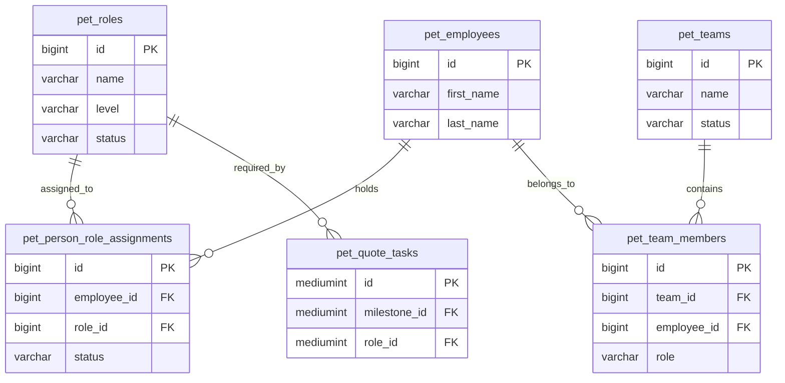
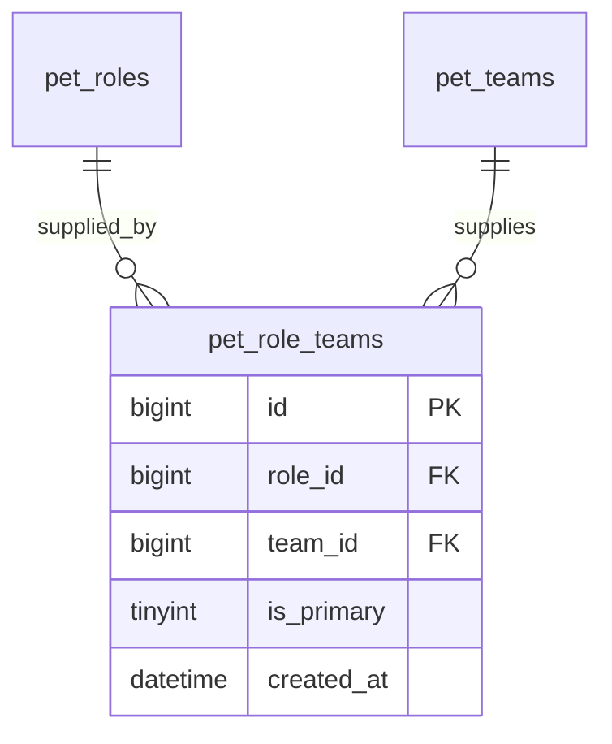
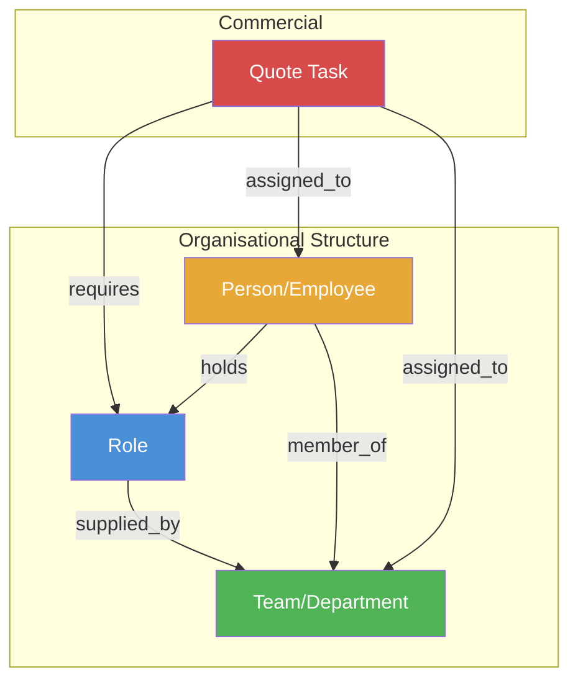
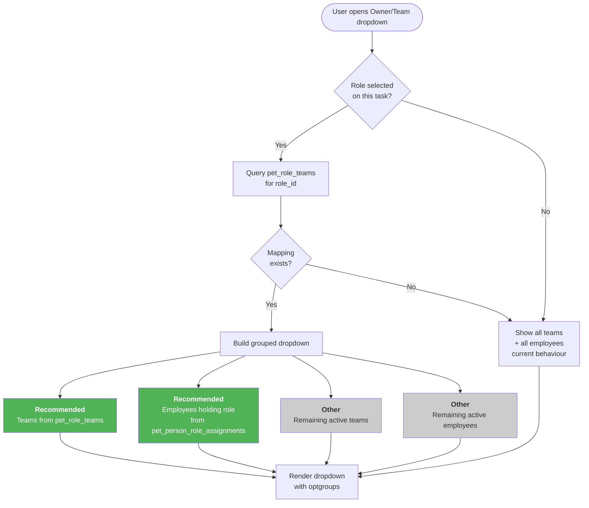
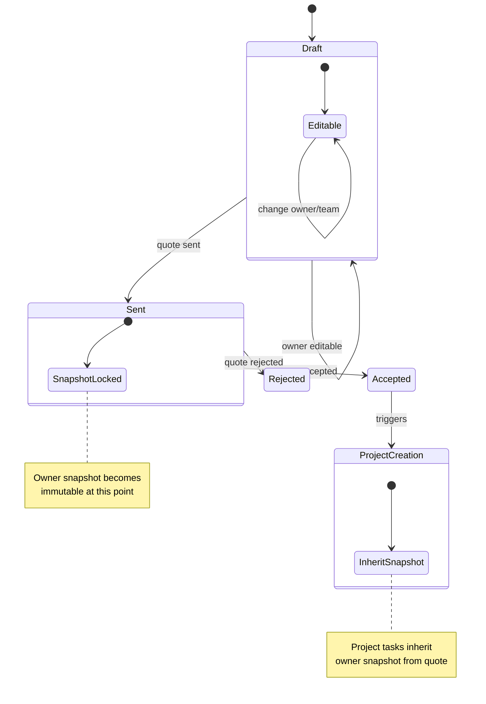
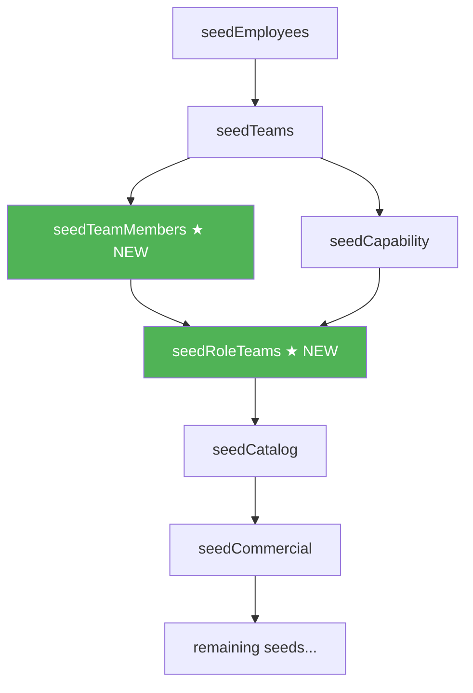
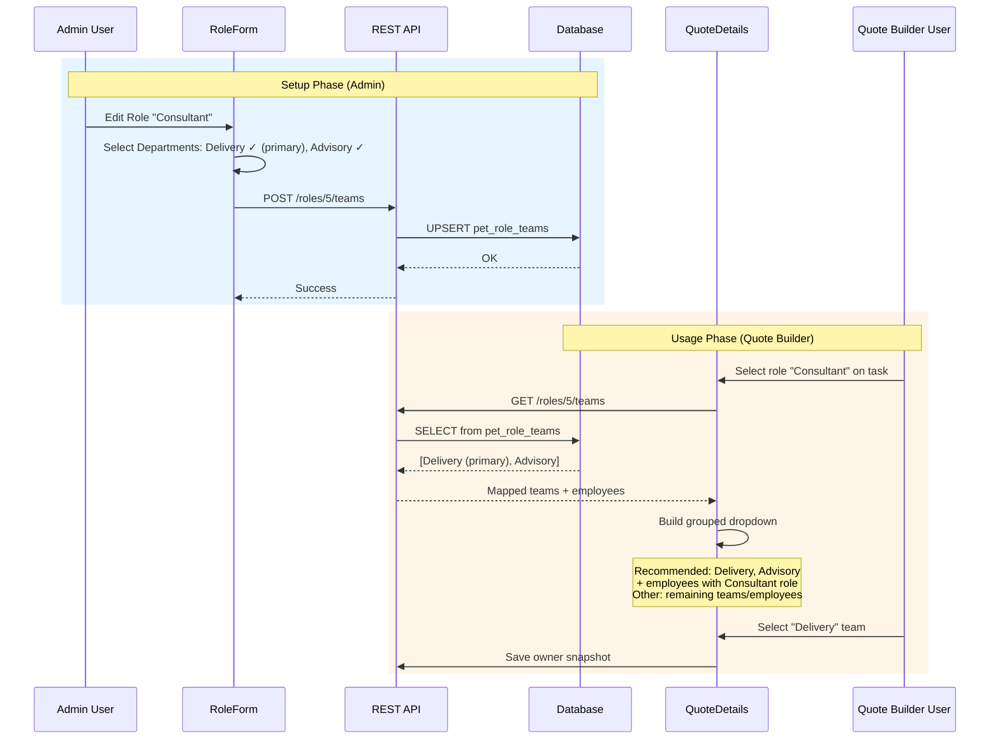
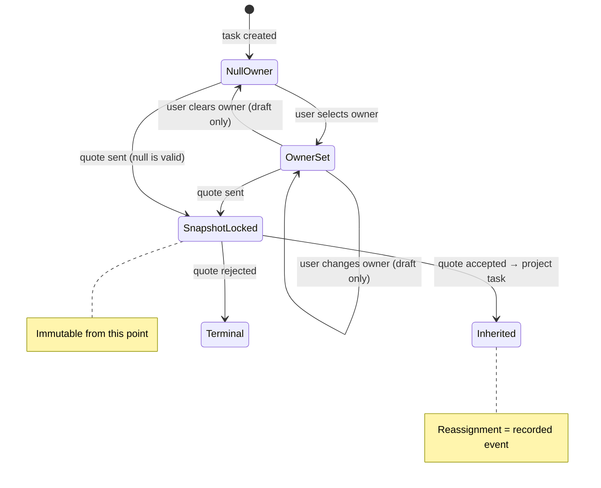

# PET — Role–Department Ownership & Smart Quote Dropdowns

## Purpose of this Document
This document defines the **structural design** for declaring which departments (teams) are responsible for supplying which roles, and how that mapping improves the quote builder and wider system.

**Authority**: Normative (once approved)

---

## 1. Problem Statement

The quote builder Owner/Team dropdown currently shows every team and every employee without context. Three relationships exist but are **not structurally connected**:

- **Team membership** — `pet_team_members` (Person ↔ Team)
- **Role capability** — `pet_person_role_assignments` (Person ↔ Role)
- **Quote line role** — `role_id` on `pet_quote_tasks` (Quote Task → Role)

Because Role → Department ownership is never declared, the system infers structure from staffing. This causes:

- New roles with no staff appear unusable
- Temporary staffing changes affect system behaviour
- Multi-team employees create ambiguity
- Quote assignment UX is noisy and error-prone

### Current Relationship Gap



**Missing link**: There is no direct relationship between `pet_roles` and `pet_teams`.

---

## 2. Structural Solution

### New Table: `pet_role_teams`

Introduces an explicit organisational mapping answering:

> "Which departments are responsible for supplying this role?"

This represents **organisational structure**, not staffing.



**Constraint**: `UNIQUE(role_id, team_id)`

### Examples

- Consultant → Delivery, Advisory
- Support Technician → Support
- Project Manager → Projects

---

## 3. Complete Relationship Model

After this change, the system contains **four independent relationships**:



| Relationship | Table | Meaning |
|---|---|---|
| Role ↔ Department | `pet_role_teams` | Organisational ownership |
| Person ↔ Role | `pet_person_role_assignments` | Capability / eligibility |
| Person ↔ Team | `pet_team_members` | Reporting structure |
| Quote Task → Role | `pet_quote_tasks.role_id` | Commercial requirement |

**These must not be inferred from each other.**

---

## 4. Quote Builder Behaviour

### Role-Aware Dropdown Logic



### Decision: Recommended + Other (not hard filter)
- Guides users toward correct choices
- Allows operational overrides
- Avoids "why can't I assign X?" friction

---

## 5. Snapshot & Immutability Rules

Quote line ownership is a **snapshot**, not a live relationship. This aligns with PET Principle 3 (Immutability of Historical Truth).

### Ownership Lifecycle



### Rules
- **Draft**: owner freely editable
- **Sent / Accepted**: owner snapshot becomes immutable
- **Project creation**: project tasks inherit the snapshot
- Later reassignments are **recorded events**, not silent overwrites

---

## 6. Primary Department Flag

`is_primary` optionally marks one department as the default for a role.

### Purpose
- Auto-select default team when role is chosen in quote builder
- Improve UX in dropdown defaults

### Constraint
- Only **one** `is_primary = 1` per `role_id`
- Enforced at application layer (not DB unique constraint, since most rows will be `0`)

### Usage rule
This flag is used **only for defaults**, not routing logic.

---

## 7. Seed Data: Cleanup, Fixes, and New Fixtures

This section covers three concerns:
- **7a.** Existing duplicate cleanup
- **7b.** Idempotency fixes to existing seed methods
- **7c.** New `pet_role_teams` fixture data
- **7d.** Missing `pet_team_members` fixture data

---

### 7a. Duplicate Cleanup (prerequisite)

Duplicate records exist due to repeated seed runs. This is **independent of the structural change** but must occur first.

**Root cause**: `seedTeams()` and `seedCapability()` in `DemoSeedService.php` insert without checking for existing records. `seedEmployees()` has a count-based guard (`if ($existing >= 8) return`) but teams and roles have none.

**Known duplicates**:
- Roles: Consultant, Project Manager, Support Technician, Developer, DevOps Engineer, Security Analyst
- Teams: Executive, Delivery, Support

**Cleanup procedure** (run once, before new seed data):
1. For each duplicate name in `pet_roles`, keep the **lowest `id`**.
2. Reassign all FKs referencing duplicate role IDs:
   - `pet_role_skills.role_id`
   - `pet_person_role_assignments.role_id`
   - `pet_role_kpis.role_id`
   - `pet_quote_tasks.role_id`
   - `pet_quote_catalog_items.role_id`
   - `pet_person_kpis.role_id`
3. Delete duplicate role rows.
4. Repeat for `pet_teams` (lowest `id`), reassigning:
   - `pet_team_members.team_id`
   - `pet_quote_tasks` owner references where `ownerType = 'team'`
5. Delete duplicate team rows.
6. Remove orphaned `pet_demo_seed_registry` entries.

---

### 7b. Idempotency Fixes to Existing Seed Methods

**`seedTeams()`** (DemoSeedService.php line 360):
- Currently: blind `$this->wpdb->insert()` for Executive, Delivery, Support.
- Fix: check `SELECT id FROM pet_teams WHERE name = %s LIMIT 1` before each insert. Skip if exists.

```php
// Pattern:
$existing = (int)$this->wpdb->get_var(
    $this->wpdb->prepare("SELECT id FROM $t WHERE name = %s LIMIT 1", $name)
);
if (!$existing) {
    $this->wpdb->insert($t, ['name' => $name, 'created_at' => $seededAt]);
}
```

**`seedCapability()` roles section** (DemoSeedService.php line 602):
- Currently: calls `CreateRoleHandler` for each role without checking existence.
- Fix: check `SELECT id FROM pet_roles WHERE name = %s LIMIT 1` before each create. If exists, use existing ID and skip creation + publish.

```php
// Pattern:
$rolesTable = $this->wpdb->prefix . 'pet_roles';
$existingId = (int)$this->wpdb->get_var(
    $this->wpdb->prepare("SELECT id FROM $rolesTable WHERE name = %s LIMIT 1", $r['name'])
);
if ($existingId > 0) {
    $roleIds[$r['name']] = $existingId;
} else {
    $roleId = $createRole->handle(...);
    $roleIds[$r['name']] = (int)$roleId;
    $publishRole->handle(...);
}
```

---

### 7c. New Seed Method: `seedRoleTeams()`

**Execution order**: Must run **after** both `seedTeams()` and `seedCapability()` — it needs resolved team IDs and role IDs.

Place in `seedFull()` orchestrator between `seedCapability()` and `seedCatalog()`:
```php
$summary['role_teams'] = $this->seedRoleTeams($seedRunId, $seedProfile, $recentDate);
```

**Fixture data**:

| Role               | Team(s)                  | Primary     |
|---|---|---|
| Consultant         | Delivery, Support        | Delivery    |
| Support Technician | Support                  | Support     |
| Project Manager    | Delivery                 | Delivery    |
| Developer          | Delivery                 | Delivery    |
| DevOps Engineer    | Delivery, Support        | Delivery    |
| Security Analyst   | Delivery                 | Delivery    |

**Rationale for mappings**:
- Consultant → Delivery (primary, main work) + Support (advisory overflow)
- Support Technician → Support only (pure operational)
- Project Manager → Delivery only (project-focused)
- Developer → Delivery only
- DevOps Engineer → Delivery (primary) + Support (on-call, incident infrastructure)
- Security Analyst → Delivery only

**Implementation pattern**:
```php
private function seedRoleTeams(string $seedRunId, string $seedProfile, string $seededAt): array
{
    $rt = $this->wpdb->prefix . 'pet_role_teams';
    $rolesTable = $this->wpdb->prefix . 'pet_roles';
    $teamsTable = $this->wpdb->prefix . 'pet_teams';

    $roleName = fn(string $name): int => (int)$this->wpdb->get_var(
        $this->wpdb->prepare("SELECT id FROM $rolesTable WHERE name = %s LIMIT 1", $name)
    );
    $teamName = fn(string $name): int => (int)$this->wpdb->get_var(
        $this->wpdb->prepare("SELECT id FROM $teamsTable WHERE name = %s LIMIT 1", $name)
    );

    $mappings = [
        ['role' => 'Consultant',         'team' => 'Delivery', 'is_primary' => 1],
        ['role' => 'Consultant',         'team' => 'Support',  'is_primary' => 0],
        ['role' => 'Support Technician', 'team' => 'Support',  'is_primary' => 1],
        ['role' => 'Project Manager',    'team' => 'Delivery', 'is_primary' => 1],
        ['role' => 'Developer',          'team' => 'Delivery', 'is_primary' => 1],
        ['role' => 'DevOps Engineer',    'team' => 'Delivery', 'is_primary' => 1],
        ['role' => 'DevOps Engineer',    'team' => 'Support',  'is_primary' => 0],
        ['role' => 'Security Analyst',   'team' => 'Delivery', 'is_primary' => 1],
    ];

    $count = 0;
    foreach ($mappings as $m) {
        $roleId = $roleName($m['role']);
        $teamId = $teamName($m['team']);
        if ($roleId <= 0 || $teamId <= 0) continue;

        // Idempotent: skip if mapping already exists
        $existing = (int)$this->wpdb->get_var($this->wpdb->prepare(
            "SELECT id FROM $rt WHERE role_id = %d AND team_id = %d",
            $roleId, $teamId
        ));
        if ($existing > 0) continue;

        $this->wpdb->insert($rt, [
            'role_id'    => $roleId,
            'team_id'    => $teamId,
            'is_primary' => $m['is_primary'],
            'created_at' => $seededAt,
        ]);
        $this->registryAdd($seedRunId, $rt, (string)$this->wpdb->insert_id);
        $count++;
    }

    return ['role_teams' => $count];
}
```

**Idempotency**: Uses `SELECT ... WHERE role_id = %d AND team_id = %d` before insert. The UNIQUE constraint on the table is a safety net.

---

### 7d. Missing Seed: `seedTeamMembers()`

**Current state**: `pet_team_members` has **zero** demo data. No `seedTeamMembers()` method exists.

**Impact on this feature**: The Recommended Employees section of the dropdown is populated from `pet_person_role_assignments` (who holds the role), not team membership. However, team membership is needed for the broader demo to be realistic — e.g. verifying stress-test S4 (employee moves teams) and S8 (multi-team employee).

**Recommended fixture data**:

| Employee          | Team(s)             | Role in team |
|---|---|---|
| Steve Admin       | Executive            | lead         |
| Mia Manager       | Delivery             | lead         |
| Liam Lead Tech    | Support              | lead         |
| Ava Consultant    | Delivery             | member       |
| Noah Support      | Support              | member       |
| Zoe Finance       | Executive            | member       |
| Ethan DevOps      | Delivery, Support    | member       |
| Isabella Analyst  | Delivery             | member       |

Note: Ethan is intentionally multi-team (Delivery + Support) to support stress-test S8.

**Execution order**: Must run after `seedTeams()` and `seedEmployees()`.

Place in `seedFull()` orchestrator after `seedTeams()`:
```php
$summary['team_members'] = $this->seedTeamMembers($seedRunId, $seedProfile, $recentDate);
```

**Implementation pattern**: Same idempotent check-before-insert approach as `seedRoleTeams()`.

---

### 7e. Registry Updates

`registerSeedRunEntities()` must be updated to include:
```php
// Role-team mappings
$roleTeams = $this->wpdb->prefix . 'pet_role_teams';
foreach ($this->wpdb->get_col($this->wpdb->prepare(
    "SELECT id FROM $roleTeams WHERE created_at = %s", [$seededAt]
)) as $id) {
    $this->registryAdd($seedRunId, $roleTeams, (string)$id);
}
```

### 7f. Seed Execution Order (Updated)



---

## 8. UI Changes

### QuoteDetails.tsx
Owner/Team dropdown becomes **role-aware**:
- Reads `role_id` from current task
- Fetches role-team mapping from API
- Renders optgroup-based dropdown (Recommended / Other)

Current code location: `src/UI/Admin/components/QuoteDetails.tsx` (lines 2517–2672)

### RoleForm.tsx
Add **Departments** multi-select:
- Fetches active teams
- Shows checkboxes (matching existing Required Skills pattern)
- One checkbox per team, with "Primary" radio/toggle
- Saves to `pet_role_teams` via API

Current code location: `src/UI/Admin/components/RoleForm.tsx`

### Team View (optional, future)
Display "Roles supplied by this team" as a read-only list on team detail view.

---

## 9. API Changes

### New Endpoints

**GET** `/roles/{id}/teams`
Returns teams mapped to a role, ordered with `is_primary` first.

**POST** `/roles/{id}/teams`
Replaces the full set of team mappings for a role.
Payload: `{ teams: [{ team_id: number, is_primary: boolean }] }`

### Modified Endpoints

**GET** `/roles/{id}`
Include `teams` array in response.

**GET** `/quote-tasks/{id}/owner-options`
Returns grouped owner options based on task's `role_id`.

---

## 10. Migration Definition

### Table Creation

```sql
CREATE TABLE IF NOT EXISTS {prefix}pet_role_teams (
    id bigint(20) UNSIGNED NOT NULL AUTO_INCREMENT,
    role_id bigint(20) UNSIGNED NOT NULL,
    team_id bigint(20) UNSIGNED NOT NULL,
    is_primary tinyint(1) NOT NULL DEFAULT 0,
    created_at datetime DEFAULT CURRENT_TIMESTAMP NOT NULL,
    PRIMARY KEY (id),
    UNIQUE KEY role_team_unique (role_id, team_id),
    KEY role_id (role_id),
    KEY team_id (team_id)
);
```

Migration class: `CreateRoleTeamsTables` in `Migration/Definition/`

---

## 11. Process Flow: End-to-End



---

## 12. Decisions Summary

### Dropdown Filtering → Option B: Recommended + Other
Guides without blocking. Avoids user friction.

### Snapshot Timing → Option C: Draft editable, locked on sent/accepted
Draft flexibility with immutable history once quote leaves draft.

### Role-Department Mapping → Option B: Many-to-many with primary flag
Improves defaults. No structural complexity increase.

---

## 13. Lifecycle Integration Contract

This section defines **when each entity exists, when it must not exist, and what triggers its creation**.

### 13a. `pet_role_teams` (Configuration Entity)

**When does it exist?**
- Created explicitly by an admin via RoleForm when configuring role → department ownership.
- May exist before any quotes reference the role.
- May exist before any employees hold the role.
- The system must function correctly with **zero rows** in `pet_role_teams`.

**What triggers its creation?**
- Admin action only: `POST /roles/{id}/teams` from RoleForm.
- No other lifecycle event creates rows in this table.

#### Render Rules
- Dropdown grouping (Recommended / Other) renders **only** when `pet_role_teams` rows exist for the task's `role_id`.
- If no mappings exist for a role, the dropdown renders identically to current behaviour (flat list: all teams + all employees).
- The dropdown must **never** render empty due to mapping — the "Other" section always contains all remaining active options.
- The `is_primary` flag affects **pre-selection and ordering only**, never visibility.

#### Creation Rules
- Rows are created exclusively via admin configuration (RoleForm).
- Rows are **never** created as a side-effect of: quote creation, quote acceptance, role creation, team creation, employee assignment, or any other lifecycle event.
- Creating a mapping for a role with no assigned employees is valid.
- Creating a mapping for a role in `draft` status is valid.

#### Mutation Rules
- Mappings are freely editable at any time. This is a **configuration table**, not a transactional record.
- Changing mappings has **no effect** on existing quote snapshots.
- Changing mappings has **no effect** on existing project task assignments.
- Changes take immediate effect for all **future** dropdown renders.
- Deleting all mappings for a role causes the dropdown to revert to fallback (flat list) behaviour.

---

### 13b. Quote Task Owner Snapshot

**When does it exist?**
- Owner/team assignment exists on a quote task when a user explicitly selects a value from the dropdown.
- May be `null` (unassigned) throughout the entire draft lifecycle. Null owner is valid.

**When must it NOT exist?**
- No automatic owner assignment occurs at any point.
- Selecting a role on a task does **not** auto-assign an owner, even if a primary department is configured.

**What triggers its creation?**
- User explicitly selects an owner/team from the dropdown and saves.
- The `is_primary` flag may pre-populate the dropdown selection, but does **not** commit until the user saves.

#### Render Rules
- On **draft** quotes: owner field is an editable dropdown.
- On **sent / accepted / rejected** quotes: owner field renders as read-only text.
- If the owner entity (employee or team) is subsequently archived, the snapshot text is still displayed.

#### Creation Rules
- Owner snapshot is set by explicit user selection only.
- `is_primary` pre-populates the dropdown default but must **not** auto-save.
- A quote task may exist with no owner assigned (`null`). This is not an error.

#### Mutation Rules
- **Draft** quote: owner freely editable.
- **Sent** quote: owner is immutable (snapshot locked).
- **Accepted** quote: owner is immutable.
- **Rejected** quote: owner is immutable.
- Project tasks created from accepted quote: inherit snapshot, then follow project-task mutation rules.
- Reassignment after snapshot lock requires a **recorded event**, not a silent overwrite.



---

## 14. Prohibited Behaviours

The following must **never** occur. Violations are system defects.

### Mapping Lifecycle
- `pet_role_teams` rows must **not** be auto-created on role creation.
- `pet_role_teams` rows must **not** be auto-created on team creation.
- `pet_role_teams` rows must **not** be auto-created on quote creation or acceptance.
- `pet_role_teams` rows must **not** be inferred from `pet_person_role_assignments` or `pet_team_members`.
- Archiving a role or team must **not** cascade-delete `pet_role_teams` rows.

### Dropdown Behaviour
- Selecting a role on a quote task must **not** auto-assign an owner or team.
- The `is_primary` flag must **not** auto-save an owner on the quote task — it only pre-selects the dropdown.
- The dropdown must **not** hide any active team or employee. The "Other" section must always be present when grouping is active.
- The system must **not** fail or show errors when `pet_role_teams` has zero rows for a given role.

### Snapshot Integrity
- Changing `pet_role_teams` mappings must **not** retroactively alter any existing quote snapshot.
- Changing `pet_role_teams` mappings must **not** retroactively alter any existing project task assignment.
- Quote task owner must **not** be mutated after quote leaves draft state.
- Project task owner inherited from quote must **not** be silently overwritten. Reassignment must create a domain event.

### Data Independence
- `pet_role_teams` must **not** be treated as an event log or audit trail. It is configuration only.
- The three relationships (Role↔Team, Person↔Role, Person↔Team) must **not** be inferred from each other at any point in any code path.

---

## 15. Stress-Test Scenarios

Cross-boundary lifecycle tests. Each scenario must pass before implementation is considered complete.

### S1: New role, no mappings, no employees
- Create role "Solutions Architect" with no `pet_role_teams` rows and no `pet_person_role_assignments`.
- Add a quote task requiring "Solutions Architect".
- Open Owner/Team dropdown.
- **Expected**: Flat list (all teams + all employees). No errors. No empty dropdown.

### S2: Role with mappings but no employees holding that role
- Create `pet_role_teams`: Solutions Architect → Delivery.
- Open dropdown on a task requiring Solutions Architect.
- **Expected**: Recommended Teams shows "Delivery". Recommended Employees section is empty or omitted. Other shows all remaining teams + all employees.

### S3: Mapping changes after quote sent
- Draft quote with task: role=Consultant, owner=Delivery team.
- Send quote (snapshot locks).
- Admin changes Consultant mapping: remove Delivery, add Advisory.
- **Expected on sent quote**: Owner still shows "Delivery" (snapshot unchanged).
- **Expected on new draft**: Dropdown now recommends Advisory, not Delivery.

### S4: Employee moves teams (team membership independent of role)
- Employee Alice is in Delivery team, holds Consultant role.
- Consultant mapped to Delivery.
- Alice appears in Recommended Employees for Consultant tasks.
- Alice moves from Delivery to Advisory (`pet_team_members` change).
- **Expected**: Alice still appears in Recommended Employees (she still holds the Consultant role). Team membership is independent.

### S5: Delete all mappings for a role
- Consultant has mappings to Delivery and Advisory.
- Admin removes all mappings via RoleForm.
- **Expected**: Dropdown for Consultant tasks reverts to flat list (all teams + employees). No errors. No empty state.

### S6: Primary department pre-selection does not auto-save
- Consultant has `is_primary=1` on Delivery.
- Add new task with role=Consultant on a draft quote.
- **Expected**: Dropdown pre-selects "Delivery" but owner is **not** persisted until user explicitly saves. Navigating away without saving leaves owner as `null`.

### S7: Clone accepted quote
- Accept quote with task: role=Consultant, owner=Delivery.
- Clone the accepted quote into new draft.
- **Expected**: New draft task has owner=Delivery (copied from snapshot) but is **editable**.
- Admin changes Consultant mapping → does **not** affect cloned draft's copied value.
- User can freely change the owner on the cloned draft.

### S8: Multi-team employee
- Employee Bob is member of both Delivery and Advisory.
- Consultant mapped to Delivery only.
- Bob holds Consultant role.
- **Expected**: Bob appears in Recommended Employees. Delivery appears in Recommended Teams. Advisory appears in Other Teams.

### S9: Quote acceptance → project creation → archived employee
- Accept quote with task: role=Consultant, owner=Alice (employee).
- Project task created → inherits owner=Alice as snapshot.
- Alice is archived (leaves company).
- **Expected**: Project task still shows Alice as original owner (immutable snapshot). Reassignment to Bob creates a recorded domain event. Alice is not silently erased.

### S10: Concurrent mapping edit and quote save
- User A is editing Consultant mappings in RoleForm.
- User B is saving a draft quote task with role=Consultant.
- **Expected**: User B's dropdown shows whatever mappings were in effect at time of dropdown load. User A's save takes effect on next dropdown load, not retroactively on User B's session.

---

## What This Enables
- Quote assignment becomes **role-aware**
- Department responsibility is **explicit**
- Staffing changes no longer affect system logic
- Historical records remain **stable**
- UI becomes significantly **less noisy**

Aligns with PET principles: domain clarity, explicit governance, immutable operational history.
