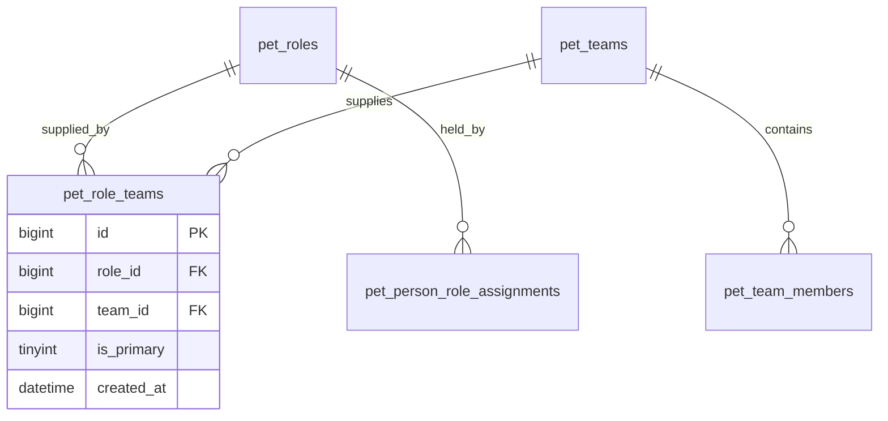

# Data Model — Role–Department Mapping

## Table: pet_role_teams

  Column       Type                     Notes
  ------------ ------------------------ -----------------------------------------
  id           bigint PK                Immutable
  role_id      bigint FK                FK to pet_roles.id, required
  team_id      bigint FK                FK to pet_teams.id, required
  is_primary   tinyint(1)               0 or 1; default 0
  created_at   datetime                 Immutable

## Constraints

- `UNIQUE(role_id, team_id)` — a role-team pair may only exist once.
- `role_id` must reference an existing, non-archived role.
- `team_id` must reference an existing, non-archived team.
- At most **one** row per `role_id` may have `is_primary = 1` (enforced at application layer).

## Domain Meaning

This table answers:

> "Which departments are responsible for supplying this role?"

It represents **organisational structure**, not staffing.

## Relationship to Other Tables

## Independence Rule

This mapping is **independent** of:

- `pet_person_role_assignments` (who holds a role)
- `pet_team_members` (who belongs to a team)

A role may be mapped to a department even if no employee currently holds that role in that department.

## Rules

- No hard deletes. Removing a mapping deletes the row (this is a configuration table, not an event log).
- Archiving a role or team should not cascade-delete mappings; archived entities are excluded at query time.
- Changes to this table do not affect existing quote snapshots.

## Lifecycle Contract

**When does it exist?**
- Created explicitly by an admin via RoleForm.
- May exist before any quotes reference the role.
- May exist before any employees hold the role.
- The system must function correctly with **zero rows**.

**What triggers its creation?**
- Admin action only: `POST /roles/{id}/teams`.
- No other lifecycle event creates rows.

**Creation rules:**
- Rows created exclusively via admin configuration.
- Never as a side-effect of quote, role, team, or assignment lifecycle.
- Valid for roles in any status (including `draft`).

**Mutation rules:**
- Freely editable at any time (configuration table, not transactional).
- Changes have no effect on existing quote snapshots or project tasks.
- Changes take immediate effect for future dropdown renders.

## Prohibited Behaviours

- Must **not** be auto-created on role creation, team creation, quote creation, or quote acceptance.
- Must **not** be inferred from `pet_person_role_assignments` or `pet_team_members`.
- Archiving a role or team must **not** cascade-delete rows.
- Must **not** be treated as an event log or audit trail.
- Changes must **not** retroactively alter any existing quote or project snapshot.

## Usage

- **RoleForm.tsx**: Admin edits role → department mappings
- **QuoteDetails.tsx**: Dropdown reads mappings to build Recommended/Other groups
- **API**: `GET /roles/{id}/teams` and `POST /roles/{id}/teams`
