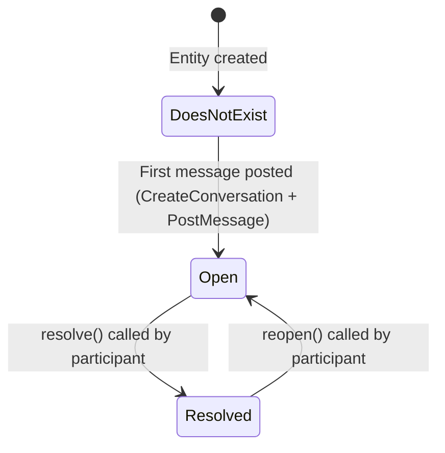
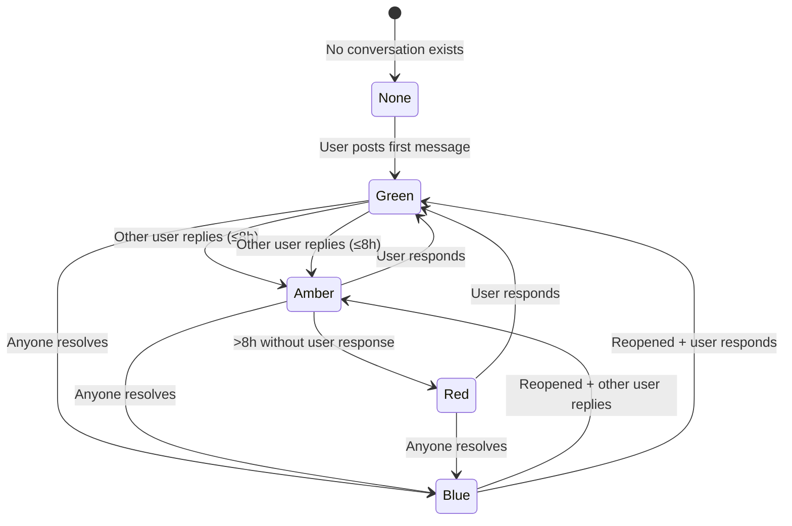
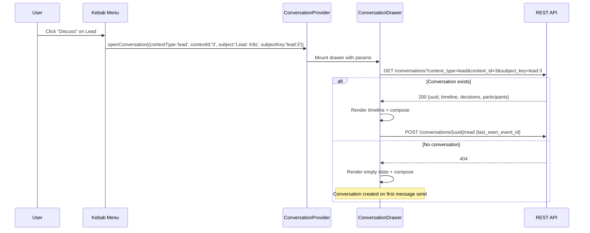
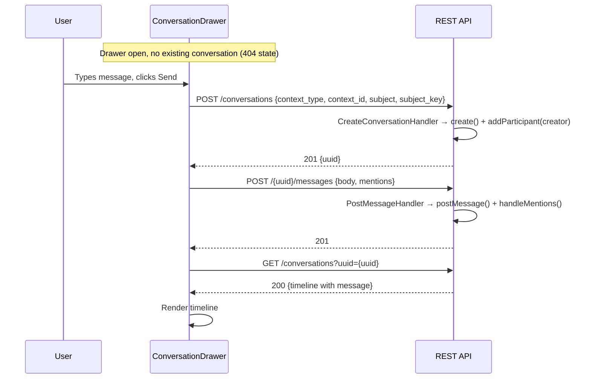
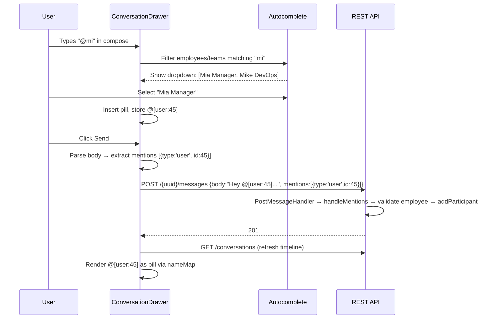
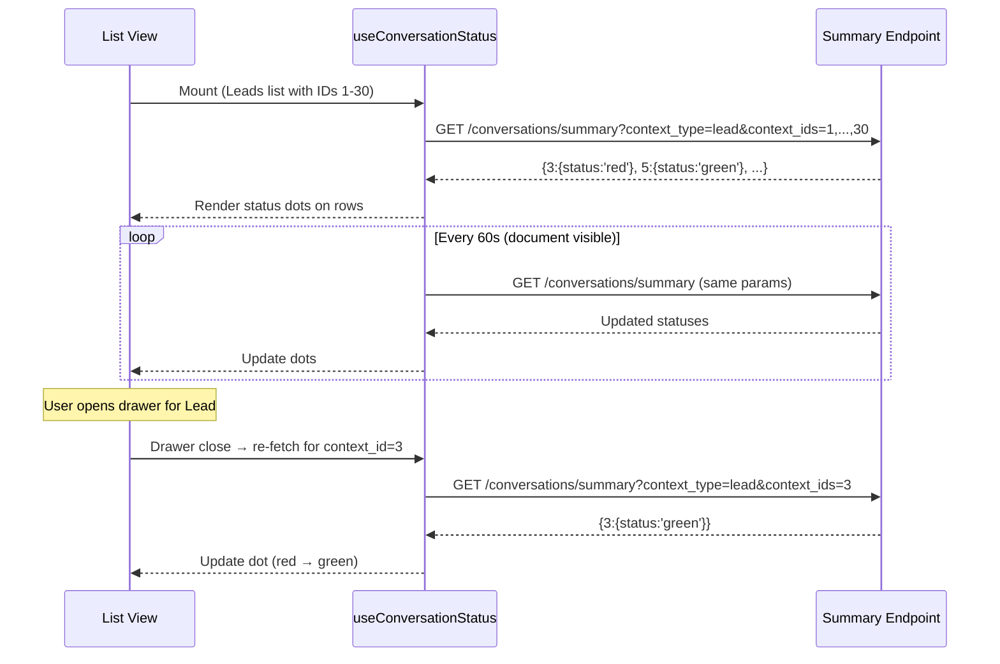
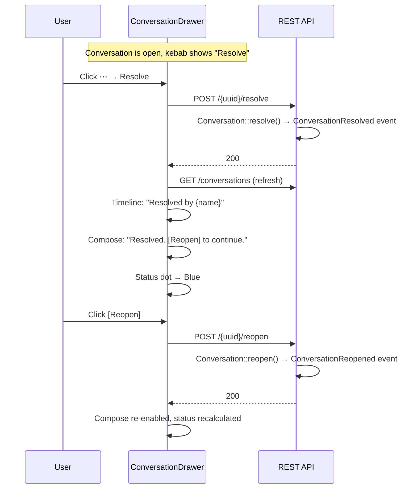
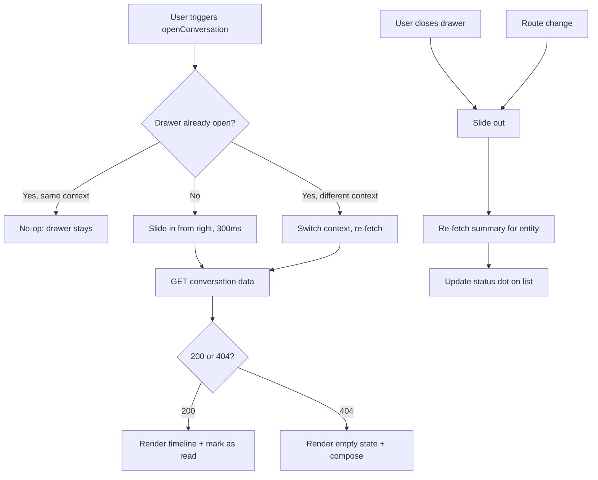
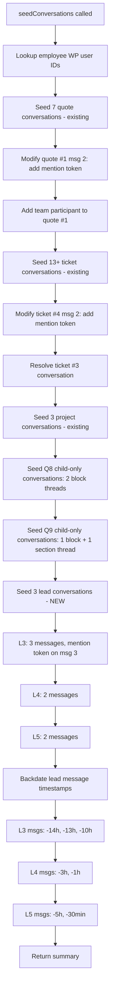

# PET Conversation System — Standardisation Specification (v1.0)

**Status:** Draft (implementation-ready)
**Date:** 2026-03-06
**Scope:** Unified conversation UX across all PET entity types
**Authority:** Normative — supersedes per-entity conversation UI decisions

---

## 0. Problem Statement & Current State

Conversations exist in PET but are delivered through **seven inconsistent patterns**:

- **QuoteDetails** — centred modal (800×600px), per-section & per-block threads, triggered via `setConversationContext` state
- **TicketDetails** — inline panel (embedded), toggle button, supports SLA + main thread switching
- **ProjectDetails** — inline panel (embedded), toggle button, basic implementation
- **ArticleDetails** — inline panel (embedded), toggle button, basic implementation
- **Leads** — inline panel above table, kebab menu trigger, recently added
- **SlaDefinitions** — centred modal (800×600px), kebab menu trigger, identical to quote pattern
- **Conversations page** — full-page list → detail navigation

### What's Missing Globally
- No @mention autocomplete (backend supports `[{type, id}]` via `PostMessageHandler.handleMentions()` but UI sends empty `mentions: []`)
- No conversation status indicators (red/amber/green/blue) on list views
- No participant visibility inside panels
- No resolve/reopen UI (backend endpoints exist: `POST /{uuid}/resolve`, `POST /{uuid}/reopen`)
- No name resolution ("User 45" shown instead of real names)
- No standardised mobile experience
- No deep linking from notifications/activity into conversation threads

### What Exists (backend — complete)
- **Domain entity:** `Conversation.php` — state machine (open ↔ resolved), append-only event sourcing, participant management (user/contact/team)
- **19 event types:** ConversationCreated, MessagePosted, ConversationResolved, ConversationReopened, ParticipantAdded/Removed, ContactParticipantAdded/Removed, TeamParticipantAdded/Removed, ReactionAdded/Removed, RedactionApplied, DecisionRequested/Responded/Finalized/Cancelled
- **Persistence:** 6 tables — `pet_conversations`, `pet_conversation_participants`, `pet_conversation_events`, `pet_conversation_read_state`, `pet_decisions`, `pet_decision_events`
- **REST API:** 15 endpoints on `/pet/v1/conversations/*` — full CRUD, reactions, participants, decisions, mark-as-read, unread-counts, active-subjects, my-conversations, pending-decisions
- **Access control:** `ConversationAccessControl` — participant OR context-based check; non-participants get 404 (not 403)

---

## 1. Structural Specification

### 1.1 Fields

#### 1.1.1 ConversationDrawer (new React component)

| Prop / Internal State | Type | Source | Description |
| :--- | :--- | :--- | :--- |
| `contextType` | string | `openConversation()` param | Entity type: `lead`, `quote`, `ticket`, `project`, `knowledge_article`, `sla` |
| `contextId` | string | `openConversation()` param | Entity primary key |
| `contextVersion` | string? | `openConversation()` param | Only for quotes (version isolation) |
| `subject` | string | `openConversation()` param | Display title in drawer header |
| `subjectKey` | string? | `openConversation()` param | Thread discriminator within context |
| `conversationUuid` | string? | Fetched from API | Set after GET returns existing conversation |
| `conversationState` | `'open'` \| `'resolved'` | Fetched from API | Controls compose bar and kebab menu |
| `timeline` | Event[] | Fetched from API | Append-only event list, newest-first pagination |
| `participants` | Participant[] | Fetched from API | User/contact/team participant list |
| `decisions` | Decision[] | Fetched from API | Inline decision cards |
| `nameMap` | NameMap | `useNameMap()` hook | `{users: Map<id, {name, initials}>, teams: Map<id, {name}>, contacts: Map<id, {name, email}>}` |

#### 1.1.2 Status Indicator (computed per-user, per-conversation)

| Field | Type | Description |
| :--- | :--- | :--- |
| `status` | `'red'` \| `'amber'` \| `'green'` \| `'blue'` \| `'none'` | Computed from header conversation message timing + state (for quotes: scoped to `subject_key = 'quote:{context_id}'`) |
| `unread_count` | int | Events with id > `last_seen_event_id` (header conversation only) |
| `last_message_at` | datetime? | Most recent `MessagePosted` event timestamp (header conversation) |
| `last_message_actor_id` | int? | Actor of most recent message (header conversation) |
| `conversation_state` | `'open'` \| `'resolved'` | Current header conversation state |
| `has_pending_decision` | bool | Any decision in `pending` state |
| `child_discussion_count` | int | Count of non-resolved child conversations where `subject_key != CONCAT(context_type, ':', context_id)`. Always >= 0. |
| `child_worst_status` | `'red'` \| `'amber'` \| `'green'` \| `'blue'` \| `'none'` | Most urgent RAG status among active child conversations (priority: red > amber > green > blue > none). Derived at query time, never persisted. |

**Status derivation rules:**

| Status | Colour | Condition |
| :--- | :--- | :--- |
| **Overdue** | 🔴 Red | Participant AND last message NOT from this user AND message >8h old |
| **Needs attention** | 🟡 Amber | Participant AND last message NOT from this user AND message ≤8h old |
| **Responded** | 🟢 Green | Participant AND last message IS from this user |
| **Concluded** | 🔵 Blue | `conversation.state === 'resolved'` |
| **None** | ⚪ Grey | No conversation exists or user is not a participant |

**Priority:** Blue overrides all (resolved is terminal). Otherwise: Red > Amber > Green.

#### 1.1.3 MentionInput (new React component)

| Field | Type | Description |
| :--- | :--- | :--- |
| `rawText` | string | User-visible text with @mention pills |
| `serialisedBody` | string | Body with `@[user:45]` / `@[team:3]` / `@[contact:12]` tokens |
| `mentions` | `{type, id}[]` | Extracted from serialised tokens before POST |
| `autocompleteQuery` | string? | Text after `@` trigger, used to filter pools |
| `autocompleteResults` | `{type, id, name}[]` | Filtered from employees + teams + contacts |

#### 1.1.4 ConversationProvider (React Context)

```typescript
interface ConversationContextValue {
  openConversation: (params: {
    contextType: string;
    contextId: string;
    contextVersion?: string;
    subject: string;
    subjectKey?: string;
  }) => void;
  closeConversation: () => void;
  isOpen: boolean;
}
```

### 1.2 Invariants

1. **Single drawer instance.** Only one ConversationDrawer may be mounted at any time. Opening a new conversation while one is open replaces the context (no stacking).
2. **Append-only timeline.** Messages cannot be edited or deleted. `RedactionApplied` events blank fields but never remove events.
3. **Conversation-on-first-message.** Opening the drawer for an entity with no conversation does NOT create a conversation record. Creation happens only when the first message is POSTed (via `POST /conversations` then `POST /{uuid}/messages`).
4. **Participant gating.** Timeline content renders only after the backend confirms access (200 from GET). Client-side checks are supplementary, never authoritative.
5. **Last Internal Coverage.** Cannot remove the last internal user participant from a conversation. Backend returns 400; UI disables remove button.
6. **Resolved conversations are read-only.** No messages may be posted to a resolved conversation. Backend enforces via `DomainException`; UI disables compose bar.
7. **Non-participants see nothing.** Summary endpoint returns `"status": "none"` for entities where the user has no participant record. GET returns 404 for non-participants.
8. **Name map never returns raw IDs.** Every `actor_id` in the timeline must resolve to a display name. Fallback: `"User #45"` for unknown/deleted entities.

### 1.3 State Transitions

#### 1.3.1 Conversation State Machine



**Transition rules:**
- `DoesNotExist → Open`: Only via `POST /conversations` + `POST /{uuid}/messages` in sequence. Never auto-created on entity view.
- `Open → Resolved`: `POST /{uuid}/resolve`. Records `ConversationResolved` event. Compose bar disabled. Status indicator → Blue.
- `Resolved → Open`: `POST /{uuid}/reopen`. Records `ConversationReopened` event. Compose bar re-enabled. Status indicator recalculated.
- `Resolved → Resolved`: No-op (domain entity returns silently).
- `Open → Open`: No-op (domain entity returns silently).

#### 1.3.2 Per-User Status Indicator Lifecycle



### 1.4 Events

All events are already implemented in `src/Domain/Conversation/Event/`. The standardisation work adds no new domain events. The drawer must render all existing event types:

| Event Type | Timeline Rendering | Actor Display |
| :--- | :--- | :--- |
| `ConversationCreated` | System: "Conversation started by {name}" | Creator name |
| `MessagePosted` | Message bubble with body, mentions rendered as pills | Author name |
| `ConversationResolved` | System: "Conversation resolved by {name}" | Resolver name |
| `ConversationReopened` | System: "Conversation reopened by {name}" | Reopener name |
| `ParticipantAdded` | System: "{name} was added by {actor}" | Both names |
| `ParticipantRemoved` | System: "{name} was removed by {actor}" | Both names |
| `ContactParticipantAdded` | System: "Contact {name} was added" | Contact + actor names |
| `ContactParticipantRemoved` | System: "Contact {name} was removed" | Contact + actor names |
| `TeamParticipantAdded` | System: "Team {name} was added" | Team + actor names |
| `TeamParticipantRemoved` | System: "Team {name} was removed" | Team + actor names |
| `ReactionAdded` | Reaction count on parent message updates | Tooltip shows names |
| `ReactionRemoved` | Reaction count on parent message decrements | — |
| `RedactionApplied` | Affected message shows "[redacted]" for blanked fields | — |
| `DecisionRequested` | In-stream decision card with [Approve]/[Reject] buttons | Requester name |
| `DecisionResponded` | Decision card updates with outcome | Responder name |
| `DecisionFinalized` | Decision card shows final state | Finalizer name |
| `DecisionCancelled` | Decision card shows "Cancelled" | Canceller name |

### 1.5 Persistence

#### 1.5.1 Existing Tables (no schema changes)

**`pet_conversations`:**
`id` (PK), `uuid` (unique), `context_type` (varchar 50), `context_id` (char 36), `context_version` (varchar 50, nullable), `subject` (text), `subject_key` (varchar 50, nullable), `state` (varchar 20), `created_at` (datetime)
Indexes: `uuid`, `context_idx (context_type, context_id)`, `subject_key_idx`, `context_lookup_idx (context_type, context_id, context_version, subject_key)`, `context_version_idx`

**`pet_conversation_participants`:**
`conversation_id`, `user_id` (nullable), `contact_id` (nullable), `team_id` (nullable), `added_at` (datetime)
Unique indexes: `unique_user_participant (conversation_id, user_id)`, `unique_contact_participant (conversation_id, contact_id)`, `unique_team_participant (conversation_id, team_id)`

**`pet_conversation_events`:**
`id` (PK, auto-increment), `conversation_id`, `reply_to_message_id` (nullable), `event_type` (varchar 100), `payload` (json), `occurred_at` (datetime), `actor_id`
Index: `conversation_time_idx (conversation_id, occurred_at)`, `reply_idx (reply_to_message_id)`

**`pet_conversation_read_state`:**
`conversation_id`, `user_id` — composite PK. `last_seen_event_id` (bigint)

**`pet_decisions`:**
`id` (PK), `uuid` (unique), `conversation_id`, `decision_type`, `state`, `payload` (json), `policy_snapshot` (json), `requested_at`, `requester_id`, `finalized_at`, `finalizer_id`, `outcome`, `outcome_comment`

**`pet_decision_events`:**
`id` (PK), `decision_id`, `event_type`, `payload` (json), `occurred_at`, `actor_id`

#### 1.5.2 Query Method: getSummaryForContexts (no schema changes)

`SqlConversationRepository::getSummaryForContexts(string $contextType, array $contextIds, int $userId): array`

Executes two queries per call:

**Part 1 — Header status:** Selects the latest conversation per `context_id` where `subject_key = CONCAT(contextType, ':', context_id)`. Joins to events for last message actor/timestamp and to read_state for unread counts. Status computed in PHP via `computeRagStatus()`: if `state === 'resolved'` → blue; else if `last_msg_actor_id === userId` → green; else if `last_msg_at < now - 8h` → red; else → amber.

**Part 2 — Child aggregate:** For each `context_id`, selects all conversations where `subject_key != CONCAT(contextType, ':', context_id)` AND `state != 'resolved'`. Counts active children and computes worst RAG status across them using the same `computeRagStatus()` rules (priority: red > amber > green > blue > none).

Both parts are merged by `context_id`. Context IDs that have children but no header conversation are included in the response with `status: 'none'` and `child_discussion_count > 0`.

**Performance:** Batched (max 50 IDs). Two queries, both using indexed lookups on `(context_type, context_id)` and `subject_key`. No N+1.

#### 1.5.3 Repository Interface: findByContext strict mode

`ConversationRepository::findByContext(string $contextType, string $contextId, ?string $contextVersion = null, ?string $subjectKey = null, bool $strict = false): ?Conversation`

When `$strict = false` (default): if no exact match for the given `subject_key` is found, falls back to the most recent conversation for the context regardless of `subject_key` (backward-compatible behaviour).

When `$strict = true`: no fallback. Returns `null` if no conversation matches the exact `subject_key`. Used by `CreateConversationHandler` to prevent false duplicate detection when creating child conversations.

### 1.6 API

#### 1.6.1 Existing Endpoints (no changes)

| Method | Route | Purpose |
| :--- | :--- | :--- |
| POST | `/conversations` | Create conversation |
| GET | `/conversations` | Get by uuid or context params |
| POST | `/{uuid}/messages` | Post message (with mentions, attachments, reply_to) |
| POST | `/{uuid}/resolve` | Resolve conversation |
| POST | `/{uuid}/reopen` | Reopen conversation |
| POST | `/{uuid}/read` | Mark as read (last_seen_event_id) |
| POST | `/{uuid}/messages/{id}/reactions` | Add reaction |
| DELETE | `/{uuid}/messages/{id}/reactions/{type}` | Remove reaction |
| POST | `/{uuid}/participants/add` | Add participant (user/contact/team) |
| POST | `/{uuid}/participants/remove` | Remove participant |
| POST | `/{uuid}/decisions` | Request decision |
| POST | `/decisions/{uuid}/respond` | Respond to decision |
| GET | `/conversations/unread-counts` | Unread counts per conversation |
| GET | `/conversations/active-subjects` | Open subject keys for a context |
| GET | `/conversations/me` | User's recent conversations |
| GET | `/decisions/pending` | User's pending decisions |

#### 1.6.2 New Endpoint

```
GET /pet/v1/conversations/summary?context_type={type}&context_ids={comma-separated ids}
```

**Request params:**
- `context_type` (required): Entity type string
- `context_ids` (required): Comma-separated entity IDs (max 50)

**Response:** Map of `context_id → status object`
```json
{
  "3": {
    "status": "red",
    "unread_count": 3,
    "last_message_at": "2026-03-06T08:00:00Z",
    "last_message_actor_id": 45,
    "conversation_state": "open",
    "has_pending_decision": false,
    "child_discussion_count": 4,
    "child_worst_status": "amber"
  },
  "5": {
    "status": "none",
    "unread_count": 0,
    "child_discussion_count": 2,
    "child_worst_status": "green"
  }
}
```

Quotes with no header conversation but active children appear with `status: 'none'` and `child_discussion_count > 0`. Quotes with no conversations at all do not appear in the response.

---

## 2. Lifecycle Integration Contract

### 2.1 Render Rules

**When MUST the ConversationDrawer render:**
- When `ConversationProvider.isOpen === true` — i.e. after any component calls `openConversation()`
- The drawer renders regardless of whether a conversation record exists yet (empty state with compose bar is valid)

**When MUST the ConversationDrawer NOT render:**
- When no `openConversation()` call has been made (initial state)
- After `closeConversation()` is called
- After a route change (drawer auto-closes on navigation)

**When MUST status indicator dots render on list views:**
- On every DataTable row for entities that support conversations (leads, quotes, tickets, projects, KB articles, SLA definitions)
- Inside the "Discuss" kebab menu item
- Dots render ONLY after the summary endpoint returns; while loading, show nothing (not a spinner)

**When MUST the child discussion badge render (Quotes list only):**
- When `child_discussion_count > 0` for a quote
- Badge shows a chat-bubble icon + count, coloured by `child_worst_status` using the same `statusColors` map
- Badge is positioned between the header dot (if present) and the title text
- `onClick` navigates into QuoteDetails (where per-block/section notification dots are visible)
- `title` tooltip: `"{N} active discussion(s) on line items — click to view"`
- `e.stopPropagation()` to prevent row selection
- The header dot and child badge are independent — both, either, or neither may render

**When MUST status indicator dots NOT render:**
- On entities where the user is not a participant (summary returns `"status": "none"`) and `child_discussion_count === 0`
- On entities that have never had a conversation (not present in summary response)
- During initial page load before the summary fetch completes

**When MUST the compose bar be disabled:**
- When `conversation.state === 'resolved'` — show: "This conversation has been resolved. [Reopen] to continue."
- When a POST is in flight (send button disabled, input remains editable)

**When MUST @mention autocomplete render:**
- When user types `@` followed by ≥1 character in the compose input
- Dropdown appears above compose bar, inside the drawer
- Maximum 8 results, grouped: 👤 Users, 👥 Teams, 📇 Contacts (contacts only if context has customer association)

**When MUST @mention autocomplete NOT render:**
- When compose bar is disabled (resolved conversation)
- When `@` is not the trigger (e.g. email addresses mid-word should not trigger)
- When the character after `@` is whitespace

**ConversationDrawer dimensions:**
- Desktop: `width: 440px`, full viewport height, fixed right edge
- Tablet (≤1024px): `width: 360px`
- Mobile (≤768px): Full-screen sheet (`width: 100vw`, `height: 100vh`)

**Visual layout:**
```
┌─────────────────────────────────┬──────────────┐
│                                 │  DRAWER      │
│    Page content remains         │  ┌─────────┐ │
│    visible and interactive      │  │ Header  │ │
│    (dimmed overlay optional)    │  │─────────│ │
│                                 │  │         │ │
│                                 │  │Timeline │ │
│                                 │  │         │ │
│                                 │  │─────────│ │
│                                 │  │Compose  │ │
│                                 │  └─────────┘ │
└─────────────────────────────────┴──────────────┘
```

**Drawer header:**
```
┌──────────────────────────────────┐
│ [←] Subject Title        [⋯] [×]│  ← Header (sticky)
│ ● Status    3 participants       │
├──────────────────────────────────┤
```
- Back arrow (←): Only shown when navigated from sub-thread
- Participant count: Clickable → participant list popover
- Kebab (⋯): Resolve/Reopen, View participants, Copy link
- Close (×): Closes drawer

**Compose bar:**
```
├──────────────────────────────────┤
│ ↩ Replying to Mia: "Can we…" ×  │  ← Reply context (conditional)
│ @┆ Type a message…      [Send]  │  ← Compose bar (sticky bottom)
└──────────────────────────────────┘
```
- `Enter` sends; `Shift+Enter` newline
- Reply context bar shown when replying to a message

**Participant list popover** (click participant count):
```
┌──────────────────────────────┐
│ Participants (3)             │
│ ────────────────────────────  │
│ 👤 Mia Manager (creator)    │
│ 👤 Ava Consultant           │
│ 👥 Support Team             │
│ ────────────────────────────  │
│ + Add participant            │
└──────────────────────────────┘
```

**Kebab menu (drawer header):**
```
┌───────────────────────┐
│ ✅ Resolve             │  ← Only when state = 'open'
│ 🔓 Reopen             │  ← Only when state = 'resolved'
│ ─────────────────────  │
│ 👥 View participants   │
│ 🔗 Copy link           │
└───────────────────────┘
```

**WP sidebar badges:**
PET menu items (Leads, Delivery, Support, etc.) show a numeric count badge when user has ≥1 red or amber conversations in that section. Uses standard `add_menu_page` count badge pattern.

**@mention pill styling:**
`background: #e8f0fe; color: #1a73e8; border-radius: 3px; padding: 0 4px; font-weight: 500`

### 2.2 Creation Rules

**When does a Conversation exist in the lifecycle of the parent entity?**

A conversation record is created ONLY when the first message is posted. Not on:
- Entity creation (lead created, quote created, ticket opened, project created, article published, SLA defined)
- Drawer opening (viewing the empty state does NOT create a record)
- Navigation to an entity detail page
- @mention autocomplete activation

**What triggers conversation creation?**

1. User opens drawer via `openConversation()` → GET returns 404 → empty state rendered
2. User types message and clicks Send
3. Frontend calls `POST /conversations` with `{context_type, context_id, subject, subject_key, context_version?}` → returns `{uuid}`
4. Frontend immediately calls `POST /{uuid}/messages` with `{body, mentions, attachments}`
5. Both calls inside a single user action (Send button handler)

**Smart participant seeding on creation:**

| Context Type | Auto-added participants | Source |
| :--- | :--- | :--- |
| `quote` | Customer contacts + creator | `CreateConversationHandler.handleQuoteParticipants()` (existing) |
| `ticket` | Creator only | Creator auto-added (existing) |
| `project` | Creator only | Creator auto-added (existing) |
| `lead` | Creator only | Creator auto-added |
| `knowledge_article` | Creator only | Creator auto-added |
| `sla` | Creator only | Creator auto-added |

**Implicit participant rule (existing):** Any user who posts a message is auto-added as participant if not already present (`PostMessageHandler` lines 61-63).

**@mention auto-add rule (existing):** Any user/team/contact mentioned in a message is auto-added as participant (`PostMessageHandler.handleMentions()` lines 73-101).

### 2.3 Mutation Rules

**What mutations are allowed on a conversation?**

| Mutation | When Allowed | When Prohibited |
| :--- | :--- | :--- |
| Post message | `state === 'open'` | `state === 'resolved'` (backend throws `DomainException`) |
| Add reaction | Always (on any existing message) | — |
| Remove reaction | Only own reactions | Others' reactions |
| Add participant | `state === 'open'` or `'resolved'` | — |
| Remove participant | When >1 internal participant remains | Last internal participant (400 error) |
| Resolve | `state === 'open'` | `state === 'resolved'` (no-op) |
| Reopen | `state === 'resolved'` | `state === 'open'` (no-op) |
| Request decision | `state === 'open'` | `state === 'resolved'` |
| Respond to decision | Decision `state === 'pending'` | Decision already finalized/cancelled |
| Redact | Always (admin only) | — |

**What mutations happen to conversations when the parent entity changes?**

| Parent Entity Change | Effect on Conversation |
| :--- | :--- |
| Lead converted to quote | Conversation remains on lead. New quote gets its own conversations. No migration. |
| Lead disqualified | Conversation remains accessible. No state change. |
| Quote accepted | Conversation remains. Project may get its own conversations. |
| Quote new version created | New version isolated by `context_version`. Old conversations remain accessible. |
| Ticket closed | Conversation remains accessible. NOT auto-resolved. |
| Project completed | Conversation remains accessible. NOT auto-resolved. |
| Article archived | Conversation remains accessible. |
| Entity deleted | Conversations orphaned but remain in DB. Drawer shows "Entity not found" via deep link. |

**Conversation state does NOT cascade from parent entity state.** A ticket being closed does not resolve its conversation. These are independent lifecycle decisions.

---

## 3. Negative Guarantees (Prohibited Behaviours)

1. **Must NOT auto-create conversation on entity creation.** No conversation record is created when a lead, quote, ticket, project, article, or SLA is created. Conversations exist only after the first message.

2. **Must NOT auto-create conversation on drawer open.** Opening the drawer for an entity with no conversation shows an empty state with compose bar. The GET returns 404 and the UI handles this gracefully.

3. **Must NOT render unless drawer is explicitly opened.** ConversationPanel/ConversationDrawer is never pre-mounted or hidden. It mounts only in response to `openConversation()`.

4. **Must NOT allow inline panels after standardisation.** Once migration is complete, `ConversationPanel` must ONLY be rendered inside `ConversationDrawer`. No component may embed it directly (QuoteDetails modal, TicketDetails inline, ProjectDetails inline, ArticleDetails inline, Leads inline — all removed).

5. **Must NOT leak conversation existence to non-participants.** All conversation endpoints return 404 (not 403) for non-participants. Summary endpoint returns `"status": "none"`. No information leakage via error codes.

6. **Must NOT show stale status indicators.** When a user opens and reads/responds to a conversation, the status dot MUST update on drawer close. The summary is re-fetched for the discussed entity.

7. **Must NOT allow message editing or deletion.** Append-only invariant is absolute. No UI affordance for edit/delete. Only `RedactionApplied` can blank specific fields (admin-only operation).

8. **Must NOT inject default conversations.** No entity starts with a pre-created empty conversation. No "Welcome to the conversation" auto-message.

9. **Must NOT mutate conversation state based on parent entity state.** Closing a ticket does not resolve its conversation. Completing a project does not resolve its conversation. Converting a lead does not resolve its conversation.

10. **Must NOT render @mention tokens as raw text.** `@[user:45]` in message bodies must always resolve to display name pills. Fallback: `@User #45` for unknown/deleted entities. Never show the raw token.

11. **Must NOT allow posting to resolved conversations.** Compose bar disabled when `state === 'resolved'`. Backend enforces independently. Double protection.

12. **Must NOT break the resolve/reopen state machine.** UI shows "Resolve" only when `state === 'open'`; "Reopen" only when `state === 'resolved'`. Never both.

13. **Must NOT introduce WebSocket dependencies.** Polling at 60-second intervals is the only acceptable real-time strategy. PET runs on standard WordPress hosting.

14. **Must NOT bypass participant checks client-side.** The drawer must NOT render timeline content unless the backend confirms access (200 response). Client-side role checks are supplementary hints only.

---

## 4. Stress-Test Scenarios

### ST-1: New lead — conversation should not exist
**Setup:** Create a new lead via the form.
**Expected:** No conversation record in `pet_conversations` for this lead. Status indicator shows ⚪ (none). Opening drawer shows empty state with compose bar. No conversation UUID assigned.
**Verify query:** `SELECT * FROM pet_conversations WHERE context_type = 'lead' AND context_id = {new_lead_id}` → 0 rows.

### ST-2: Lead with conversation → disqualified — conversation survives
**Setup:** Create a conversation on a lead (post 3 messages). Then disqualify the lead.
**Expected:** Lead status changes to `disqualified`. Conversation remains `open`. All messages still visible in drawer. Status indicator still shows green (user's last message) or amber/red.
**Verify:** Conversation `state` is still `open` after disqualification.

### ST-3: Lead converted to quote — conversation stays on lead, not copied
**Setup:** Create a conversation on a lead. Convert lead to quote.
**Expected:** Lead conversation remains accessible via `context_type = 'lead'`. No conversation auto-created on the new quote. Quote starts with ⚪ (none).
**Verify:** `SELECT * FROM pet_conversations WHERE context_type = 'quote' AND context_id = {new_quote_id}` → 0 rows.

### ST-4: Resolved conversation — cannot post
**Setup:** Create conversation with 5 messages. Resolve it. Attempt to type and send a message.
**Expected:** Compose bar shows "This conversation has been resolved. [Reopen] to continue." Send button hidden/disabled. API returns 400 with `DomainException`. Status indicator → 🔵 Blue.

### ST-5: Resolved then reopened — compose bar restores
**Setup:** Resolve a conversation. Click Reopen from kebab menu.
**Expected:** Timeline shows "Conversation reopened by {name}". Compose bar re-enables. Status indicator recalculates (amber/green based on last message).

### ST-6: Rapid @mention in large org (50+ employees, 10+ teams)
**Setup:** 60 employees, 15 teams. User types `@` then 1 character.
**Verify:** Autocomplete appears within 200ms. Results correctly filtered and grouped (👤/👥/📇). Selecting inserts correct token. Keyboard nav (↑/↓/Enter) works.

### ST-7: Conversation with 200+ messages — pagination
**Setup:** Quote conversation with 250 messages from 5 participants.
**Verify:** Initial load shows most recent 20 messages. "Load earlier" works 10+ times. Timeline scroll smooth. Memory stable. Name resolution works for all 5 participants.

### ST-8: Status indicator bulk load (30 leads on list page)
**Setup:** Leads list with 30 items. 8 have conversations: 3 red, 2 amber, 2 green, 1 blue.
**Verify:** `GET /conversations/summary?context_type=lead&context_ids=1,2,...,30` returns in ≤200ms. No N+1 queries. All dots render correctly. Remaining 22 show no dot.

### ST-9: Two users viewing same conversation — polling consistency
**Setup:** Two users have the same conversation open. User A posts a message.
**Verify:** User B sees the message on next poll (≤60s). User A's status → green. User B's status → amber (≤8h) or red (>8h).

### ST-10: Mobile full-screen sheet
**Setup:** iPhone SE (375px viewport). Open conversation from Leads kebab.
**Verify:** Drawer is full-screen. Compose bar above keyboard (`env(safe-area-inset-bottom)`). Timeline scrolls correctly. @mention dropdown fits. Close button returns to leads list. No horizontal overflow.

### ST-11: @mention non-participant triggers auto-add
**Setup:** Mention @Ava in conversation where Ava is not a participant.
**Verify:** Message posts. Ava auto-added (ParticipantAdded event in timeline). Ava can now see conversation. Status indicator appears for Ava.

### ST-12: Last Internal Coverage — cannot remove self
**Setup:** Conversation with only one internal user participant.
**Verify:** Remove button disabled/hidden. `POST /participants/remove` returns 400. Error explains constraint.

### ST-13: Deep link from activity feed
**Setup:** Activity feed shows "Mia commented on Lead: K8s Migration".
**Verify:** Click navigates to correct PET page. Drawer opens to correct conversation. Timeline scrolls to referenced event. Mark-as-read fires.

### ST-14: Opening drawer for different entity while one is open
**Setup:** Open conversation for Lead #3. While drawer is open, click "Discuss" on Lead #5 from the list.
**Verify:** Drawer context switches to Lead #5. Previous conversation data replaced. No stacking. Timeline shows Lead #5 data.

### ST-15: No conversation on fresh entity — send first message
**Setup:** Brand new lead, no conversation history.
**Verify:** Status indicator ⚪. Open drawer → empty state. Type message → Send. Conversation created atomically. Status updates to green on drawer close. Subsequent opens show the message.

---

## 5. Process Flows

### 5.1 Opening a Conversation from a List View



### 5.2 Posting First Message (Conversation Creation)



### 5.3 Posting a Message with @Mention



### 5.4 Status Indicator Polling Lifecycle



### 5.5 Resolve / Reopen Flow



### 5.6 Drawer Open/Close Lifecycle



---

## 6. Entry Point Standardisation

### 6.1 Components to Migrate

| Component | Current Pattern | Remove | Replace With |
| :--- | :--- | :--- | :--- |
| QuoteDetails | `conversationContext` state + centred modal | Modal div, state | `openConversation({contextType:'quote', ...})` |
| TicketDetails | `activeConversation` state + inline panel | Inline panel, state | `openConversation({contextType:'ticket', ...})` |
| ProjectDetails | `showConversation` state + inline panel | Inline panel, state | `openConversation({contextType:'project', ...})` |
| ArticleDetails | `showConversation` state + inline panel | Inline panel, state | `openConversation({contextType:'knowledge_article', ...})` |
| Leads | `discussingLead` state + inline panel | Inline panel, state | `openConversation({contextType:'lead', ...})` |
| SlaDefinitions | `discussingSla` state + centred modal | Modal div, state | `openConversation({contextType:'sla', ...})` |
| Support (list) | Kebab → navigate to TicketDetails with flag | Navigation redirect | `openConversation({contextType:'ticket', ...})` directly |
| Conversations page | Full-page detail | Detail rendering | Row click → `openConversation()` (list stays visible) |

### 6.2 Kebab Menu Standard

Every entity list supporting conversations includes a "Discuss" item with status dot:

```typescript
{
  type: 'action',
  label: 'Discuss',
  icon: statusDot,
  onClick: () => openConversation({
    contextType: 'lead',
    contextId: String(item.id),
    subject: `Lead: ${item.subject}`,
    subjectKey: `lead:${item.id}`,
  }),
}
```

### 6.3 Detail View Standard

Every detail view includes a "Discuss" button in its header:

```typescript
<button
  className={`button ${isConversationOpen ? 'button-primary' : ''}`}
  onClick={() => openConversation({ ... })}
>
  {statusDot} Discuss
</button>
```

---

## 7. Deep Linking

### 7.1 URL Format

Context-based: `?page=pet-sales#discuss=lead:3`
Direct: `?page=pet-delivery#conversation={uuid}&event={event_id}`

### 7.2 Resolution Flow

1. Page loads and renders normally
2. Parse URL fragment for `discuss=` or `conversation=` params
3. If `discuss={type}:{id}` → call `openConversation({contextType: type, contextId: id, ...})`
4. If `conversation={uuid}&event={id}` → open drawer, scroll to event
5. Mark as read up to the specified event

### 7.3 Activity Feed Integration

Activity feed items with `reference_type = 'conversation'` → deep link. Click: navigate to correct page → open drawer → scroll to event.

---

## 8. Mobile Considerations

### 8.1 Full-Screen Sheet (≤768px)
- `width: 100vw; height: 100vh; position: fixed; top: 0; left: 0`
- Header sticky top, compose sticky bottom with `bottom: env(safe-area-inset-bottom)`
- Timeline scrolls between them
- Close (×) returns to page

### 8.2 Keyboard Handling
- Virtual keyboard pushes compose bar up
- Timeline auto-scrolls to latest message
- `position: fixed` compose bar adjusts for keyboard height

### 8.3 Touch
- Swipe right to close (tablet only; not mobile full-screen)
- Long-press on message → reaction picker
- Tap outside autocomplete → dismiss

---

## 9. Demo Seed Specification

### 9.1 Current Seed State

`DemoSeedService::seedConversations()` seeds:
- **7 quote header conversations** (Q1–Q7) — all `state: open`, 2-4 messages each, multiple actors
- **Child (line-item) conversations** seeded for Q1, BQ1, BQ2 (block + section threads) and Q8, Q9 (child-only, no header)
- **13+ ticket conversations** — explicit messages for first 13, fallback templates with rotating actors for the rest
- **3 project conversations** — 2-3 messages each

**Quote child indicator demo data:** Q8 has 2 block conversations (no header), Q9 has 1 block + 1 section conversation (no header). These demonstrate the child-badge-only scenario on the Quotes list.

### 9.2 Gaps in Current Seed

| Gap | Impact |
| :--- | :--- |
| No lead conversations | Cannot demo status indicators on Leads list |
| No resolved conversations | Cannot demo 🔵 Blue indicator |
| No @mention tokens in bodies | Cannot demo mention pill rendering |
| No time-varied messages | All statuses compute as 🟢 Green (last poster = seed user = current user) |
| No team participants | Cannot demo team in participant popover |
| No conversations where current user is NOT the last poster | Cannot demo 🔴 Red or 🟡 Amber |

### 9.3 New Seed: Lead Conversations

Add after the project conversations block. Three lead conversations targeting three different status states:

**L3 (K8s Migration, qualified) — 🔴 RED target:**
- Message 1: Current user, backdated -14h: "Nexus wants a full K8s readiness assessment. Tariq mentioned they have 12 microservices currently on Docker Compose."
- Message 2: Ethan, backdated -13h: "I can scope the assessment. We should check their CI/CD maturity first — if they are still using manual deploys, the migration path is different."
- Message 3: Mia, backdated -10h: "@[user:{currentUserId}] Can you confirm the budget range with Tariq before we commit engineering hours?"
- **Mentions array on msg 3:** `[{type: 'user', id: currentUserId}]`
- **Status logic:** Last message from Mia (not current user), >8h ago → 🔴

**L4 (Security Audit RFP, new) — 🟡 AMBER target:**
- Message 1: Current user, backdated -3h: "Government RFP received. Deadline is end of month. Isabella, can you review the compliance requirements?"
- Message 2: Isabella, backdated -1h: "Reviewed the RFP. They require ISO 27001 alignment and POPIA compliance audit. I can draft the response framework."
- **Status logic:** Last message from Isabella (not current user), <8h ago → 🟡

**L5 (Managed Backup Add-on, new) — 🟢 GREEN target:**
- Message 1: Noah, backdated -5h: "RPM asked about managed backup pricing. Their current setup is 2TB across both sites."
- Message 2: Current user, backdated -30min: "I will add this to the renewal quote. Standard pricing for 2TB managed backup is R850/month per site."
- **Status logic:** Last message from current user → 🟢

**L1 (converted), L2 (converted), L6 (disqualified):** No conversations seeded → ⚪ None.

### 9.4 New Seed: Resolved Conversation (🔵 Blue)

After seeding ticket conversations, resolve one:

**Target:** Ticket #3 (Server alert — "CPU at 92%"). After seeding its 3 messages, call:
```php
$resolveHandler->handle(new ResolveConversationCommand($convUuid, $noahId));
```

This adds a `ConversationResolved` event and sets `state = 'resolved'`. Status indicator → 🔵 Blue on the ticket list.

### 9.5 Modify Existing Seed: @Mention Tokens

Update these existing messages to include mention tokens:

**Quote conv #1, message 2 (Mia):**
Current body: `'Looks good. The payment schedule split 50/50 works for RPM. Can we confirm the advisory pack pricing with Ava?'`
New body: `'Looks good. The payment schedule split 50/50 works for RPM. Can we confirm the advisory pack pricing with @[user:' . $avaId . ']?'`
Mentions: `[['type' => 'user', 'id' => $avaId]]`

**Ticket conv #4, message 2 (current user):**
Current body: `'Ticket escalated — SLA is tight on this one. @Noah can you provision today?'`
New body: `'Ticket escalated — SLA is tight on this one. @[user:' . $noahId . '] can you provision today?'`
Mentions: `[['type' => 'user', 'id' => $noahId]]`

### 9.6 New Seed: Team Participant

After creating quote conversation #1 (RPM Website), add the Support team:
```php
$addParticipant->handle(new AddParticipantCommand($convUuid, 'team', $supportTeamId, $currentUserId));
```

### 9.7 Message Time Backdating Pattern

Since `PostMessageHandler` always uses `new DateTimeImmutable()`, lead conversation messages need post-insert backdating:

```php
// After posting all messages for a lead conversation:
$convId = $wpdb->get_var($wpdb->prepare(
    "SELECT id FROM {$wpdb->prefix}pet_conversations WHERE uuid = %s", $convUuid
));
$events = $wpdb->get_results($wpdb->prepare(
    "SELECT id FROM {$wpdb->prefix}pet_conversation_events 
     WHERE conversation_id = %d AND event_type = 'MessagePosted' ORDER BY id ASC",
    $convId
));
foreach ($events as $i => $event) {
    $wpdb->update(
        $wpdb->prefix . 'pet_conversation_events',
        ['occurred_at' => $now->modify($messages[$i]['age'])->format('Y-m-d H:i:s')],
        ['id' => $event->id]
    );
}
```

### 9.8 Seed Process Flow



### 9.9 Seed Verification Queries

```sql
-- Context type distribution
SELECT context_type, COUNT(*) FROM wp_pet_conversations GROUP BY context_type;
-- Expected: quote:7 header + child conversations for Q1/BQ1/BQ2/Q8/Q9, ticket:13+, project:3, lead:3

-- Resolved conversation exists
SELECT uuid, state FROM wp_pet_conversations WHERE state = 'resolved';
-- Expected: 1 row (ticket #3)

-- @mention tokens in message bodies
SELECT COUNT(*) FROM wp_pet_conversation_events 
WHERE event_type = 'MessagePosted' AND payload LIKE '%@\[user:%';
-- Expected: ≥3 (quote#1, ticket#4, lead#3)

-- Team participant exists
SELECT * FROM wp_pet_conversation_participants WHERE team_id IS NOT NULL;
-- Expected: ≥1 row (Support team on quote#1)

-- Time-varied messages (lead conversations)
SELECT e.occurred_at, e.actor_id, c.context_type, c.context_id
FROM wp_pet_conversation_events e
JOIN wp_pet_conversations c ON c.id = e.conversation_id
WHERE c.context_type = 'lead' AND e.event_type = 'MessagePosted'
ORDER BY c.context_id, e.occurred_at;
-- Expected: messages with varied timestamps, not all identical
```

---

## 10. Implementation Sequence

### Phase 1: Foundation (ConversationDrawer + Provider)
1. Create `ConversationDrawer.tsx` (slide-over shell with header, timeline, compose)
2. Create `ConversationProvider.tsx` (React Context with `openConversation` / `closeConversation`)
3. Create `conversation-drawer.css`
4. Create `useConversation.ts` hook
5. Wrap admin app root in `ConversationProvider`
6. Migrate QuoteDetails and SlaDefinitions to use drawer

### Phase 2: Name Resolution + Resolve/Reopen
7. Create `useNameMap.ts` hook
8. Update timeline rendering (real names instead of "User 45")
9. Add Resolve/Reopen to drawer kebab menu
10. Render system events (resolved, reopened) in timeline

### Phase 3: @Mention Autocomplete
11. Create `MentionInput.tsx`
12. Wire `mentions` array into POST payload
13. Render `@[type:id]` tokens as styled pills in timeline

### Phase 4: Status Indicators
14. Implement `GET /conversations/summary` endpoint + `getSummaryForContexts()` repo method
15. Create `useConversationStatus.ts` hook
16. Add status dots to DataTable rows and KebabMenu
17. Add WP sidebar badge counts

### Phase 5: Standardise All Entry Points
18. Migrate TicketDetails, ProjectDetails, ArticleDetails, Leads, Support to drawer
19. Remove all inline ConversationPanel mounts
20. Remove per-component conversation state variables
21. Update Conversations page to use drawer

### Phase 6: Mobile + Deep Linking
22. Responsive drawer (full-screen ≤768px)
23. Deep link parsing from URL fragments
24. Activity feed click → drawer integration

### Phase 7: Demo Seed
25. Add 3 lead conversations with time-varied messages
26. Add @mention tokens to existing seed messages
27. Resolve ticket #3 conversation
28. Add team participant to quote #1
29. Backdate timestamps for status indicator testing

---

## 11. Files Affected

### New Files
- `src/UI/Admin/components/ConversationDrawer.tsx`
- `src/UI/Admin/components/ConversationProvider.tsx`
- `src/UI/Admin/components/MentionInput.tsx`
- `src/UI/Admin/hooks/useConversation.ts`
- `src/UI/Admin/hooks/useNameMap.ts`
- `src/UI/Admin/hooks/useConversationStatus.ts`
- `src/UI/Admin/styles/conversation-drawer.css`

### Modified Files (entry point standardisation)
- `src/UI/Admin/components/QuoteDetails.tsx` — remove modal, use `openConversation()`
- `src/UI/Admin/components/TicketDetails.tsx` — remove inline panel, use `openConversation()`
- `src/UI/Admin/components/ProjectDetails.tsx` — remove inline panel, use `openConversation()`
- `src/UI/Admin/components/ArticleDetails.tsx` — remove inline panel, use `openConversation()`
- `src/UI/Admin/components/Leads.tsx` — remove inline panel, use `openConversation()`
- `src/UI/Admin/components/SlaDefinitions.tsx` — remove modal, use `openConversation()`
- `src/UI/Admin/components/Support.tsx` — add Discuss kebab with status dot
- `src/UI/Admin/components/KebabMenu.tsx` — add optional status dot rendering
- `src/UI/Admin/components/ConversationPanel.tsx` — refactor for nameMap, resolve/reopen, mention rendering
- `src/UI/Admin/components/Conversations.tsx` — drawer instead of full-page detail
- `src/UI/Admin/components/App.tsx` — wrap in `ConversationProvider`

### Backend
- `src/UI/Rest/Controller/ConversationController.php` — add `GET /conversations/summary` route
- `src/Infrastructure/Persistence/Repository/Conversation/SqlConversationRepository.php` — refactored `getSummaryForContexts()` (two queries: header + child aggregate), added `computeRagStatus()` helper, added `strict` mode to `findByContext()`
- `src/Domain/Conversation/Repository/ConversationRepository.php` — added `bool $strict = false` parameter to `findByContext()` interface
- `src/Application/Conversation/Command/CreateConversationHandler.php` — passes `strict: true` to `findByContext()` to prevent false duplicate detection for child conversations
- `src/UI/Admin/hooks/useConversationStatus.ts` — extended `StatusSummary` type with `child_discussion_count` and `child_worst_status`
- `src/UI/Admin/components/Quotes.tsx` — added child badge rendering in Title column (chat-bubble icon + count, coloured by worst status)
- `src/Application/System/Service/DemoSeedService.php` — extend `seedConversations()` with leads, mentions, resolved conv, team participant, backdating, Q8/Q9 child-only conversations

---

## 12. Glossary

- **Child discussion indicator** — Chat-bubble badge + count on the Quotes list view showing active non-header conversations (line-item, section, block threads). Independent of the header dot.
- **child_discussion_count** — Derived count of non-resolved child conversations per quote context. Computed by `getSummaryForContexts()` Part 2 query.
- **child_worst_status** — Most urgent RAG status across active child conversations. Never persisted.

- **Drawer** — Slide-over panel anchored to right edge of viewport (440px desktop, full-screen mobile)
- **Status dot** — Coloured circle (🔴🟡🟢🔵⚪) indicating per-user header conversation status
- **Child badge** — Chat-bubble icon + count badge on Quotes list, coloured by `child_worst_status`, showing active line-item discussions
- **Mention token** — Stored format `@[type:id]` in message body, resolved to display name pill on render
- **Subject key** — Unique thread identifier within a context (e.g. `quote_section:42`, `ticket_sla:5`). Header conversations use `{context_type}:{context_id}`; child conversations use any other pattern.
- **Last Internal Coverage** — Domain rule: cannot remove the last internal (user or team) participant
- **Summary endpoint** — Batch API returning header conversation status + child discussion aggregate for multiple entities in one call
- **Name map** — Client-side cache mapping user/team/contact IDs to display names and initials
- **Conversation-on-first-message** — Design rule: conversation records exist only after the first message is posted
- **Strict mode (findByContext)** — When `strict = true`, `findByContext` returns `null` if no exact `subject_key` match exists, instead of falling back to any conversation for the context. Prevents false duplicate detection in `CreateConversationHandler`.
