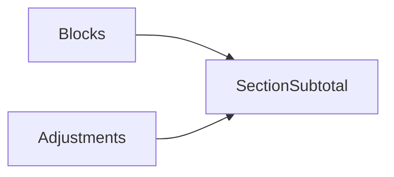
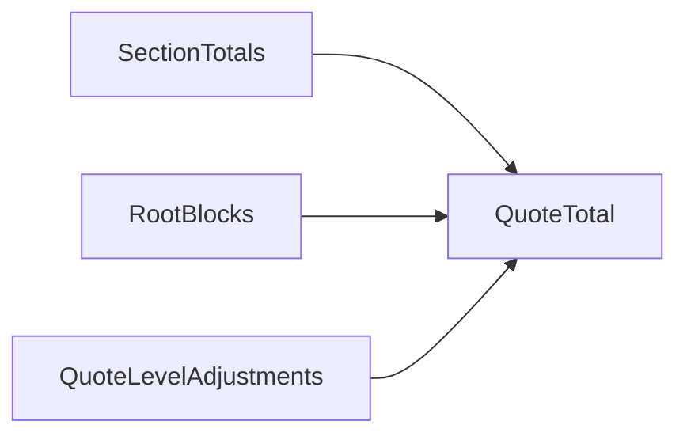
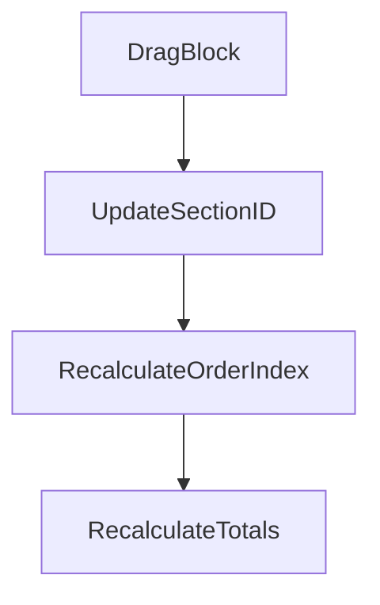
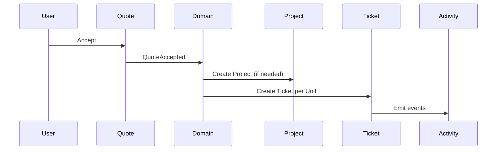

# PET Quote Sections + Composable Blocks — Execution Baseline (v1.0)

Status: Authoritative execution brief  
Instruction: All files currently in `docs/ToBeMoved/` must be relocated before implementation.  
Mode: ADD-ONLY. No refactors. No renames.

---

# 1. Documentation Relocation

Move all new quote/section/visual/spec docs from:

plugins/pet/docs/ToBeMoved/

Into appropriate folders:

- 01_overview/visuals/
- 04_quotes/
- 06_operations/
- 09_demo/

Update master index ADDITIVELY only.

Implementation may begin only after relocation.

---

# 2. Quote Structural Model

Quote becomes:

```mermaid
flowchart TD
    Q[Quote]
    Q --> S1[Section]
    Q --> S2[Section]
    Q --> RB[Root Block (optional)]

    S1 --> B1[Block]
    S1 --> B2[Block]
    S2 --> B3[Block]
```

Rules:
- Sections NOT nestable
- Blocks may exist outside Sections
- Sections reorderable
- Blocks reorderable
- Blocks draggable between Sections

---

# 3. Section Header Model

Visual:
- Full-width black header
- Inline editable title (default: "New Section")
- Drag handle on left
- Totals on right
- “⋯” menu for toggles

Toggles:
- show_total_value (default ON)
- show_item_count (default OFF)
- show_total_hours (default OFF)

Collapse:
- Individual collapse/expand
- Global collapse/expand all

---

# 4. Totals Logic

Section total:



Quote total:



Display Rules:
- If only once-off → show once-off total
- If recurring present → show:
  - Once-off total
  - Recurring total (/period)
- Never mix recurring into once-off figure

---

# 5. Adjustment Scope

If adjustment inside Section:
- If other blocks exist → applies to Section
- If only block → applies to entire Quote

---

# 6. Drag / Drop Ordering Model

Persistence model:

- quote_sections.order_index (sparse increments)
- quote_blocks.section_id (nullable)
- quote_blocks.order_index scoped by section_id

Movement rules:



Safety:
- Dedicated drag handles only
- Cannot delete non-empty Section
- Clone Section clones all blocks beneath

---

# 7. Acceptance & Delivery (Unchanged)

Sections do NOT affect delivery.



Delivery still based on block type:
- Simple → tickets
- Project → project + tickets
- Repeat → agreement + scheduler

---

# 8. Required Tests

1. Section ordering persists.
2. Block move between sections persists.
3. Section clone duplicates blocks.
4. Section delete blocked if not empty.
5. Totals correct after reorder/move.
6. Recurring totals separate from once-off.
7. Acceptance logic unchanged.

---

END OF BASELINE

