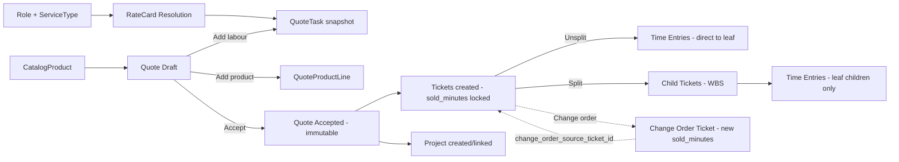

STATUS: AUTHORITATIVE — IMPLEMENTATION REQUIRED
SCOPE: Ticket Backbone Correction
VERSION: v2
SUPERSEDES: v1
DATE: 2026-03-06

# Quote → Ticket → Project Flow (v2)

This specifies how accepted quote tasks become tickets and then form the delivery spine of a project.

Governed by `00_foundations/02_Ticket_Architecture_Decisions_v1.md`.
Structural spec: `03_commercial/05_Sold_Ticket_Structural_Spec_v1.md`.

## Entities (conceptual)

- **CatalogProduct** (products only — hardware, licenses, subscriptions)
- **Role** (competency + `base_internal_rate` for internal cost)
- **ServiceType** (classification of labour — Consulting, Support, Training, etc.)
- **RateCard** (sell pricing per role + service type + optional contract)
- **Quote** (versioned, accepted immutable)
- **QuoteLine / QuoteTask** (snapshot of product catalog or role + rate card economics)
- **Ticket** (one per sold item, created at acceptance, immutable sold fields)
- **Project** (container for tickets as WBS)
- **Phase** (grouping / payment schedule anchor)

> See `03_commercial/07_Products_Roles_ServiceTypes_and_RateCards_v2.md` for authoritative entity definitions.

## Draft quote building

### Labour items

When user adds labour to a quote:

1. Select a **Role** and **ServiceType**. System resolves the applicable **RateCard** to determine sell rate. `base_internal_rate` is sourced from the Role.
2. Create a **draft QuoteTask** record with snapshotted `base_internal_rate`, `sell_rate`, `service_type_id`, and `rate_card_id`.

**No tickets are created during quoting.** Draft quote tasks are managed entirely within the quote builder (`wp_pet_quote_tasks`). Tickets represent real commitments and are created only at acceptance.

### Simple vs complex (phases)

- Simple: quote tasks have `phase_id = NULL` or default phase.
- Complex: phases are explicit groupings; each quote task references a phase.
- Phase totals are derived by summing quote task snapshots.

## Quote acceptance boundary

On `QuoteAccepted`:

1. Freeze quote snapshot (already the case).
2. For every labour QuoteTask on the accepted quote, create **one ticket** in `wp_pet_tickets` with:
   - `quote_id` = accepted quote ID
   - `primary_container` = 'project'
   - `lifecycle_owner` = 'project'
   - `ticket_kind` = 'work'
   - `status` = 'planned'
   - `sold_minutes` = snapshotted duration from quote task (immutable from this point)
   - `sold_value_cents` = snapshotted sell value (immutable from this point)
   - `estimated_minutes` = same as `sold_minutes` initially
   - `is_baseline_locked` = 1
   - `required_role_id`, `department_id`, `phase_id` from quote task
   - `project_id` = project being created
   - `root_ticket_id` = self (this is the sold root)
3. Store `ticket_id` on the QuoteTask record for traceability.
4. Create/attach Project:
   - `Project.sourceQuoteId = quote.id`
   - Project gets tickets as the deliverables spine.

### What does NOT happen at acceptance

- No "baseline ticket" is created as a separate record.
- No "execution ticket clone" is created.
- No `ticket_mode` is set.
- The accepted quote snapshot is the audit record. The ticket's `sold_minutes` is the operational baseline.

## WBS expansion (splitting)

When PM breaks down a 100-hour sold ticket into smaller units:

- The sold ticket becomes a roll-up: `is_rollup = 1`.
- `sold_minutes` on the parent remains immutable (6000 for 100h).
- Child tickets are created with `estimated_minutes` allocated from the parent.
- Each child's `parent_ticket_id` = the sold ticket.
- Each child's `root_ticket_id` = the sold ticket (the sold root).
- Time is logged on children only (leaf-only rule).

Children can be split further (unlimited depth). `root_ticket_id` always points back to the original sold ticket.

Variance = `sold_minutes` on root minus `SUM(estimated_minutes)` on all leaf descendants.

## Change orders

When scope changes after acceptance:

1. A new quote version or delta quote is created and accepted.
2. A new ticket is created with its own `sold_minutes`.
3. The new ticket carries `change_order_source_ticket_id` = the original sold ticket.
4. The change order ticket is NOT a child of the original (no `parent_ticket_id` relationship).

This preserves:
- The original ticket's leaf/rollup status unchanged.
- Clean WBS structure.
- Commercial traceability via the explicit link.

Reporting aggregates original + change order tickets by following `change_order_source_ticket_id`.

## Goods / hardware / software resale

For goods items, create operational tickets if they require work:
- procurement
- delivery
- install
- billing steps

Those tickets may be non-time-loggable if they are purely logistical, but they must exist if human work is involved.

## Payment schedule linkage

Payment schedule items may reference:
- quote total (deposit)
- `phase_id`
- `quote_line_id`
- `ticket_id` (the sold ticket created at acceptance)

No schedule item may reference mutable execution-only artifacts (e.g., child tickets created during WBS splitting) without a sold anchor.

## Quote revision handling

Before acceptance, quote revisions only affect quote-side records. Since no tickets exist during quoting, there is no ticket cleanup required when quote lines are added, removed, or modified.

Old quote versions remain as quote history. Tickets are created only from the accepted version.

## Partial acceptance

A quote version is accepted as a whole. Partial acceptance (accepting some line items but not others) is not supported.

If a customer wants only part of a quote, split it into separate quotes.

## Mermaid overview

