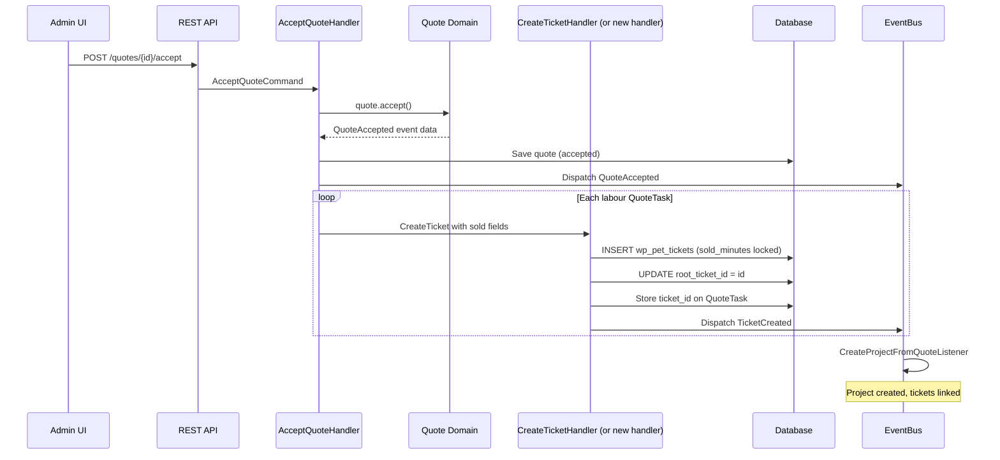
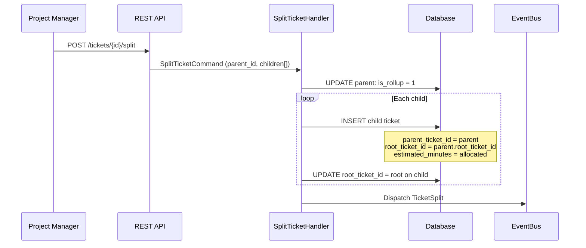
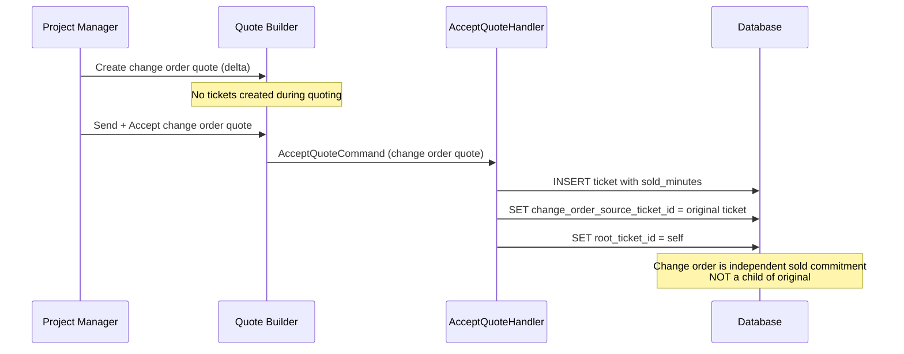
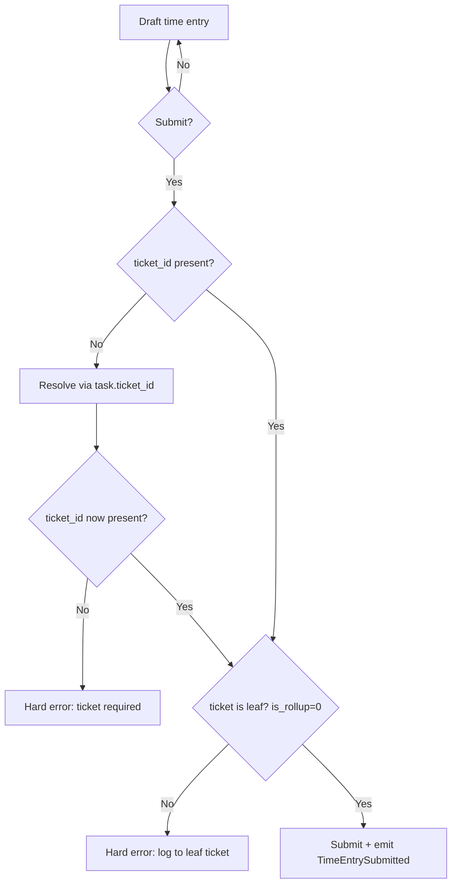
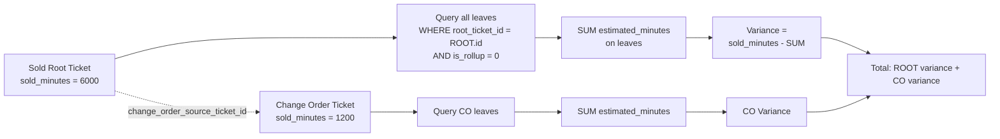
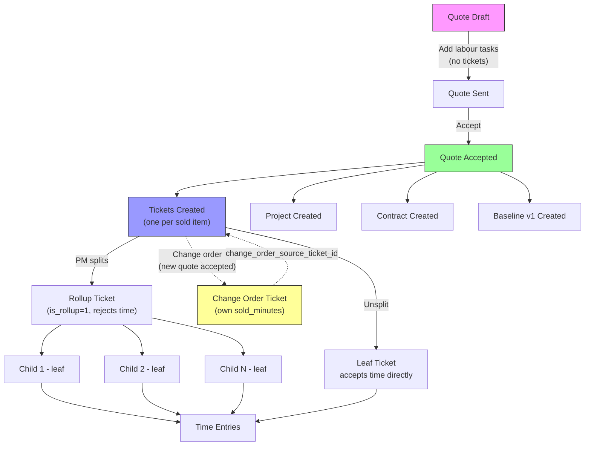

STATUS: AUTHORITATIVE — IMPLEMENTATION REQUIRED
SCOPE: Sold Ticket (project ticket created at quote acceptance)
VERSION: v1
DATE: 2026-03-06

# Sold Ticket — Structural Specification and Lifecycle Contract (v1)

> Governed by `00_foundations/02_Ticket_Architecture_Decisions_v1.md`.

This document defines the complete contract for project tickets created when a quote is accepted. It covers structural specification, lifecycle integration, prohibited behaviours, and stress-test scenarios.

---

# 1. Structural Specification

## 1.1 Fields

### Immutable at creation (baseline-locked)

- `sold_minutes` INT NOT NULL — snapshotted from accepted quote task duration. **Never changes after creation.**
- `sold_value_cents` BIGINT NOT NULL — snapshotted from accepted quote task sell value. **Never changes after creation.**
- `is_baseline_locked` TINYINT(1) NOT NULL DEFAULT 1 — always 1 for sold tickets.
- `quote_id` BIGINT NOT NULL — the accepted quote.
- `root_ticket_id` BIGINT NOT NULL — set to self (post-insert update).

### Set at creation (operationally mutable)

- `customer_id` BIGINT NOT NULL — from quote.
- `project_id` BIGINT NOT NULL — the project created/linked at acceptance.
- `primary_container` = 'project'
- `lifecycle_owner` = 'project'
- `ticket_kind` = 'work'
- `status` = 'planned' (initial project lifecycle status)
- `estimated_minutes` INT — initially = `sold_minutes`. Mutable during planning.
- `is_rollup` TINYINT(1) DEFAULT 0 — becomes 1 when ticket is split into children.
- `phase_id` BIGINT NULL — from quote task, if phases are used.
- `required_role_id` BIGINT NULL — from quote task snapshot.
- `department_id_ext` BIGINT NULL — from quote task snapshot.
- `billing_context_type` = 'project'
- `is_billable_default` = 1
- `parent_ticket_id` BIGINT NULL — NULL for top-level sold tickets; set for WBS children.
- `change_order_source_ticket_id` BIGINT NULL — NULL for original sold tickets; set for change order tickets.
- `queue_id` VARCHAR NULL — optionally set for routing.
- `owner_user_id` VARCHAR NULL — optionally set for assignment.

### Explicitly NOT stored

- `planned_minutes` — derived at query time: `SUM(estimated_minutes) WHERE parent_ticket_id = ?`
- `remaining_minutes` — derived from actual time logged vs estimated.
- `ticket_mode` — removed. Not set on new tickets.

## 1.2 Invariants

- I-SOLD-01: `sold_minutes` and `sold_value_cents` are immutable once set. Domain must reject any mutation attempt.
- I-SOLD-02: `is_baseline_locked` is 1 for all tickets created from accepted quotes. Cannot be set to 0.
- I-SOLD-03: `root_ticket_id` = self for top-level sold tickets. For WBS children, `root_ticket_id` = the sold root.
- I-SOLD-04: Tickets must not exist before quote acceptance. No draft tickets during quoting.
- I-SOLD-05: One ticket per quote task. Idempotent creation — re-running acceptance must not duplicate tickets.
- I-SOLD-06: If `is_rollup = 1`, ticket rejects time entries. Only leaves accept time.
- I-SOLD-07: Change orders produce new tickets with `change_order_source_ticket_id` set, never mutate original sold fields.
- I-SOLD-08: `parent_ticket_id` is NOT set between a change order ticket and its source. They are independent.

## 1.3 State transitions

Project lifecycle (from `03_domain_model/03_Ticket_Lifecycle_and_State_Machines_v1.md`):

```
planned → ready → in_progress → blocked → done → closed
                                    ↑          |
                                    +----------+
```

Allowed transitions:
- planned → ready
- ready → in_progress
- in_progress → blocked
- in_progress → done
- blocked → in_progress
- done → closed

Terminal: `closed`

`is_baseline_locked` is orthogonal — not a status. A ticket can be `in_progress` and baseline-locked simultaneously.

## 1.4 Events

### TicketCreated
Emitted when sold ticket is created at acceptance.
Payload: ticket entity with all fields.

### TicketSplit
Emitted when a sold ticket is split into WBS children.
Payload: parent ticket ID, child ticket IDs.
Side effect: parent `is_rollup` set to 1.

### TicketStatusChanged
Emitted on any status transition.
Payload: ticket, previousStatus, newStatus, lifecycleOwner.

### TicketAssigned
Emitted on assignment changes.
Payload: ticket, newOwner, previousOwner, newQueue, previousQueue.

## 1.5 Persistence

Table: `wp_pet_tickets` (same table as support and internal tickets).

Repository: `SqlTicketRepository` — uses `conditionallyAddColumn` pattern for backward compat with environments that haven't run latest migrations.

Post-insert update required: `root_ticket_id = id` for top-level sold tickets (auto-increment ID not known at insert time).

New columns required (additive migrations):
- `is_baseline_locked` TINYINT(1) NOT NULL DEFAULT 0
- `change_order_source_ticket_id` BIGINT UNSIGNED NULL

Column to be dropped (future migration):
- `ticket_mode` — no longer used

## 1.6 API

### Read
`GET /pet/v1/tickets` — returns all tickets. Must include sold ticket fields in response.

Query params for filtering:
- `lifecycle_owner=project` — replaces `ticket_mode=execution`
- `project_id={id}` — filter by project

### Response shape (sold ticket fields added)
```json
{
  "id": 42,
  "customerId": 1,
  "subject": "Theme Setup",
  "status": "planned",
  "lifecycleOwner": "project",
  "primaryContainer": "project",
  "projectId": 5,
  "quoteId": 3,
  "soldMinutes": 600,
  "estimatedMinutes": 600,
  "isBaselineLocked": true,
  "isRollup": false,
  "parentTicketId": null,
  "rootTicketId": 42,
  "changeOrderSourceTicketId": null,
  "ticketKind": "work",
  "billingContextType": "project",
  "isBillableDefault": true
}
```

### Create (internal only — via AcceptQuoteHandler)
Sold tickets are NOT created via the REST API. They are created programmatically during quote acceptance. The `POST /pet/v1/tickets` endpoint creates support tickets only.

### Update
`PUT /pet/v1/tickets/{id}` — must reject mutations to `sold_minutes`, `sold_value_cents`, and `is_baseline_locked` on baseline-locked tickets.

---

# 2. Lifecycle Integration Contract

## 2.1 In the lifecycle of the parent entity (Quote), when does the Sold Ticket exist?

### Creation rules
- Sold tickets are created **only** on `QuoteAccepted` event.
- For each labour QuoteTask on the accepted quote, exactly one ticket is created.
- Creation is idempotent: if tickets already exist for the quote (checked via `quote_id`), do not create duplicates.
- The ticket is created inside the same transaction as quote acceptance, project creation, and contract creation.

### Render rules
- Sold tickets appear in the project view once the quote is accepted.
- Sold tickets do NOT appear during quoting (they don't exist).
- The quote builder UI is unaffected — it manages its own `wp_pet_quote_tasks`.
- Project ticket views should filter on `lifecycle_owner = 'project'` (not `ticket_mode`).

### Mutation rules
- `sold_minutes` and `sold_value_cents` are immutable once set. The domain must reject mutation attempts.
- `estimated_minutes` is mutable during planning (PM adjusts estimates).
- `status` follows the project lifecycle state machine.
- `is_rollup` transitions from 0 → 1 when children are created (one-way; cannot revert to 0 while children exist).
- Assignment (`queue_id`, `owner_user_id`) is mutable at any time.

---

## 2.2 WBS split lifecycle

### When does a child ticket exist?
- Created when a PM splits a sold ticket into smaller work packages.
- The parent becomes `is_rollup = 1` and no longer accepts time entries.
- Children inherit `root_ticket_id` from the parent (always the sold root).

### When must a child NOT exist?
- Before the sold ticket exists (i.e., before acceptance).
- Without a parent — orphan children are not permitted.

### Mutation rules for children
- `estimated_minutes` is mutable (PM allocates work).
- `parent_ticket_id` is immutable once set.
- `root_ticket_id` is immutable once set.
- Children can be split further (unlimited depth).

---

## 2.3 Change order lifecycle

### When does a change order ticket exist?
- Created when a change order quote is accepted.
- Carries its own `sold_minutes` and `change_order_source_ticket_id` pointing to the original.

### When must a change order NOT exist?
- Before a change order quote is accepted.
- As a child of the original ticket (no `parent_ticket_id` relationship).

### Mutation rules
- Same as sold tickets — `sold_minutes` immutable, operational fields mutable.
- If split into children, `root_ticket_id` on those children = the change order ticket (not the original).

---

# 3. Prohibited Behaviours

- **Must NOT** create tickets during quote drafting or editing.
- **Must NOT** create tickets when a quote is sent (only on acceptance).
- **Must NOT** create a separate "baseline ticket" record.
- **Must NOT** create an "execution ticket clone".
- **Must NOT** set `ticket_mode` on any new ticket.
- **Must NOT** store `planned_minutes` as a field on the ticket entity.
- **Must NOT** store `remaining_minutes` as a field on the ticket entity.
- **Must NOT** allow mutation of `sold_minutes` or `sold_value_cents` after creation.
- **Must NOT** allow mutation of `is_baseline_locked` from 1 to 0.
- **Must NOT** allow time logging to a rollup ticket (is_rollup=1).
- **Must NOT** make a change order ticket a child of the original (no parent_ticket_id link).
- **Must NOT** use `baseline_locked` as a lifecycle status.
- **Must NOT** auto-create tickets for CatalogComponent products unless human work is required.
- **Must NOT** allow partial acceptance of a quote (accept all or nothing).
- **Must NOT** inject default ticket data that doesn't come from the quote snapshot.
- **Must NOT** duplicate tickets if acceptance handler runs twice for the same quote.

---

# 4. Stress-Test Scenarios

## A) Quote lifecycle boundaries

1. Create quote with 5 labour tasks → verify NO tickets in `wp_pet_tickets` with that `quote_id`.
2. Send quote → verify NO tickets created.
3. Revise quote (add/remove tasks) → verify NO tickets affected (none exist).
4. Accept quote → verify exactly 5 tickets created, each with correct `sold_minutes`, `is_baseline_locked = 1`, `root_ticket_id = self`.
5. Re-run acceptance handler for same quote → verify no additional tickets created (idempotent).
6. Attempt to edit `sold_minutes` on any created ticket → hard fail.

## B) Cross-boundary: Quote + Project + Ticket

7. Accept quote → verify project created with `source_quote_id` set.
8. Verify each created ticket has `project_id` = the created project's ID.
9. Verify `quote_id` on each ticket matches the accepted quote.
10. Delete the project (if allowed) → tickets remain (tickets are not cascade-deleted).

## C) WBS split stress

11. Split a 100h sold ticket into 5×20h children → parent `is_rollup = 1`, children sum `estimated_minutes = 6000`.
12. Log time to parent → hard fail (rollup).
13. Log time to child → pass.
14. Split a child into grandchildren → child becomes rollup, `root_ticket_id` still = original sold ticket.
15. Variance query: `sold_minutes` on root minus `SUM(estimated_minutes)` on all leaves = correct.

## D) Change order boundaries

16. Accept change order quote → new ticket with `change_order_source_ticket_id` = original.
17. Verify change order ticket is NOT a child of original (no `parent_ticket_id`).
18. Verify `root_ticket_id` on change order = self.
19. Split change order into children → children's `root_ticket_id` = change order (not original).
20. Aggregate reporting: original `sold_minutes` + change order `sold_minutes` = total commitment.

## E) Time entry boundaries

21. Log time to unsplit sold ticket (leaf) → pass.
22. Log time to sold ticket that was split → hard fail (rollup).
23. Submit time entry without `ticket_id` → attempt resolve via task bridge → if unresolvable, hard fail.

## F) Demo seed boundaries

24. Run demo seed → verify backbone tickets created with correct fields (see Section 5).
25. Run demo seed twice → verify no duplicates.
26. Verify seeded WBS structure: parent `is_rollup = 1`, children linked, `root_ticket_id` = parent.

## G) UI filtering boundaries

27. `GET /tickets?lifecycle_owner=project` → returns sold tickets, not support tickets.
28. `GET /tickets?lifecycle_owner=support` → returns support tickets, not sold tickets.
29. `GET /tickets?ticket_mode=execution` → should still work for backward compat (reads from malleable data on old tickets), but new tickets won't have it.

## H) Payment schedule cross-reference

30. Payment schedule item references `ticket_id` of sold ticket → verify link survives ticket status changes.
31. Payment schedule item DOES NOT reference child tickets created during WBS split.

---

# 5. Demo Seed Specification

## 5.1 Current state (what exists)

The current `seedBackboneTickets()` method in `DemoSeedService` creates:
- 1 project rollup ticket with 5 WBS children (direct DB insert)
- 4 internal tickets (direct DB insert)
- Cross-context ticket links

Additionally, `seedCommercial()` accepts Q1, which triggers `AcceptQuoteHandler::createTicketsFromQuote()`, creating tickets via `CreateTicketHandler` with `ticket_mode = 'execution'` in malleable data and `lifecycle_owner = 'support'` (incorrect).

## 5.2 Changes required

### seedCommercial() — quote acceptance path (modify)

When `AcceptQuoteHandler` is updated to create proper sold tickets:
- Q1 acceptance will automatically create sold tickets with correct backbone fields.
- Remove `ticket_mode = 'execution'` from malleable data.
- Set `lifecycle_owner = 'project'`, `primary_container = 'project'`, `status = 'planned'`.
- Set `sold_minutes`, `estimated_minutes`, `is_baseline_locked = 1`.
- Set `root_ticket_id = self` (post-insert update).
- Set `project_id` to the created project.
- Set `quote_id` to the accepted quote.

The demo seed should verify that tickets were created by checking `wp_pet_tickets WHERE quote_id = $q1Id`, not by creating them separately.

### seedBackboneTickets() — WBS demonstration (modify)

Currently seeds project tickets via direct DB insert. After the change:
- Keep the direct-insert WBS structure for demo purposes (demonstrates split tickets).
- Update fields to match the new model:
  - Add `is_baseline_locked = 1` on the parent.
  - Remove `remaining_minutes` (no longer stored).
  - Ensure `root_ticket_id` = parent ID on all children.
- Add a change order demo ticket:
  - Create a ticket with `change_order_source_ticket_id` pointing to the parent.
  - Give it its own `sold_minutes` (e.g., 240 = 4h additional scope).
  - Set `root_ticket_id = self`.

### New seed: change order ticket

```
Change Order: Additional UX Review
  sold_minutes: 240
  change_order_source_ticket_id: [parent ticket ID]
  root_ticket_id: self
  is_baseline_locked: 1
  status: planned
  lifecycle_owner: project
  primary_container: project
```

### Seed data summary (target state)

After seeding, the ticket table should contain:

**From Q1 acceptance (via handler, not direct insert):**
- ~10 sold tickets (one per implementation task in Q1) with `sold_minutes` locked, `quote_id = Q1`, `project_id` set.

**From seedBackboneTickets (direct insert, demo WBS):**
- 1 rollup parent: "Website Redesign — Full Delivery", `is_rollup = 1`, `is_baseline_locked = 1`
- 5 leaf children: Discovery, UI/UX, Frontend, Backend, QA — each with `parent_ticket_id`, `root_ticket_id`
- 1 change order ticket: linked via `change_order_source_ticket_id`, own `sold_minutes`
- 4 internal tickets (unchanged)

**From support seeding (unchanged):**
- ~13 support tickets with `lifecycle_owner = 'support'`

---

# 6. Process Flows

## 6.1 Quote acceptance → ticket creation



## 6.2 WBS split



## 6.3 Change order flow



## 6.4 Time entry enforcement



## 6.5 Variance reporting query



## 6.6 Full lifecycle overview


