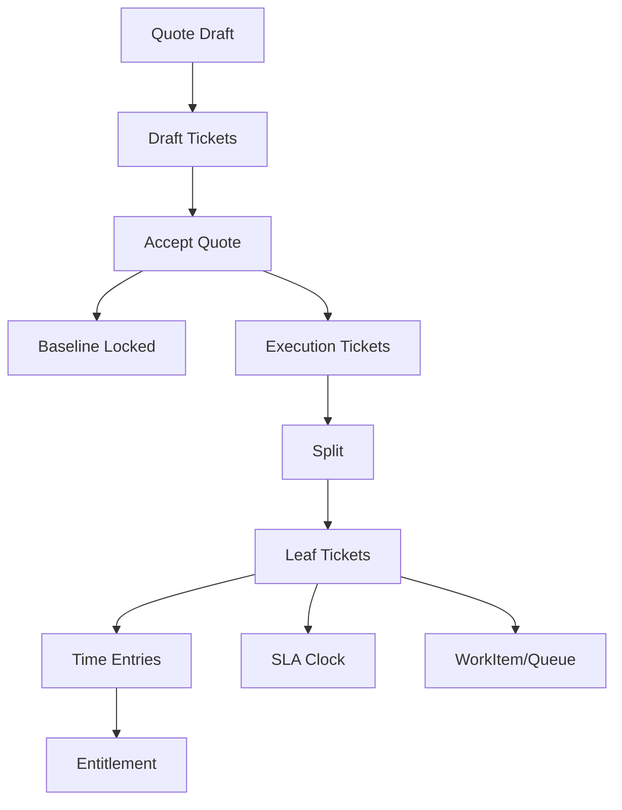

STATUS: AUTHORITATIVE — IMPLEMENTATION REQUIRED
SCOPE: Ticket Backbone Correction
VERSION: v1

# Stress Test Scenarios — Ticket Backbone (v1)

These scenarios must pass before merging implementation.

## A) Time entry invariants
1. Draft time entry created with no ticket_id; attempt submit → hard fail.
2. Draft time entry with task_id whose task has ticket_id; submit resolves ticket → pass.
3. Time entry against roll-up ticket (has children) → hard fail.
4. Time entry against leaf ticket → pass.
5. Backfill does not alter historical start/end/duration values.

## B) Quote lifecycle
6. Create quote with labour items → draft tickets created immediately and linked.
7. Accept quote → baseline becomes immutable; execution tickets created.
8. Attempt to edit baseline sold fields after acceptance → hard fail.
9. Change order adds new ticket without mutating baseline → pass.

## C) WBS split
10. Split a 100h ticket into children → parent becomes roll-up; children sum = 100h.
11. Time logged to children rolls up to parent views; parent rejects direct logging.

## D) SLA/Agreement
12. Ticket with SLA due dates triggers warning/breach events correctly.
13. Ticket with agreement included minutes consumes entitlement.
14. Overages require explicit approval record before invoicing/export.

## E) Queue/assignment
15. Ticket logged to department queue; engineer pulls; department head allocates another.
16. Preferred assignee set at creation; later reassigned; both intent and reality recorded.

## F) Backward compatibility
17. Upgrade path where tasks exist but tickets not yet backfilled: system remains operable; submit resolves where possible.
18. User skips versions and lands on schema where new columns exist but backfill not run: system fails safe (cannot submit unlinked time).

## Mermaid test map

