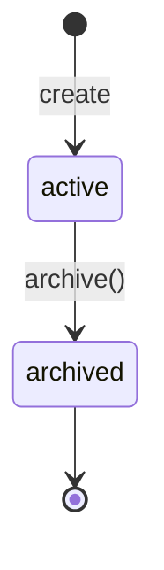
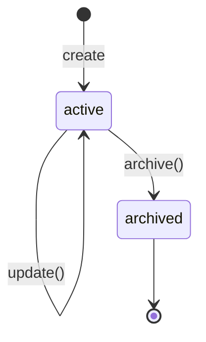
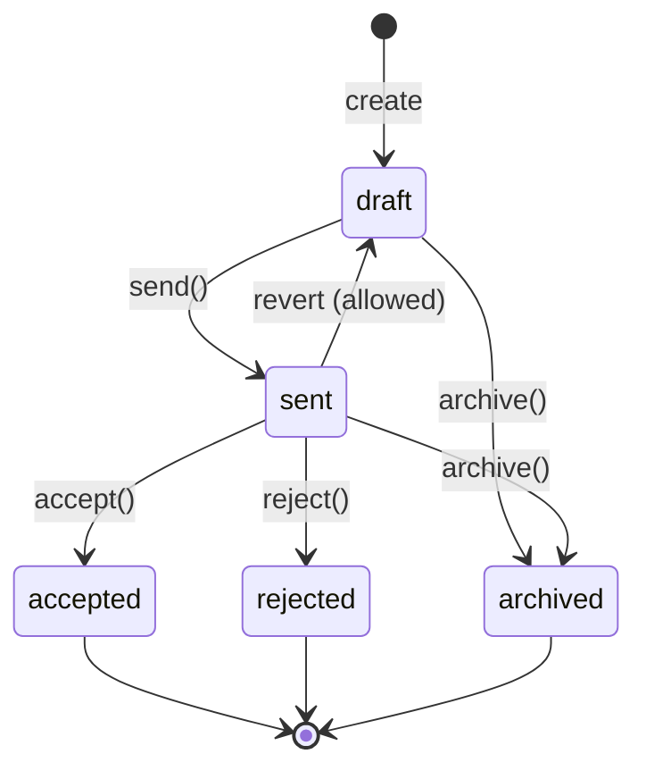
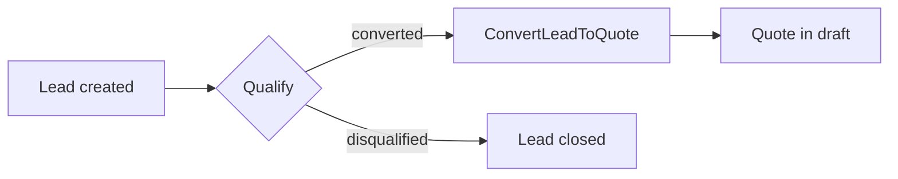
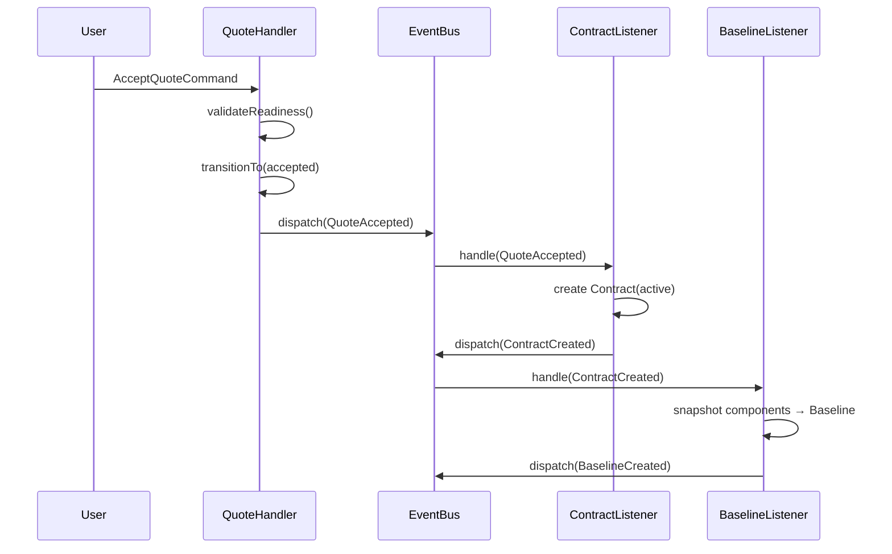
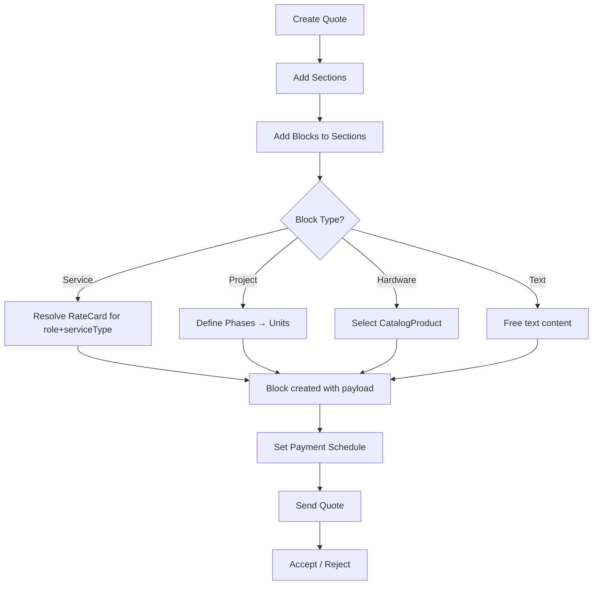
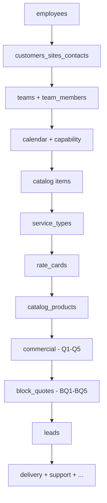

# PET Commercial Domain Specification v2

> **Scope:** Authoritative specification for the commercial domain after the Quote Builder UX overhaul.
> Covers **new** entities (ServiceType, RateCard, CatalogProduct, QuoteBlock, QuoteSection),
> **changed** entities (Quote, CatalogItem), and their integration with existing entities
> (Lead, Contract, Baseline, Forecast, PaymentMilestone, CostAdjustment, QuoteComponent hierarchy).

---

## Entity Map

```
Lead ──converts──▶ Quote ──accepts──▶ Contract ──snapshots──▶ Baseline
                     │                    │
                     ├── QuoteSection[]    ├── RateCard[] (contract-scoped override)
                     ├── QuoteBlock[]      └── Forecast
                     ├── QuoteComponent[]
                     │    ├── ImplementationComponent
                     │    │    └── QuoteMilestone[] → QuoteTask[]
                     │    ├── CatalogComponent
                     │    │    └── QuoteCatalogItem[]
                     │    ├── OnceOffServiceComponent
                     │    │    ├── SimpleUnit[] (SIMPLE topology)
                     │    │    └── Phase[] → SimpleUnit[] (COMPLEX topology)
                     │    └── RecurringServiceComponent
                     ├── CostAdjustment[]
                     └── PaymentMilestone[]

ServiceType ◀──referenced-by──▶ RateCard ──referenced-by──▶ Role
CatalogProduct (standalone product catalog, separate from CatalogItem)
```

---

# 1️⃣ Structural Specification

---

## 1.1 ServiceType (NEW)

### Fields
| Field | Type | Constraints |
|---|---|---|
| id | ?int | Auto PK |
| name | string | NOT NULL, UNIQUE, non-blank |
| description | ?string | |
| status | string | `active` or `archived` |
| created_at | DateTimeImmutable | NOT NULL |
| updated_at | DateTimeImmutable | NOT NULL |

### Invariants
- `name` must be non-empty after trim.
- `status` must be one of `['active', 'archived']`.
- Cannot update an archived service type (`DomainException`).
- Cannot archive an already-archived service type (`DomainException`).

### State Transitions


### Events
None currently emitted. ServiceType is a reference entity.

### Persistence
- Table: `{prefix}pet_service_types`
- UNIQUE constraint on `name`.
- Migration: `CreateServiceTypeTables`

### API
| Verb | Route | Handler |
|---|---|---|
| GET | `/pet/v1/service-types` | `ServiceTypeController::list` |
| POST | `/pet/v1/service-types` | `ServiceTypeController::create` → `CreateServiceTypeHandler` |
| PUT | `/pet/v1/service-types/{id}` | `ServiceTypeController::update` → `UpdateServiceTypeHandler` |
| POST | `/pet/v1/service-types/{id}` | `ServiceTypeController::archive` → `ArchiveServiceTypeHandler` |

---

## 1.2 RateCard (NEW)

### Fields
| Field | Type | Constraints |
|---|---|---|
| id | ?int | Auto PK |
| roleId | int | FK → pet_roles.id |
| serviceTypeId | int | FK → pet_service_types.id |
| sellRate | float | > 0 |
| contractId | ?int | NULL = global, non-NULL = contract-scoped override |
| validFrom | ?DateTimeImmutable | NULL = open start |
| validTo | ?DateTimeImmutable | NULL = open end |
| status | string | `active` or `archived` |
| created_at | DateTimeImmutable | |
| updated_at | DateTimeImmutable | |

### Invariants
- `sellRate > 0` enforced in constructor.
- If both `validFrom` and `validTo` are set, `validFrom <= validTo`.
- `status` must be one of `['active', 'archived']`.
- Cannot archive an already-archived rate card.
- `isEffectiveAt(date)` returns `false` for archived cards regardless of date window.

### Resolution Precedence
The resolve endpoint returns the single best-match rate card using this cascade:
1. **Contract-scoped** card matching (roleId, serviceTypeId, contractId) effective at the date.
2. **Global** card (contractId = NULL) matching (roleId, serviceTypeId) effective at the date.
3. No match → `DomainException` (404).

### State Transitions


### Events
None currently emitted. RateCard is a pricing reference entity.

### Persistence
- Table: `{prefix}pet_rate_cards`
- Composite index: `(role_id, service_type_id, contract_id, valid_from)` for resolution queries.
- Migration: `CreateRateCardTables`

### API
| Verb | Route | Handler |
|---|---|---|
| GET | `/pet/v1/rate-cards` | `RateCardController::list` — filterable by `role_id`, `service_type_id`, `contract_id`, `status` |
| POST | `/pet/v1/rate-cards` | `RateCardController::create` → `CreateRateCardHandler` |
| POST | `/pet/v1/rate-cards/{id}/archive` | `RateCardController::archive` → `ArchiveRateCardHandler` |
| GET | `/pet/v1/rate-cards/resolve` | `RateCardController::resolve` → `ResolveRateCardHandler` — params: `role_id`, `service_type_id`, `?contract_id`, `?effective_date` |

---

## 1.3 CatalogProduct (NEW)

### Fields
| Field | Type | Constraints |
|---|---|---|
| id | ?int | Auto PK |
| sku | string | NOT NULL, UNIQUE, non-blank |
| name | string | NOT NULL, non-blank |
| description | ?string | |
| category | ?string | |
| unitPrice | float | >= 0 |
| unitCost | float | >= 0 |
| status | string | `active` or `archived` |
| created_at | DateTimeImmutable | |
| updated_at | DateTimeImmutable | |

### Invariants
- `unitPrice >= 0`, `unitCost >= 0`.
- `sku` and `name` must be non-blank.
- `status` must be one of `['active', 'archived']`.
- Cannot update an archived product.
- Cannot archive an already-archived product.

### Relationship to CatalogItem
`CatalogProduct` is a **standalone product catalog** entity, replacing the product-type entries previously mixed into `CatalogItem`. `CatalogItem` remains for service-type entries with WBS templates. They are separate tables and separate domain paths.

### State Transitions


### Persistence
- Table: `{prefix}pet_catalog_products`
- UNIQUE constraint on `sku`.
- Migration: `CreateCatalogProductsTable`

### API
| Verb | Route | Handler |
|---|---|---|
| GET | `/pet/v1/catalog-products` | `CatalogProductController::list` (active only) |
| POST | `/pet/v1/catalog-products` | `CatalogProductController::create` → `CreateCatalogProductHandler` |
| PUT | `/pet/v1/catalog-products/{id}` | `CatalogProductController::update` → `UpdateCatalogProductHandler` |
| POST | `/pet/v1/catalog-products/{id}/archive` | `CatalogProductController::archive` → `ArchiveCatalogProductHandler` |

---

## 1.4 QuoteSection (NEW)

### Fields
| Field | Type | Constraints |
|---|---|---|
| id | ?int | Auto PK |
| quoteId | int | FK → pet_quotes.id |
| name | string | Default: "New Section" |
| orderIndex | int | Sort order |
| showTotalValue | bool | Default: true |
| showItemCount | bool | Default: false |
| showTotalHours | bool | Default: false |

### Invariants
- A section belongs to exactly one quote.
- `orderIndex` determines render order within a quote.
- Display flags control which summary totals appear in the section header.

### Persistence
- Table: `{prefix}pet_quote_sections`
- Index: `(quote_id)`, `(order_index)`

---

## 1.5 QuoteBlock (NEW)

### Fields
| Field | Type | Constraints |
|---|---|---|
| id | ?int | Auto PK |
| position | int | Render order |
| type | string | One of the TYPE_* constants (see below) |
| componentId | ?int | Optional back-reference to a QuoteComponent |
| sellValue | float | |
| internalCost | float | |
| priced | bool | If false, excluded from totals |
| sectionId | ?int | FK → pet_quote_sections.id |
| payload | array | JSON-serialized rich data (varies by type) |

### Block Type Constants
- `OnceOffSimpleServiceBlock` — flat service line (quantity × rate)
- `OnceOffProjectBlock` — phased project with nested units
- `RepeatServiceBlock` — recurring service
- `RepeatHardwareBlock` — recurring hardware
- `HardwareBlock` — once-off hardware product
- `PriceAdjustmentBlock` — discount/surcharge
- `PaymentPlanBlock` — payment schedule summary
- `TextBlock` — rich text, not priced

### Payload Structure by Type

**OnceOffSimpleServiceBlock:**
```json
{
  "description": "string",
  "quantity": "int",
  "sellValue": "float (per-unit)",
  "totalValue": "float",
  "roleId": "?int",
  "ownerType": "employee|team",
  "ownerId": "?int",
  "owner": "?string (display name)",
  "teamId": "?int",
  "team": "?string",
  "catalogItemId": "?int"
}
```

**OnceOffProjectBlock:**
```json
{
  "description": "string",
  "totalValue": "float",
  "phases": [
    {
      "id": "string",
      "name": "string",
      "order": "int",
      "units": [
        {
          "id": "string",
          "description": "string",
          "quantity": "int",
          "unitPrice": "float",
          "totalValue": "float",
          "roleId": "?int",
          "ownerType": "employee|team",
          "ownerId": "?int",
          "owner": "?string",
          "teamId": "?int",
          "team": "?string",
          "catalogItemId": "?int"
        }
      ]
    }
  ]
}
```

**TextBlock:**
```json
{ "content": "string" }
```

### Static Methods
- `QuoteBlock::fromComponents(QuoteComponent[])` — converts component hierarchy to block list.
- `QuoteBlock::totalSellValue(QuoteBlock[])` — sums sell values for priced blocks.
- `QuoteBlock::totalInternalCost(QuoteBlock[])` — sums internal costs for priced blocks.

### Persistence
- Table: `{prefix}pet_quote_blocks`
- Columns: `id, quote_id, component_id, section_id, type, order_index, priced, payload_json, created_at`
- Composite index: `(quote_id, section_id, order_index)`

---

## 1.6 Quote (CHANGED)

### Fields Added
- `paymentSchedule: PaymentMilestone[]` — required before send/accept.
- `malleableData: array` — freeform metadata.
- `archivedAt: ?DateTimeImmutable`

### Changed Behaviour
- `validateReadiness()` now enforces:
  1. At least one component.
  2. Implementation components must have milestones with tasks.
  3. Catalog component items: products must not have WBS, services must have SKU and roleId.
  4. Margin >= 0.
  5. Title non-empty.
  6. Payment schedule non-empty.
  7. Payment schedule total must equal quote totalValue (tolerance: ±0.01).
- `send()` calls `validateReadiness()` before transitioning to `sent`.
- `accept()` calls `validateReadiness()` before transitioning to `accepted`.

### State Machine (unchanged but documented)


Terminal states: `accepted`, `rejected`, `archived`.

### Events
| Event | Trigger |
|---|---|
| QuoteAccepted | `accept()` — implements DomainEvent + SourcedEvent |
| QuoteApproved | Internal approval workflow |
| PaymentScheduleDefinedEvent | `setPaymentSchedule()` command |
| ContractCreated | Listener on QuoteAccepted |
| BaselineCreated | Listener on ContractCreated |
| ChangeOrderApprovedEvent | Cost adjustment approved |

---

## 1.7 CatalogItem (CHANGED — scope narrowed)

CatalogItem now serves **service-type catalog entries** only. Products have been extracted to `CatalogProduct`.

### Changed Validation
- Type must be `product` or `service`.
- `service` type requires `unitCost > 0` and `unitPrice > 0`.
- `product` type: allowed but new product entries should use `CatalogProduct` instead.

---

## 1.8 PaymentMilestone (existing, unchanged)

### Fields
| Field | Type | Constraints |
|---|---|---|
| id | ?int | Auto PK |
| title | string | |
| amount | float | >= 0 |
| dueDate | ?DateTimeImmutable | |
| paid | bool | Default: false |

### Invariant
- `amount` cannot be negative.

---

## 1.9 CostAdjustment (existing, unchanged)

### Fields
| Field | Type | Constraints |
|---|---|---|
| id | ?int | Auto PK |
| quoteId | int | FK |
| description | string | |
| amount | float | Positive = increase, negative = decrease |
| reason | string | |
| approvedBy | string | |
| appliedAt | DateTimeImmutable | |

---

# 2️⃣ Lifecycle Integration Contract

---

## Lead → Quote Lifecycle



### Render Rules
- Lead list renders independently of quotes.
- Quote builder renders only when a Quote entity exists.
- Block editor (QuoteBlock/QuoteSection) renders only for draft quotes.
- Rate card resolver is available in the block editor when adding service blocks.

### Creation Rules
- **Lead**: Created explicitly via `CreateLeadCommand`. Status: `new`.
- **Quote**: Created explicitly via `CreateQuoteCommand` or via `ConvertLeadToQuoteCommand` (sets `leadId`).
- **QuoteSection**: Created explicitly via `AddQuoteSectionCommand`. Never auto-created.
- **QuoteBlock**: Created explicitly via `CreateQuoteBlockCommand`. Never auto-created with the quote.
- **QuoteComponent**: Created explicitly via `AddComponentCommand`. The old quote builder path.
- **PaymentMilestone**: Set via `SetPaymentScheduleCommand`. Required before send/accept.
- **Contract**: Auto-created by listener on `QuoteAccepted` event.
- **Baseline**: Auto-created by listener on `ContractCreated` event, snapshotting quote components.
- **Forecast**: Created separately, linked by `quoteId`.

### Mutation Rules
- Quote: Only mutable in `draft` state (via `update()`). Components/blocks can only be added/removed in non-terminal states.
- QuoteSection: Mutable while quote is in `draft`.
- QuoteBlock: Mutable while quote is in `draft`.
- Contract: `active` → `completed` or `terminated`. No other transitions.
- Baseline: Immutable once created.
- ServiceType / RateCard / CatalogProduct: Mutable while `active`. Archived = frozen.

---

## Quote Acceptance → Contract → Baseline Flow



---

## Block-Based Quote Builder Flow



---

# 3️⃣ Negative Guarantees (Prohibited Behaviours)

---

### ServiceType
- **Must NOT** allow creation with empty/whitespace-only name.
- **Must NOT** allow update after archival.
- **Must NOT** allow duplicate names (UNIQUE constraint).
- **Must NOT** be deleted — only archived.

### RateCard
- **Must NOT** allow `sellRate <= 0`.
- **Must NOT** allow `validFrom > validTo` when both are set.
- **Must NOT** return archived cards from `isEffectiveAt()` regardless of date range.
- **Must NOT** auto-create rate cards — they are always explicitly provisioned.
- **Must NOT** inject default rates — if no rate card matches, the resolve endpoint returns 404.

### CatalogProduct
- **Must NOT** allow negative `unitPrice` or `unitCost`.
- **Must NOT** allow empty/whitespace SKU or name.
- **Must NOT** allow updates to archived products.
- **Must NOT** allow duplicate SKUs (UNIQUE constraint).
- **Must NOT** be confused with `CatalogItem` — they are separate entities and tables.

### QuoteBlock
- **Must NOT** auto-create blocks when a quote is created.
- **Must NOT** render blocks unless the block entity exists in the database.
- **Must NOT** include non-priced blocks (e.g. TextBlock) in total calculations.
- **Must NOT** allow block mutation after quote enters a terminal state.
- **Must NOT** store computed totals in the block row — totals are derived from payload at read time.

### QuoteSection
- **Must NOT** auto-create sections when a quote is created.
- **Must NOT** render section unless it exists.
- **Must NOT** duplicate sections on quote clone — sections must be explicitly recreated.

### Quote
- **Must NOT** auto-create on lead creation.
- **Must NOT** allow send without payment schedule.
- **Must NOT** allow send without at least one component.
- **Must NOT** allow send with negative margin.
- **Must NOT** allow payment schedule total to differ from quote total by more than 0.01.
- **Must NOT** allow component addition/removal in terminal states.
- **Must NOT** allow update in any state other than draft.
- **Must NOT** inject default values for currency, components, or payment schedule.

### PaymentMilestone
- **Must NOT** auto-create with the quote.
- **Must NOT** allow negative amounts.
- **Must NOT** exist without being explicitly set via `SetPaymentScheduleCommand`.

### Contract
- **Must NOT** be manually created — only created by event listener on `QuoteAccepted`.
- **Must NOT** transition from completed or terminated to any other state.

### Baseline
- **Must NOT** be mutated after creation — it is an immutable snapshot.
- **Must NOT** be created without a contract.
- **Must NOT** be manually created — only created by event listener on `ContractCreated`.

---

# 4️⃣ Stress-Test Scenarios

---

## 4.1 Quote Lifecycle Stress Tests

| # | Scenario | Expected Outcome |
|---|---|---|
| S1 | New draft quote → no sections or blocks exist | Sections/blocks arrays empty. No defaults injected. |
| S2 | Draft quote with components but no payment schedule → send | `DomainException: Quote must have a payment schedule` |
| S3 | Draft quote with payment schedule total ≠ quote total → send | `DomainException: Payment schedule total must match quote total value` |
| S4 | Draft quote with negative margin → send | `DomainException: Quote margin cannot be negative` |
| S5 | Accept quote without components → accept | `DomainException: Quote must have at least one component` |
| S6 | Accept quote in draft state (not sent) | `DomainException: Invalid state transition from draft to accepted` |
| S7 | Add component to accepted quote | `DomainException: Cannot add components to a finalized quote` |
| S8 | Remove component from rejected quote | `DomainException: Cannot remove components from a finalized quote` |
| S9 | Update quote in sent state | `DomainException: Cannot update a quote that is not in draft state` |
| S10 | Clone accepted quote → blocks | Blocks must be explicitly recreated on the new draft. No auto-clone. |

## 4.2 Block-Specific Stress Tests

| # | Scenario | Expected Outcome |
|---|---|---|
| B1 | Create TextBlock with priced=false | Block excluded from `totalSellValue()` and `totalInternalCost()` |
| B2 | Delete service block → other blocks unaffected | Remaining blocks retain position and payload |
| B3 | Block with no section (sectionId=null) | Block renders at quote level, outside sections |
| B4 | Multiple blocks in same section → reorder | `order_index` updated; no data loss |
| B5 | OnceOffProjectBlock with empty phases array | Block created with totalValue from payload |
| B6 | Block created from components via `fromComponents()` | Type correctly mapped; position sequential |

## 4.3 RateCard Resolution Stress Tests

| # | Scenario | Expected Outcome |
|---|---|---|
| R1 | Resolve with contract-specific card available | Contract card returned (not global) |
| R2 | Resolve with no contract card, global exists | Global card returned |
| R3 | Resolve with no matching cards at all | `DomainException` (404) |
| R4 | Resolve with archived contract card, active global exists | Global card returned (archived excluded) |
| R5 | Resolve with date outside all validity windows | `DomainException` (404) |
| R6 | Resolve with NULL validFrom/validTo (open-ended) | Card returned for any date |
| R7 | Two global cards for same role+serviceType, different date ranges | Card effective at requested date returned |

## 4.4 ServiceType / CatalogProduct Stress Tests

| # | Scenario | Expected Outcome |
|---|---|---|
| T1 | Create ServiceType with duplicate name | DB UNIQUE violation error |
| T2 | Archive active ServiceType → update archived | `DomainException: Cannot update an archived service type` |
| T3 | Archive already-archived ServiceType | `DomainException: ServiceType is already archived` |
| T4 | Create CatalogProduct with empty SKU | `InvalidArgumentException: CatalogProduct SKU cannot be empty` |
| T5 | Update archived CatalogProduct | `DomainException: Cannot update an archived catalog product` |
| T6 | Create CatalogProduct with negative unitPrice | `InvalidArgumentException: CatalogProduct unit price cannot be negative` |

## 4.5 Cross-Boundary Stress Tests

| # | Scenario | Expected Outcome |
|---|---|---|
| X1 | Lead converted to quote → original lead status | Lead status = `converted`, `convertedAt` set |
| X2 | Quote accepted → contract auto-created | Contract exists with status `active`, linked by `quoteId` |
| X3 | Contract created → baseline auto-created | Baseline exists with snapshotted components, immutable |
| X4 | Delete blocks from quote → section still exists | Section not cascade-deleted |
| X5 | Archive ServiceType → existing RateCards referencing it | RateCards still exist but resolve skips archived ServiceType's cards |
| X6 | Quote with CostAdjustments → margin recalculation | `adjustedTotalInternalCost = totalInternalCost + totalAdjustments`, `margin = totalValue - adjustedTotalInternalCost` |
| X7 | Payment milestone marked paid → quote state | No state transition — payment tracking is independent |
| X8 | Create quote with leadId → lead not found | Quote created with null leadId silently |

---

# 5️⃣ Demo Data Seeding

---

## 5.1 New Entities Seeded

### ServiceTypes (8 records)
Seeded by `DemoSeedService::seedServiceTypes()`:
1. Managed Support
2. Project Delivery
3. Consulting & Advisory
4. DevOps Engineering
5. Training & Knowledge Transfer
6. Security Services
7. Cloud Infrastructure
8. Emergency Response

### RateCards (~22 records)
Seeded by `DemoSeedService::seedRateCards()`:

**Global cards (20)** — Role × ServiceType matrix:
- Consultant × {Consulting & Advisory: 200, Project Delivery: 180, Security: 210, Training: 190}
- Support Technician × {Managed Support: 150, Emergency Response: 280, Security: 160}
- Project Manager × {Project Delivery: 175, Training: 170, Cloud Infrastructure: 185}
- Developer × {Project Delivery: 170, DevOps: 185, Cloud: 180, Security: 175}
- DevOps Engineer × {DevOps: 195, Cloud: 200, Managed Support: 160}
- Security Analyst × {Security: 220, Cloud: 190, Consulting: 205}

**Contract-scoped cards (2):**
- Consultant × Consulting & Advisory → 185.0 (Q1 contract — discounted from 200)
- DevOps Engineer × Cloud Infrastructure → 180.0 (Q5 contract — discounted from 200)

### CatalogProducts (10 records)
Seeded by `DemoSeedService::seedCatalogProducts()`:
- HW-LAPTOP-001, HW-MON-001, HW-DOCK-001, HW-BACKUP-001
- SW-O365-001, SW-SEC-001, SW-PM-001
- INFRA-SW-001, INFRA-FW-001, INFRA-UPS-001

### Block-Based Quotes (5 quotes)
Seeded by `DemoSeedService::seedBlockBasedQuotes()`:

**BQ1 — RPM Digital Transformation**
- Section: Professional Services (3 simple service blocks)
- Section: Project Delivery (1 project block with 2 phases, 5 units)

**BQ2 — Acme Infrastructure Overhaul**
- Section: Assessment (2 service blocks)
- Section: Implementation (3 service blocks)
- Section: Project Work (1 project block with 3 phases, 9 units)

**BQ3 — Nexus Cloud-Native Platform**
- Section: Delivery (2 project blocks — API Platform + Cloud Infrastructure)
- Section: Advisory (2 service blocks)

**BQ4 — Government Security Programme**
- Section: Security Services (4 service blocks)
- Section: Compliance & Governance (3 service blocks)

**BQ5 — RPM Support & Maintenance**
- Section: Support Services (1 text block + 4 service blocks)
- Section: Escalation Management (1 service block + 1 project block)

## 5.2 Existing Entities (Changes Required)

### seedCommercial() — No structural changes
The existing Q1–Q5 component-based quotes continue to seed as before. The new `seedBlockBasedQuotes()` runs **after** `seedCommercial()` and creates the BQ1–BQ5 quotes alongside them.

### Seed Order Dependencies


### Registry Integration
All new entities are registered in `pet_demo_seed_registry` via:
- `seedServiceTypes()` → registers each service type ID
- `seedRateCards()` → registers each rate card ID
- `seedCatalogProducts()` → registers each catalog product ID
- `seedBlockBasedQuotes()` → registers quotes, sections, and blocks
- `registerSeedRunEntities()` → bulk-registers by created_at timestamp

### Purge Impact
The demo purge endpoint deletes from `pet_demo_seed_registry` which cascades to all seeded data. The new tables (`pet_service_types`, `pet_rate_cards`, `pet_catalog_products`, `pet_quote_sections`, `pet_quote_blocks`) are all purge-safe via registry.

---

# 6️⃣ Migration Checklist

| Migration Class | Table | New/Altered |
|---|---|---|
| `CreateServiceTypeTables` | `pet_service_types` | NEW |
| `CreateRateCardTables` | `pet_rate_cards` | NEW |
| `CreateCatalogProductsTable` | `pet_catalog_products` | NEW |
| `CreateQuoteSectionsTables` | `pet_quote_sections`, `pet_quote_blocks` | NEW |
| `UpdateQuoteBlocksAddPayloadAndCreatedAt` | `pet_quote_blocks` | ALTER (add `payload_json`, `created_at`, composite index) |

All registered in `MigrationRegistry`.
