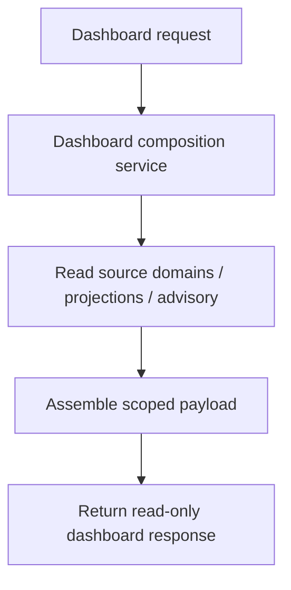
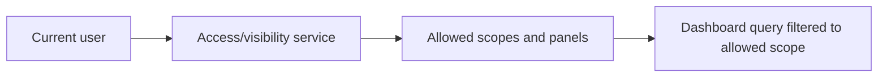
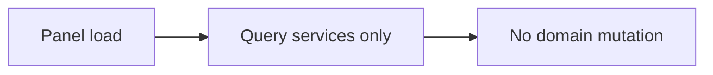

# PET Dashboard Composition and Manager Summary Surfaces — Completion Specification v1

**Target location:** `plugins/pet/docs/10_dashboards/PET_Dashboard_Composition_And_Manager_Summary_Surfaces_v1.md`

## 0. Purpose

This document defines the next completion package for PET around dashboard composition and manager-facing summary surfaces.

This package is intended to make PET’s operational and advisory truth visible in a coherent, read-only management layer.

It covers:

- dashboard composition
- manager summary surfaces
- cross-domain read-side synthesis
- role-appropriate visibility
- demo-ready summary views

This is a **completion package**, not a redesign.

The purpose is not to invent new business truth, but to compose existing truth from operational and advisory domains into surfaces that help managers, coordinators, and executives understand what is happening.

This package must preserve PET principles:

- operational truth remains in source domains
- dashboards are read-only
- no business mutation from dashboards
- additive history remains authoritative
- cross-domain metrics are derived, not manually edited
- UI contains no business logic
- backward compatibility
- forward-only migrations

---

# 1. Scope of This Work Package

## 1.1 Included

This package covers completion of:

1. manager-facing summary/dashboard surfaces
2. cross-domain dashboard composition using existing PET truth
3. queue, escalation, advisory, support, and delivery summary views
4. role-appropriate visibility of dashboard panels
5. demo seed support for realistic dashboard states
6. tests for read-side safety, visibility correctness, and summary integrity

## 1.2 Excluded

This package does **not** include:

- dashboard-side command mutation
- editable dashboard widgets
- predictive modelling
- autonomous recommendations
- redesign of source domains
- customer portal dashboards unless already scaffolded
- full BI/analytics engine implementation
- external dashboarding systems

---

# 2. Structural Specification

## 2.1 Dashboard principle

Dashboards are **derived read surfaces** over existing PET truth.

They must compose from domains such as:

- support
- SLA / escalation
- delivery
- work orchestration / queues
- advisory
- people / resilience where already available
- finance / billing where already available

Dashboards must not become a separate mutable domain.

## 2.2 Canonical dashboard concepts

This package should support, at minimum, the following dashboard concepts if the underlying source truth exists:

- dashboard panel / summary block
- role-specific dashboard view
- dashboard count / metric tiles
- dashboard risk / attention sections
- recent activity / recent escalations / recent advisory outputs where already supported
- queue summary panels
- project/support status summary panels

TRAE must preserve existing dashboard naming where already present and aligned.

## 2.3 Canonical dashboard fields

Each dashboard block or summary card should be able to expose the following types of fields as applicable:

- `panel_key`
- `title`
- `metric_value`
- `metric_unit` (nullable)
- `severity` or visual state where derived from source truth
- `scope_type`
- `scope_id`
- `as_of`
- `count_breakdown` or equivalent structured payload
- `items` or preview rows where appropriate
- `source_summary` or derivation note where already useful
- `visibility_scope`

These may be derived by query services and need not imply new persistence.

## 2.4 Invariants

### A. Read-only truth
Dashboards are read-only derived surfaces.
No dashboard interaction may directly mutate business truth in this package.

### B. Derived from real source data
Dashboard metrics and lists must derive from actual persisted source-domain data, projections, or advisory artefacts.
No fake dashboard-only truth.

### C. Role-scoped visibility
Users must only see dashboard surfaces and metrics appropriate to their structural access.

### D. Consistent summary composition
A dashboard count or attention panel must not contradict the underlying source query for the same scope at the same moment, beyond normal timing/projection lag.

### E. No render-time side effects
Loading or viewing dashboards must not create, mutate, assign, escalate, or regenerate any source-domain artefact.

## 2.5 Dashboard lifecycle expectations

Dashboard data is ephemeral read composition over current truth.
Where history is needed, it must come from existing historical source data, not from dashboards writing new history.

## 2.6 Events

This package does not require dashboard-specific business events unless the current codebase already emits or projects such events for read optimization.

Dashboards may rely on:
- source-domain events
- existing feed/activity projections
- existing advisory outputs
- existing queue/work projections

## 2.7 Persistence

Preferred implementation order:

1. reuse existing source repositories and read models
2. add query/composition services for dashboard assembly
3. add additive read-optimized projection tables only if necessary and justified

This package should prefer composition/query services over new mutable persistence.

## 2.8 API

Expected API shape for this phase includes read-only endpoints such as:

- get dashboard summary for current user
- get manager dashboard for a scope the user may access
- get dashboard panel detail where appropriate
- get attention/risk sections
- get queue summary sections
- get recent advisory / escalation / work summaries

Exact route names may follow existing conventions, but they must remain read-only.

---

# 3. Lifecycle Integration Contract

## 3.1 Render rules

Dashboard surfaces render only when:

- relevant feature flags or UI surfaces are enabled
- the requesting user has visibility to the scope
- the underlying source data exists
- the dashboard blocks are derived from real source/projection/advisory truth

Dashboard panels must not fabricate data for presentation-only effect.

## 3.2 Creation rules

Dashboard surfaces do not create domain artefacts.

They derive from:
- existing source records
- existing projections
- existing advisory reports/signals
- existing escalation/work/activity truth

Dashboard artefacts must not be created:
- on panel render
- on dashboard load
- on polling refresh
- by summary/count endpoints

## 3.3 Mutation rules

No domain mutation is allowed from dashboard surfaces in this package.

Dashboards may link to existing command-capable screens, but must not themselves perform mutation.

## 3.4 Parent/source lifecycle relationship

Dashboards exist inside the lifecycle of source truth without becoming source truth.

Always ask:
- what source domains feed this panel?
- what scope is this panel summarizing?
- what current truth is it derived from?
- what visibility restrictions apply?

---

# 4. Prohibited Behaviours

- Must not mutate tickets, projects, work items, queues, escalations, advisory outputs, people data, or billing data from dashboards.
- Must not place business legality in UI code.
- Must not invent dashboard-only source truth.
- Must not regenerate advisory reports on dashboard render.
- Must not create escalations, assignments, or work items while loading dashboards.
- Must not bypass scope/role visibility restrictions.
- Must not show counts the user cannot legally drill into.
- Must not rely on hardcoded demo-only values in production dashboard composition.
- Must not duplicate the same source item across panels in misleading ways without clear panel semantics.
- Must not make dashboards the authoritative source for workflow or KPI truth.

---

# 5. Completion Scope for This Work Package

## 5.1 Included

### A. Dashboard composition services
Complete query/composition services that assemble dashboard payloads from existing domains.

### B. Manager summary surfaces
Complete manager-facing surfaces for:
- queue summary
- escalation/risk summary
- advisory summary
- support/workload summary
- delivery summary where source data exists
- delivery project drill-through that opens Delivery project detail workspace using `?page=pet-delivery#project=<id>`

### C. Role/scoped dashboard access
Implement structural access control for dashboard views based on existing role/team/manager relationships.

### D. Dashboard APIs
Add or complete read-only endpoints for dashboard summaries and supporting panel details.

### E. UI/dashboard composition
Complete admin/app surfaces that render dashboard data from APIs only.

### F. Demo seed
Seed realistic underlying truth so dashboards render meaningful states without fake UI-only data.

### G. Tests
Add tests for:
- read-side safety
- scope visibility correctness
- summary consistency
- feature-flag alignment where applicable

## 5.2 Deferred

- dashboard-side write actions
- predictive analytics
- customer-facing external dashboards
- BI exports
- custom dashboard builder
- advanced caching layers unless necessary for correctness/performance

---

# 6. Stress-Test Scenarios

## 6.1 Read-side safety
Loading dashboard summary, panel detail, and refresh endpoints performs zero writes.

## 6.2 Scope restriction
A non-manager cannot access manager-only dashboard data outside their permitted scope.

## 6.3 Summary consistency
Counts shown for queue/escalation/advisory panels match the underlying source query for the same scope.

## 6.4 Feature flag off
If relevant dashboard/advisory/queue visibility features are off, the corresponding surfaces do not appear or return data.

## 6.5 Escalation/advisory independence
Dashboard views of escalations and advisory outputs do not mutate or regenerate them.

## 6.6 Role-specific composition
Different roles receive appropriate dashboard composition without seeing unauthorized panels.

## 6.7 Demo integrity
Demo seed drives dashboard data through real source/projection/advisory records, not fake dashboard-only rows.

---

# 7. Demo Seed Contract

## 7.1 Required demo examples

Seed enough underlying truth to demonstrate dashboard value through real records, including:

- active support workload
- queue distribution
- recent escalations
- advisory signals/reports
- delivery work/project activity
- manager-visible risk/attention items

## 7.2 Required actor coverage

Seed at least:

- one manager
- one support-oriented user
- one delivery-oriented user
- one second team or scope for contrast

## 7.3 No fake dashboards

Demo dashboard states must arise from real source/projection/advisory truth.
Do not seed dashboard-only rows disconnected from source truth.

---

# 8. Process Flow Diagrams

## 8.1 Dashboard composition

## 8.2 Scope-gated visibility

## 8.3 Read-only rule

---

# 9. Implementation Notes for TRAE

TRAE must treat this document as binding.

This package is about composition and visibility over existing truth, not about inventing a new analytics platform.

If current code already contains partial dashboard components, controllers, or composition services, TRAE must:
- preserve what aligns
- identify real completion gaps
- implement only the missing completion work

If ambiguity remains during planning, TRAE must stop and return bounded options before implementation.
