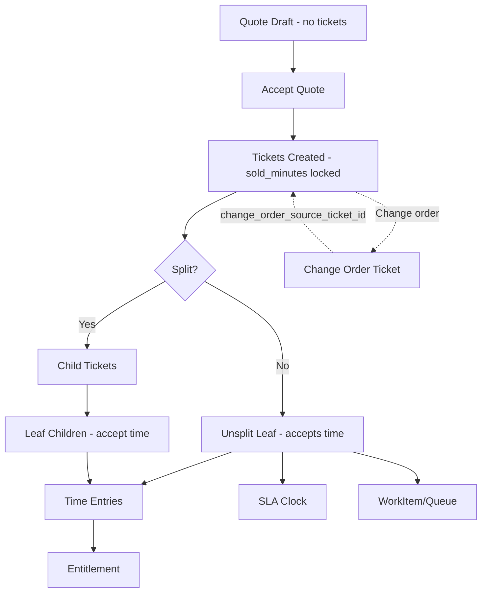

STATUS: AUTHORITATIVE — IMPLEMENTATION REQUIRED
SCOPE: Ticket Backbone Correction
VERSION: v2
SUPERSEDES: v1
DATE: 2026-03-06

# Stress Test Scenarios — Ticket Backbone (v2)

> Governed by `00_foundations/02_Ticket_Architecture_Decisions_v1.md`.
> See also: `07_commercial/05_Sold_Ticket_Structural_Spec_v1.md` for the comprehensive spec with lifecycle contract, prohibited behaviours, and extended stress tests.

These scenarios must pass before merging implementation.

## A) Time entry invariants
1. Draft time entry created with no ticket_id; attempt submit → hard fail.
2. Draft time entry with task_id whose task has ticket_id; submit resolves ticket → pass.
3. Time entry against roll-up ticket (has children) → hard fail.
4. Time entry against leaf ticket (unsplit sold ticket or leaf child) → pass.
5. Backfill does not alter historical start/end/duration values.

## B) Quote lifecycle
6. Create quote with labour items → NO tickets created during quoting.
7. Accept quote → one ticket per sold labour item with `sold_minutes` locked, `is_baseline_locked = 1`.
8. Attempt to edit `sold_minutes` or `sold_value_cents` after acceptance → hard fail.
9. Change order creates new ticket with `change_order_source_ticket_id` pointing to original → pass.
10. Change order ticket is NOT a child of the original (no parent_ticket_id) → verify.

## C) WBS split
11. Split a 100h ticket into children → parent becomes roll-up; children estimated_minutes sum ≤ 100h (variance visible if not equal).
12. Time logged to children rolls up to parent views; parent rejects direct logging.
13. Children can be split further (grandchildren); `root_ticket_id` always points to sold root.

## D) SLA/Agreement
14. Ticket with SLA due dates triggers warning/breach events correctly.
15. Ticket with agreement included minutes consumes entitlement.
16. Overages require explicit approval record before invoicing/export.

## E) Queue/assignment
17. Ticket logged to department queue; engineer pulls; department head allocates another.
18. Preferred assignee set at creation; later reassigned; both intent and reality recorded.

## F) Backward compatibility
19. Upgrade path where tasks exist but tickets not yet backfilled: system remains operable; submit resolves where possible.
20. User skips versions and lands on schema where new columns exist but backfill not run: system fails safe (cannot submit unlinked time).

## G) Change order aggregation
21. Original ticket (10h) + change order ticket (5h) → reporting shows 15h total by following `change_order_source_ticket_id`.
22. Change order ticket can be split into children with its own `root_ticket_id` = self.

## Mermaid test map

