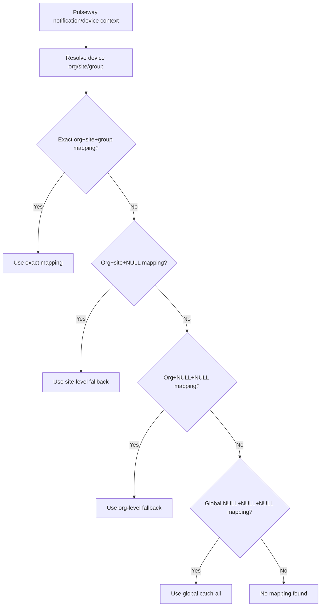
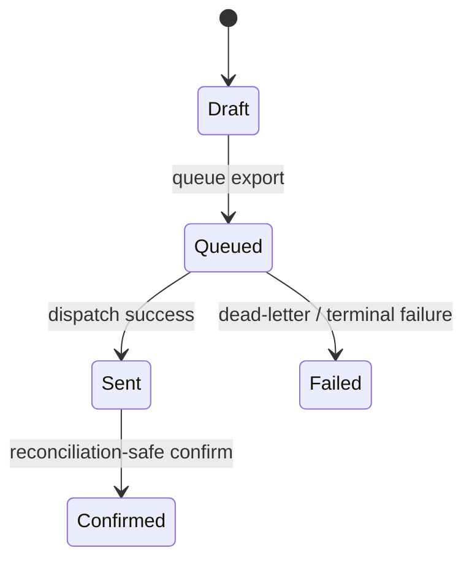

# PET Gap Closure — Pulseway Mapping, Feature Flags, and Billing Export v1

## 1. Purpose

This document defines the authoritative gap-closure specification for three currently identified implementation gaps in PET:

1. Pulseway mapping resolution determinism and precedence
2. Feature flag seeding and alignment
3. Billing export lifecycle completion

This is a **gap-closure specification**, not a redesign document. The purpose is to close real behavioural gaps revealed by audit, preserve backward compatibility, and reduce implementation drift.

This document is binding for implementation.

---

## 2. Scope

### In scope
- Feature flag seeding alignment for flags already referenced in code
- Pulseway org/site/group mapping precedence and deterministic selection
- Billing export confirmation / reconciliation lifecycle completion
- Minimal REST/API additions required for billing export confirmation
- Minimal migration changes required to support the above safely
- Tests required to enforce the intended lifecycle and negative guarantees
- Demo seed review and any required additive seed updates

### Out of scope
- Redesign of Pulseway integration architecture
- New feature flag concepts or policy redesign
- New billing concepts beyond confirmation/reconciliation completion
- Documentation recovery for unrelated undocumented subsystems
- UI redesign beyond minimal exposure required by confirmed lifecycle/API changes

---

## 3. Architectural Constraints

The following PET rules are non-negotiable:

- Domain rules must live in the Domain layer only
- Immutable historical records remain immutable
- Corrections are additive only
- Backward compatibility is mandatory
- Migrations are forward-only
- UI must not contain business logic
- Read-side projections and dashboards must not create or mutate domain records
- No implementation may broaden scope beyond the specific gaps defined here

---

# 4. Subsystem A — Feature Flag Alignment

## 4.1 Structural Specification (what it is)

### Fields
Feature flags are key/value settings stored in the PET settings persistence layer.

For the purposes of this gap-closure package, the authoritative referenced keys are:

- `pet_sla_scheduler_enabled`
- `pet_work_projection_enabled`
- `pet_queue_visibility_enabled`
- `pet_priority_engine_enabled`
- `pet_escalation_engine_enabled`
- `pet_helpdesk_enabled`
- `pet_helpdesk_shortcode_enabled`
- `pet_advisory_enabled`
- `pet_advisory_reports_enabled`
- `pet_resilience_indicators_enabled`
- `pet_pulseway_enabled`
- `pet_pulseway_ticket_creation_enabled`

### Invariants
- Every flag referenced by `FeatureFlagService` must exist in seeded settings storage
- Missing flags must still evaluate to disabled for runtime safety
- Seeding a missing flag must not enable a feature by default
- Existing flag values must not be overwritten by migration
- Feature flags must remain centrally resolved through `FeatureFlagService`

### State transitions
A feature flag is not a domain lifecycle aggregate. The relevant transitions are configuration state transitions only:

- absent → seeded false
- false → true
- true → false

No other semantics are introduced by this document.

### Events
No new domain events are required.

### Persistence
Feature flags persist through the PET settings storage already in use.

Implementation must add missing referenced keys via a new forward migration using additive insert-if-missing behaviour.

### API
No new feature-flag API is required by this document.

If an existing admin/settings surface already exists, it may continue to operate unchanged.

---

## 4.2 Lifecycle Integration Contract (when it exists)

### Render rules
- A feature must not render or register routes unless its governing flag logic allows it
- Missing seeded keys must not cause fatal behaviour; they must resolve as disabled
- This document does not require a new UI for managing flags

### Creation rules
- Missing referenced keys must be created only by migration or explicit settings administration
- Runtime code must not auto-create missing flags during feature access

### Mutation rules
- Runtime feature access must not mutate flag state
- Migrations must only insert missing flags and must not reset existing values
- Controllers, services, and jobs must continue to read through `FeatureFlagService`, not bypass it

---

## 4.3 Prohibited Behaviours

- Must not silently enable newly seeded flags by default
- Must not overwrite existing stored flag values
- Must not create flags lazily during runtime access
- Must not duplicate flag meaning under different keys
- Must not introduce controller-local flag parsing separate from `FeatureFlagService`
- Must not remove currently referenced flags without repository-wide proof that they are unused

---

## 4.4 Stress-Test Scenarios

1. **Missing seeded flag in older install**
   - Existing system upgrades
   - Migration runs
   - Missing referenced flag appears with value false
   - Existing values remain unchanged

2. **Missing flag before migration**
   - Runtime flag lookup occurs before migration on old environment
   - Feature remains disabled
   - No auto-write occurs

3. **Flag already present and true**
   - Migration runs on environment with manually enabled flag
   - Existing true value remains true

4. **Controller/service gating consistency**
   - Same flag checked in different layers
   - Both resolve through `FeatureFlagService`
   - No contradictory enable/disable behaviour

---

## 4.5 Demo Seed Contract

### New seed data
No demo content records are required.

### Changes required to old seed
If demo environments rely on these flags being visible in settings, the seed/setup path may ensure the missing keys exist. This must remain additive and must default to false unless the demo flow intentionally enables them in a separate explicit demo configuration step.

---

# 5. Subsystem B — Pulseway Mapping Precedence

## 5.1 Structural Specification (what it is)

### Fields
Pulseway org mappings use the existing mapping structure, including:

- integration identifier
- Pulseway org identifier
- Pulseway site identifier
- Pulseway group identifier
- mapped PET customer identifier
- mapped PET site identifier
- record identifier / stable persistence identity

This document does not introduce new mapping concepts.

### Invariants
- Mapping resolution must return at most one authoritative mapping for a device context
- More specific mappings must win over broader mappings
- Mapping selection must be deterministic
- Global catch-all mapping may exist only as the broadest fallback
- Ticket routing must remain backward compatible except where precedence resolves current ambiguity

### State transitions
Pulseway mappings are configuration entities, not lifecycle aggregates. Relevant mutation semantics:

- mapping absent → mapping created
- mapping updated → remains same mapping identity
- mapping deleted/disabled → no longer eligible

This document does not redefine broader CRUD behaviour. It only defines authoritative **selection precedence**.

### Events
No new domain events are required.

### Persistence
Existing persistence remains authoritative.

The repository selection logic must support deterministic precedence for a device context using this ranking:

1. `org + site + group`
2. `org + site + NULL`
3. `org + NULL + NULL`
4. `NULL + NULL + NULL`

No other precedence levels are introduced by this document.

If required to prevent unresolved ambiguity, a forward migration may add supporting uniqueness or normalisation constraints. Such migration must be additive and backward compatible.

### API
No new public API concept is required.

Existing mapping CRUD may continue to operate, but runtime resolution must follow the precedence contract in this document.

---

## 5.2 Lifecycle Integration Contract (when it exists)

### Render rules
- A mapping must not affect ticket routing unless it exists in persistence and matches the current device context under the precedence rules
- Broad fallback mappings must not hide more specific mappings
- The system must not invent a route when no mapping qualifies

### Creation rules
- Mappings are created only through existing administrative/configuration paths
- Runtime ticket creation must not auto-create missing mappings
- Catch-all mappings must not be auto-generated by the system

### Mutation rules
- Runtime ticket creation may read mappings only
- Runtime resolution must not mutate mappings
- Updates to mapping records must not change the precedence model
- Deterministic ordering must be stable for equal-ranked candidates using a stable tiebreaker

---

## 5.3 Prohibited Behaviours

- Must not select mappings nondeterministically
- Must not allow broader mappings to beat more specific mappings
- Must not auto-create mappings during notification ingest or ticket creation
- Must not silently ignore specificity when multiple eligible mappings exist
- Must not use catch-all fallback in a way that overrides a valid more specific match
- Must not redesign mapping semantics beyond the precedence rules defined here

---

## 5.4 Stress-Test Scenarios

1. **Exact match wins**
   - Device has org/site/group
   - All four specificity levels exist
   - Exact `org + site + group` mapping is selected

2. **Site-level fallback**
   - No exact mapping exists
   - `org + site + NULL` exists
   - It is selected ahead of org-level and global mappings

3. **Org-level fallback**
   - No exact or site-level mapping exists
   - `org + NULL + NULL` exists
   - It is selected ahead of global fallback

4. **Global catch-all fallback**
   - No more specific mapping exists
   - Global all-NULL mapping exists
   - It is selected

5. **Stable duplicate rank behaviour**
   - Two eligible mappings exist at same specificity level
   - Repository still returns deterministic result using stable tiebreaker
   - No random DB-order behaviour is allowed

6. **No mapping available**
   - No eligible mapping exists
   - No mapping is returned
   - No auto-creation occurs

---

## 5.5 Demo Seed Contract

### New seed data
Demo data should include additive examples of:

- one exact org/site/group mapping
- one org/site/NULL mapping
- one org/NULL/NULL mapping
- one global NULL/NULL/NULL mapping

This allows demo verification of precedence.

### Changes required to old seed
Any existing demo seed that currently creates only exact or global mappings should be extended additively so the precedence ladder can be demonstrated and tested.

---

## 5.6 Process Flow

---

# 6. Subsystem C — Billing Export Lifecycle Completion

## 6.1 Structural Specification (what it is)

### Fields
Billing export remains the existing finance/export aggregate. Relevant lifecycle fields include:

- export identity
- export status
- export items
- queue/export timestamps where already present
- external mapping / accounting linkage where already present
- outbox linkage where already present

No new billing concept is introduced. This document only completes the lifecycle already implied by existing code.

### Invariants
- Billing export items are mutable only while export is draft
- An export may be queued only from draft
- An export may be marked sent only through the dispatch path
- An export may be confirmed only after it is sent
- Confirmation must be idempotent
- Confirmation must not alter exported items or exported invoice envelope data
- Duplicate export must not occur

### State transitions
The authoritative lifecycle is:

- `draft → queued → sent → confirmed`
- `draft → queued → failed` is allowed through dispatch failure handling

No other transitions are permitted unless already valid under existing broader domain rules and explicitly preserved by current domain code.

### Events
No new mandatory domain event is required by this document.

If an existing finance/export eventing pattern already exists, confirmation may participate additively without redesign.

### Persistence
Existing billing export persistence remains authoritative.

Implementation must complete the confirmation path using existing repositories and external mapping evidence where available.

Confirmation must update only lifecycle state and confirmation metadata if such metadata already exists or is minimally added.

### API
A minimal confirmation API surface is required unless an equivalent application path already exists.

The confirmation action must:
- target an existing sent export
- be idempotent
- reject illegal states
- avoid mutation of export items

---

## 6.2 Lifecycle Integration Contract (when it exists)

### Render rules
- Draft exports may render draft-only actions such as item composition and queueing
- Queued exports must not render as confirmed
- Sent exports may render confirmation/reconciliation action if confirmation has not yet occurred
- Confirmed exports must render as confirmed and must not expose queue/edit actions

### Creation rules
- Billing exports are created through existing export creation flows only
- Confirmation must not create a new export
- Confirmation must not create duplicate accounting export records

### Mutation rules
- Export items may be added only while draft
- Queueing is allowed only from draft
- Sent is allowed only from queue/dispatch success path
- Confirmed is allowed only from sent and only when reconciliation-safe evidence exists
- Confirming an already confirmed export must be a no-op success

---

## 6.3 Prohibited Behaviours

- Must not allow item mutation after queueing
- Must not confirm an export that was never sent
- Must not re-queue a confirmed export
- Must not create a second accounting export for the same billing export
- Must not mutate exported invoice content during confirmation
- Must not treat confirmation as a destructive overwrite of prior export history
- Must not leave an unused lifecycle state exposed with no executable path

---

## 6.4 Stress-Test Scenarios

1. **Draft export remains editable**
   - Draft exists
   - Items added successfully
   - No queue/send/confirm side effects occur

2. **Queued export becomes immutable**
   - Export transitions to queued
   - Additional item insertion is rejected

3. **Sent export can be confirmed**
   - Export sent successfully
   - Reconciliation-safe evidence exists
   - Confirmation succeeds
   - Items remain unchanged

4. **Illegal early confirmation**
   - Draft or queued export is confirmed
   - Operation is rejected
   - No mutation occurs

5. **Idempotent confirmation**
   - Sent export confirmed once
   - Confirmation requested again
   - Second call returns success/no-op
   - No duplicate side effects occur

6. **Duplicate export prevention**
   - Export already queued/sent/confirmed
   - Attempt to queue/export again
   - Operation is rejected according to domain guards

---

## 6.5 Demo Seed Contract

### New seed data
Demo seed should include additive examples of:

- one draft billing export with items
- one queued billing export
- one sent billing export with external/accounting mapping evidence
- one confirmed billing export if confirmation path is implemented in seed fixtures

### Changes required to old seed
Existing demo seed should be extended so finance/demo views can show the lifecycle progression, including at least one sent export eligible for confirmation.

---

## 6.6 Process Flow

---

# 7. Implementation Guidance

## 7.1 Required minimal implementation package

### Feature flags
- Add new forward migration seeding missing referenced keys with default `false`
- Preserve existing "missing => disabled" runtime behaviour
- Do not remove existing flags in this package

### Pulseway
- Update repository resolution logic to support precedence-based matching
- Use deterministic ordering and stable tiebreaker
- Limit result to one authoritative mapping
- Add migration only if required for safe ambiguity reduction

### Billing export
- Implement confirmation path through Application + API layers
- Enforce sent-only confirmation in Domain
- Make confirmation idempotent
- Require reconciliation-safe evidence using existing external mapping/integration evidence where available
- Do not mutate export items during confirmation

---

# 8. Tests Required

## 8.1 Feature flags
- missing referenced keys seeded additively
- existing flag values preserved
- missing-before-migration still resolves disabled

## 8.2 Pulseway
- exact beats broader mappings
- site-level beats org-level
- org-level beats global catch-all
- no mapping returns no result
- stable tiebreaker prevents nondeterminism

## 8.3 Billing export
- queue only from draft
- no item mutation after queue
- confirm only from sent
- confirmation idempotent
- confirm does not alter items
- duplicate queue/export prevented

---

# 9. Approval Gate

Implementation must not begin unless the implementing agent acknowledges this document as binding.

Any ambiguity discovered during implementation must be raised explicitly before scope expansion.

