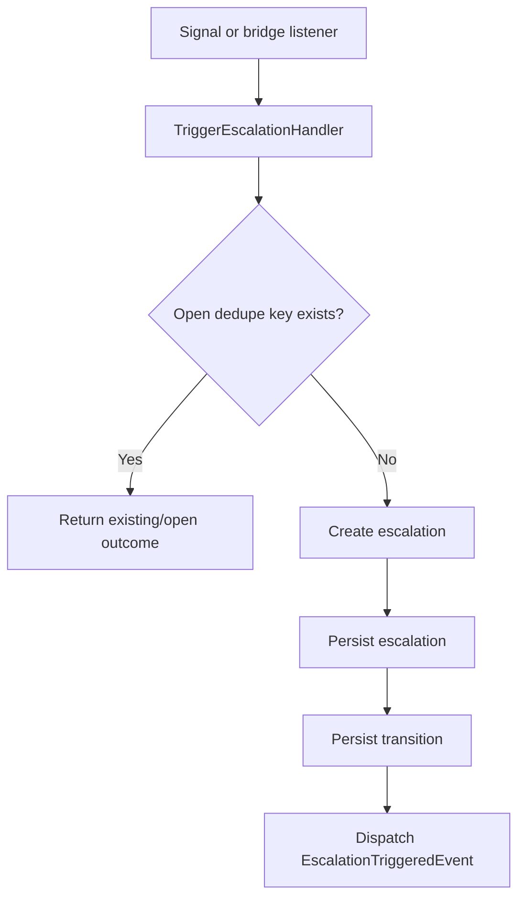
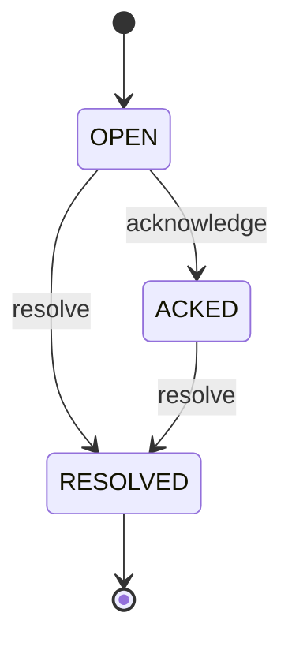
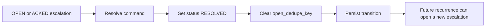

# PET Escalation Completion — Corrected Specification v2

**Target location:** `plugins/pet/docs/22_escalation_and_risk/PET_Escalation_Completion_Corrected_v2.md`

## 0. Purpose

This document replaces the earlier escalation completion draft that diverged too far from the current PET escalation implementation.

This specification is intentionally **delta-aware**:

- it treats the existing escalation aggregate as the baseline
- it identifies what stays as-is
- it identifies what must change now
- it identifies what is explicitly deferred

This is a **gap-closure completion document**, not a redesign.

---

## 1. Current Baseline to Preserve

The following existing behaviour is accepted as the baseline unless explicitly changed below:

- Escalation aggregate exists and is already implemented.
- Escalation transitions are already implemented.
- Persistence exists:
  - `pet_escalations`
  - `pet_escalation_transitions`
- Application handlers already exist:
  - trigger
  - acknowledge
  - resolve
- REST endpoints already exist for:
  - list
  - detail
  - acknowledge
  - resolve
- Dedupe currently uses `open_dedupe_key` and repository support.
- Domain events already exist:
  - `EscalationTriggeredEvent`
  - `EscalationAcknowledgedEvent`
  - `EscalationResolvedEvent`

This work package must **complete the subsystem safely**, not replace it.

---

# 2. Structural Specification

## 2.1 Aggregate
`Escalation`

## 2.2 Canonical fields

The escalation aggregate is defined by the following business fields:

- `id`
- `source_entity_type`
- `source_entity_id`
- `severity`
- `status`
- `reason`
- `summary`
- `opened_at`
- `acknowledged_at` (nullable)
- `resolved_at` (nullable)
- `resolution_note` (nullable)
- `open_dedupe_key` (nullable after resolution)
- `metadata_json` (if already supported by current persistence)

## 2.3 Canonical source types

For this work package, the authoritative supported source entity types are:

- `ticket`
- `project`
- `customer`

No new source entity types are added in this phase.

### Deferred
The following are explicitly deferred unless separately specified later:

- `task`
- `sla`

## 2.4 Canonical severity model

The authoritative severity model for this phase is the **existing richer model**, not a collapsed warning/critical model:

- `LOW`
- `MEDIUM`
- `HIGH`
- `CRITICAL`

No severity collapse is performed in this phase.

## 2.5 Canonical status model

The authoritative status model for this phase is the **existing implemented model**:

- `OPEN`
- `ACKED`
- `RESOLVED`

These are the canonical domain and persistence values for this phase.

## 2.6 Invariants

### A. Additive lifecycle
Escalation lifecycle must remain additive and historically visible.

### B. One open escalation per dedupe identity
At most one **open** escalation may exist for the same dedupe identity.

For this phase, the authoritative dedupe identity remains the **existing current model**:

- `source_entity_type`
- `source_entity_id`
- `severity`
- `reason`

encoded into `open_dedupe_key`.

This is intentionally preserved to avoid redesign during completion work.

### C. Resolved escalations must not be re-opened
Once resolved, an escalation cannot transition back to `OPEN` or `ACKED`.

### D. Resolution clears active dedupe identity
When an escalation is resolved, `open_dedupe_key` must be cleared so that a future new escalation may be opened if the condition recurs.

## 2.7 State transitions

### Allowed
- `OPEN -> ACKED`
- `OPEN -> RESOLVED`
- `ACKED -> RESOLVED`

### Idempotent no-op success
- `ACKED -> ACKED` may be treated as idempotent success at the application boundary only if already implemented that way
- `RESOLVED -> RESOLVED` may be treated as idempotent success at the application boundary only if already implemented that way

### Forbidden
- `ACKED -> OPEN`
- `RESOLVED -> OPEN`
- `RESOLVED -> ACKED`

This phase does **not** force acknowledgement-before-resolution, because the current aggregate already supports direct `OPEN -> RESOLVED` and this work package is not a redesign.

## 2.8 Events

The authoritative event names for this phase are the already-implemented domain events:

- `EscalationTriggeredEvent`
- `EscalationAcknowledgedEvent`
- `EscalationResolvedEvent`

No event renaming is part of this phase.

## 2.9 Persistence

Authoritative persistence for this phase:

- `pet_escalations`
- `pet_escalation_transitions`

Required persistence behaviour:

- transition history must be recorded
- open dedupe uniqueness must remain enforced
- resolution must clear `open_dedupe_key`
- no destructive migration of historical escalation rows is allowed

## 2.10 API

### Existing required API surface
- `GET /pet/v1/escalations`
- `GET /pet/v1/escalations/{id}`
- `POST /pet/v1/escalations/{id}/acknowledge`
- `POST /pet/v1/escalations/{id}/resolve`

### Explicit decision for this phase
A manual create endpoint is **not required** for this work package.

`POST /pet/v1/escalations` is deferred unless a separate operational workflow explicitly requires manual escalation creation.

---

# 3. Lifecycle Integration Contract

## 3.1 Render rules

Escalations must render when:
- they exist in persistence
- the requesting user has access
- the relevant feature flag is enabled
- the relevant UI surface is enabled

Escalations must not render merely because a parent entity exists.

Resolved escalations may still appear in historical/detail views if the surface is designed to show history.

## 3.2 Creation rules

Escalations may be created only by:
- the existing application trigger path
- approved bridge/listener paths already wired into the system
- future explicit rule-evaluation paths defined in later docs

Escalations must not be created:
- on page render
- on list fetch
- on dashboard aggregation
- by read-side query services
- by duplicate re-processing of the same active dedupe identity

## 3.3 Mutation rules

Escalations may mutate only via:
- acknowledge command/handler
- resolve command/handler

Permitted mutation scope:
- status transition
- timestamps associated with the transition
- resolution note where applicable
- dedupe key clearing on resolution
- transition recording

Escalations must not mutate:
- source identity
- severity
- reason
- historical transition rows
- previously recorded opened/acknowledged/resolved timestamps except as part of the legitimate first transition recording

---

# 4. Prohibited Behaviours

- Must not redesign dedupe identity in this phase.
- Must not rename severity/status/event models in this phase.
- Must not add `task` or `sla` source types in this phase.
- Must not require acknowledgement before resolution in this phase.
- Must not auto-create escalations during read/render/query operations.
- Must not create duplicate open escalations for the same active dedupe identity.
- Must not mutate source identity after creation.
- Must not reopen a resolved escalation.
- Must not delete or overwrite escalation transition history.
- Must not add a manual create endpoint in this phase.
- Must not silently translate domain values to a second competing canonical model.

---

# 5. Completion Scope for This Work Package

This package is for **completion**, not redesign.

## 5.1 Included

### A. Rules/trigger completion where already planned
Complete missing trigger paths that are already part of the intended escalation subsystem, especially where current codebase clearly indicates incomplete integration.

### B. Detail/timeline UX completion
If the API already exposes detail/history, complete the missing UI timeline/detail surface.

### C. Settings/feature-flag completion
Complete escalation-specific feature flag/settings alignment if code and UI are inconsistent.

### D. Tests
Add or complete:
- feature-flag-off behaviour
- duplicate-trigger safety
- transition legality
- resolution dedupe clearing
- API/controller behaviour where missing

## 5.2 Excluded

- source type expansion
- severity model redesign
- status model redesign
- event renaming
- full rule-engine redesign unless separately specified
- manual creation workflow
- advisory-driven escalation design if not already explicitly documented elsewhere

---

# 6. Stress-Test Scenarios

## 6.1 Duplicate trigger safety
Given an active open escalation with the same dedupe identity, a repeated trigger must not create a second open escalation.

## 6.2 Resolution then recurrence
After an escalation is resolved, a later recurrence of the same source/severity/reason may create a new escalation because the active dedupe key was cleared.

## 6.3 Acknowledge path
Acknowledging an open escalation records the transition and does not create a second escalation.

## 6.4 Direct resolve path
Resolving an open escalation directly is allowed and must record the resolution transition correctly.

## 6.5 Illegal reopen
A resolved escalation must not transition back to `OPEN` or `ACKED`.

## 6.6 Read-side safety
Listing, filtering, detail viewing, or dashboard rendering must not create or mutate escalations.

## 6.7 Feature flag off
When the escalation engine flag is off, no escalation side effects must occur through the trigger path.

## 6.8 Parent-entity independence
Escalation acknowledgement/resolution must not mutate the parent ticket/project/customer lifecycle beyond whatever separate existing listeners explicitly perform.

---

# 7. Demo Seed Contract

## 7.1 New seed expectations
Demo seed should include escalation examples that match the real implemented domain model:

- one `OPEN`
- one `ACKED`
- one `RESOLVED`

## 7.2 Source coverage
Prefer at least:
- one ticket-based escalation
- one project-based escalation

Customer-based escalation is optional for this phase.

## 7.3 History visibility
At least one seeded escalation should include transition history sufficient to demonstrate the timeline/detail view.

## 7.4 No fake models
Demo seed must use:
- current source types
- current severity values
- current status values

It must not seed speculative `warning/critical` or lowercase status values for this phase.

---

# 8. Process Flow Diagrams

## 8.1 Trigger to deduped open escalation

## 8.2 Acknowledge / resolve lifecycle

## 8.3 Resolution clears active dedupe identity

---

# 9. Implementation Notes for TRAE

TRAE must treat this document as binding.

Where existing code differs from the earlier superseded escalation draft, this corrected document wins.

If ambiguity remains during planning, TRAE must stop and return bounded options before implementation.
