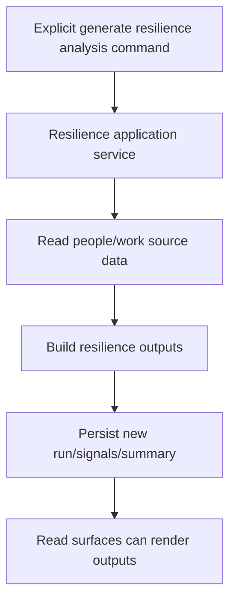
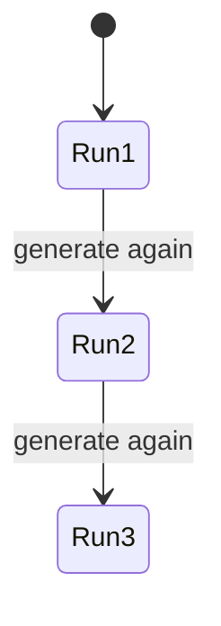
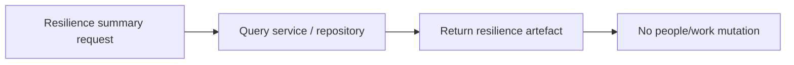

# PET People Resilience Outputs — Completion Specification v1

**Target location:** `plugins/pet/docs/23_people_resilience/PET_People_Resilience_Outputs_v1.md`

## 0. Purpose

This document defines the next completion package for PET around People Resilience outputs.

This package is intended to make people-risk, resilience, and continuity insight visible as a derived management surface over existing PET truth.

It covers:

- people resilience outputs
- resilience summary surfaces
- resilience signal visibility
- resilience analysis read models and report outputs
- manager/demo-ready resilience views

This is a **completion package**, not a redesign.

The purpose is not to invent a new HR system, but to expose structurally useful resilience insight from already-modeled PET data such as:

- role coverage
- single points of failure
- workload concentration
- assignment dependency
- team capability fragility
- critical skill/person gaps

This package must preserve PET principles:

- source truth remains in source domains
- resilience outputs are derived, additive, and read-oriented
- no people or staffing truth is mutated from resilience screens
- dashboards and reports are read-only
- UI contains no business logic
- backward compatibility
- forward-only migrations

---

# 1. Scope of This Work Package

## 1.1 Included

This package covers completion of:

1. resilience signal visibility
2. resilience summary/read surfaces
3. resilience analysis output generation if already scaffolded or clearly needed
4. manager-facing resilience panels
5. demo seed support for meaningful resilience examples
6. tests for read-side safety, additive outputs, and visibility correctness

## 1.2 Excluded

This package does **not** include:

- automated staffing actions
- leave planning engine
- recruiting workflows
- compensation or HR workflows
- predictive ML models
- automatic reassignment of work
- redesign of source employee/team/role/capability models
- external HR system integration

---

# 2. Structural Specification

## 2.1 Resilience principle

People resilience outputs are **derived advisory/management artefacts** over existing PET people/work truth.

They may derive from:
- employees
- teams
- roles
- skills/capabilities
- work orchestration
- project/support allocation
- advisory/escalation context where already relevant

They must not replace those domains.

## 2.2 Canonical resilience concepts

This package should support, at minimum, the following concepts if already present or clearly scaffolded:

- `ResilienceRequirement`
- `ResilienceSignal`
- `ResilienceAnalysisRun` or equivalent analysis identity
- resilience summary blocks/panels
- resilience output rows grouped by team or scope

TRAE must preserve existing names if aligned.

## 2.3 Canonical fields

### Resilience Requirement
Expected fields or equivalent:
- `id`
- `scope_type`
- `scope_id`
- `requirement_type`
- `title`
- `summary`
- `severity` or priority
- `status` if lifecycle exists
- `created_at`
- `metadata_json` or equivalent

### Resilience Signal
Expected fields or equivalent:
- `id`
- `signal_type`
- `severity`
- `title`
- `summary`
- `employee_id` (nullable)
- `team_id` (nullable)
- `role_id` (nullable)
- `source_entity_type` (nullable)
- `source_entity_id` (nullable)
- `status`
- `created_at`
- `analysis_run_id` or equivalent grouping
- `metadata_json` or equivalent

### Analysis Run
Expected fields or equivalent:
- `id`
- `scope_type`
- `scope_id`
- `started_at`
- `completed_at`
- `status`
- `generated_by` if applicable
- `summary_json` or equivalent
- `version_number` or run sequence where already useful

## 2.4 Invariants

### A. Derived-only truth
Resilience outputs must be derived from source people/work truth and must not become source-of-truth for staffing or capability data.

### B. Additive analysis history
If analysis runs exist, they must be additive and historically visible.
A new run must not destructively remove prior runs.

### C. No people-truth mutation
Generating or viewing resilience outputs must not mutate employees, teams, roles, assignments, or work items.

### D. Explicit generation path
If resilience analysis generation is command-based, it must occur through an explicit command path, not on page render.

### E. Read-side safety
Viewing resilience outputs, signals, summaries, or history must perform no writes.

## 2.5 Lifecycle expectations

### Requirements / signals
If lifecycle/status already exists, preserve it.
If not, this package may use lightweight active/inactive semantics rather than inventing a large state machine.

### Analysis runs
If analysis runs exist or are introduced in this package, they must be additive and retrievable.

## 2.6 Events

Where current code already supports eventing, the following semantics are required:

- resilience signal created
- resilience analysis run completed
- resilience summary refreshed if such eventing already exists

Event class names may follow current conventions.

## 2.7 Persistence

Preferred implementation order:

1. reuse existing resilience/people/work tables/entities if already present
2. complete additive output persistence
3. add analysis run persistence only where needed
4. do not alter source people/work truth except through already-existing source-domain behaviour

## 2.8 API

Expected API shape for this phase includes:

### Read
- list resilience signals
- list resilience requirements if they already exist
- view resilience summary for a team/scope
- view resilience analysis runs/history if applicable
- latest resilience summary for a scope

### Commands
- generate resilience analysis (only if analysis generation is part of current scaffold or necessary to make the package useful)

Exact route names may follow current conventions, but command and read surfaces must remain separate.

---

# 3. Lifecycle Integration Contract

## 3.1 Render rules

Resilience surfaces render only when:
- relevant feature flags are enabled
- source people/work data exists
- the requesting user has access to the relevant team/scope
- the resilience artefact actually exists, unless the surface is an explicit generate action

Resilience signals must not be fabricated in UI.

## 3.2 Creation rules

Resilience outputs may come into existence when:
- existing derivation logic creates them from source truth
- explicit analysis generation command is executed
- demo seed creates valid persisted examples through real paths

They must not be created:
- on page load
- on dashboard render
- on list fetch
- on summary endpoint render

## 3.3 Mutation rules

Resilience outputs may mutate only through explicit command paths already supported by design.

Allowed mutation categories:
- create new analysis run
- add new derived signals
- optionally close/deactivate prior signals if that is the established additive model

Not allowed:
- read endpoint side effects
- mutation of employee/team/role/work source truth
- UI-local business legality

## 3.4 Parent/source lifecycle relationship

Resilience outputs exist inside the lifecycle of source people/work truth but are not themselves source truth.

Always ask:
- what source truth feeds this output?
- what explicitly triggers generation?
- what scope does it summarize?
- what access restrictions apply?

---

# 4. Prohibited Behaviours

- Must not make resilience outputs the source of truth for staffing/capability.
- Must not mutate employees, teams, roles, skills, assignments, or work items from resilience surfaces.
- Must not generate resilience outputs on render.
- Must not fabricate signals for UI-only presentation.
- Must not silently destroy prior analysis history if additive runs are available.
- Must not move business legality into UI.
- Must not bypass scope visibility restrictions.
- Must not rely on fake dashboard-only values instead of persisted or derived truth.

---

# 5. Completion Scope for This Work Package

## 5.1 Included

### A. Resilience output/read surfaces
Complete read surfaces for resilience signals, summaries, and any existing resilience requirements.

### B. Resilience analysis generation
If analysis generation is already scaffolded or needed to make the package useful, complete an explicit generation path.

### C. Additive resilience persistence
Ensure resilience outputs/history are additive, not destructive.

### D. Manager-facing resilience panels
Complete manager-visible resilience summary panels using real persisted/derived resilience truth.

### E. Demo seed
Seed meaningful resilience examples through real source/generation paths.

### F. Tests
Add tests for:
- read-side safety
- additive generation/history
- scope visibility
- feature-flag-off behaviour
- operational independence

## 5.2 Deferred

- automated staffing recommendations
- leave/capacity simulation
- recruiting and hiring workflows
- external HR integrations
- predictive analytics beyond current resilience scope

---

# 6. Stress-Test Scenarios

## 6.1 Explicit generation
Generating resilience analysis through the command path creates new resilience output without mutating source people/work truth.

## 6.2 Repeat generation
Generating analysis again for the same scope creates additive history/run output rather than silently overwriting prior history.

## 6.3 Read-side safety
Viewing resilience list/detail/summary/history performs zero writes.

## 6.4 Feature flag off
When resilience features are off, resilience generation/read surfaces remain unavailable and create no side effects.

## 6.5 Scope isolation
A user without access to a team/scope must not view resilience outputs for that scope.

## 6.6 Signal integrity
Displayed resilience signals must come from actual persisted/derived outputs, not UI fabrication.

## 6.7 Operational independence
Generating or viewing resilience outputs must not alter employee assignments, work queues, escalations, or advisory reports.

---

# 7. Demo Seed Contract

## 7.1 Required demo examples

Seed enough resilience artefacts to demonstrate:

- at least one resilience signal
- at least one resilience summary or analysis run
- at least one repeated generation/history example if runs/versioning exist
- outputs linked to real people/work source data

## 7.2 Recommended source coverage

Prefer seeded examples derived from:
- team role coverage
- SPOF / dependency risk
- workload concentration
- capability/role fragility
where the current codebase supports them

## 7.3 No fake resilience-only rows

Demo resilience data must either:
- be generated through real resilience generation paths, or
- match persisted resilience structures and scope rules exactly

It must not be disconnected fake UI-only data.

---

# 8. Process Flow Diagrams

## 8.1 Generate resilience analysis

## 8.2 Additive history

## 8.3 Read-side safety

---

# 9. Implementation Notes for TRAE

TRAE must treat this document as binding.

This package is about making people resilience outputs visible and safe, not about inventing a new HR platform.

If current code already contains partial resilience entities, analysis services, controllers, or UI surfaces, TRAE must:
- preserve what aligns
- identify real completion gaps
- implement only the missing completion work

If ambiguity remains during planning, TRAE must stop and return bounded options before implementation.
