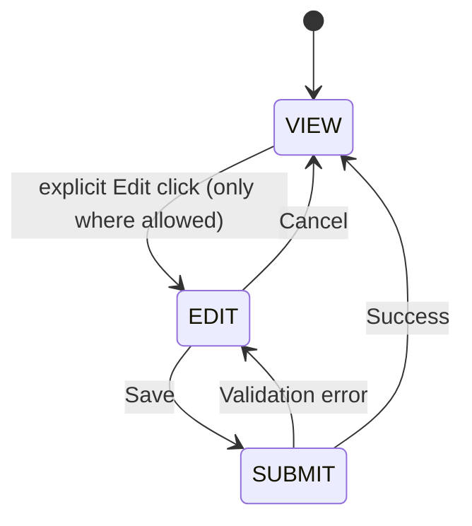

# PET Demo Shortcodes Implementation Spec
Version: v1.0 (Demo scope)  
Status: IMPLEMENTATION-READY (scope-locked)

This spec defines **only** the shortcodes needed for the next-day demo:

- `[pet_my_profile]`
- `[pet_my_work]`
- `[pet_my_calendar]`
- `[pet_activity_stream]`

It is intentionally minimal, resilient, and **demo-safe**.

---

## Global constraints (binding)

### G1) View-by-default
All shortcodes render **VIEW** mode by default.

### G2) Mutation rules
Only `[pet_my_profile]` may support editing, and **only for personal details** (see P3).  
Everything else is **read-only**.

### G3) Immutability
No shortcode may edit:
- accepted quotes
- submitted time
- SLA outcomes
- activity/event history

### G4) Data-source fallback policy (never fatal)
If a preferred data source is missing (schema drift / not implemented), the shortcode must:
- render an **empty state** (not an error)
- omit unavailable sections
- log a developer warning (server-side) but do not break rendering

### G5) Permissions & scoping
All shortcodes require authentication and must enforce:
- **SELF scope** (current user only) unless explicitly noted
- capability checks server-side
- no cross-customer leakage

---

## Standard UX states

---

## Shortcode 1: `[pet_my_profile]`

### Purpose
Show the logged-in user:
- personal details (view + edit)
- roles (view)
- skills (view)
- certifications (view)

### Audience / scope
- Audience: Staff (and optionally Managers)
- Scope: **SELF** only

### Attributes (optional)
- `show_roles="1"` (default 1)
- `show_skills="1"` (default 1)
- `show_certs="1"` (default 1)

### UI sections and fields

#### P1) Personal details (VIEW + EDIT)
Fields to display (and edit where available):
- Display name
- First name
- Last name
- Email (view; editable only if safe/allowed in your current user model)
- Phone (if stored)
- Title / Position (if stored)
- Avatar/photo (optional; demo-safe to omit)

**Edit scope (locked decision):**
- Editing is limited to **personal details only**.
- Skills/certs/roles are **view-only**.

#### P2) Roles (VIEW)
Display two labelled groups:
- **WordPress Roles** (from WP user roles)
- **PET Teams/Departments** (if a team model exists; else omit section)

#### P3) Skills (VIEW)
Display a list (or small table) of skills for the user.
If not available, show: “No skills recorded yet.”

#### P4) Certifications (VIEW)
Display a list/table:
- Certification name
- Issuer (optional)
- Award date / expiry (optional)
If not available, show: “No certifications recorded yet.”

### Data sources (priority order)

1) **PET read model / repository** if it already exists for staff profile/skills/certs
2) **WordPress user + usermeta** fallback

Fallback keys (only if needed; do not invent more):
- `pet_phone`
- `pet_title`
- `pet_skills_json` (JSON array of strings or objects)
- `pet_certs_json` (JSON array)

### Save behavior (personal details only)
- Submit uses a single endpoint/action (REST preferred) that updates only the allowed fields.
- Must validate basic formats (non-empty name; email format if editable).
- Must not fail page render if save fails—return inline validation errors.

### Acceptance criteria
- Renders without fatal errors even if skills/certs not implemented.
- Edit flow works for at least name/phone/title (where stored).
- Roles section shows WP roles; PET teams shown only if available.

---

## Shortcode 2: `[pet_my_work]`

### Purpose
A “My Day” work surface showing **what the user needs to do**, combining:
- Support tickets
- Project tickets/tasks (work items)

### Audience / scope
- Audience: Staff
- Scope: **SELF**

### Locked decisions
- Include: **assigned to me + items I’m participating in** (mentions/comments) where available.
- Show in **two groups**: Support vs Project.
- Default filter: **Open/In Progress/Waiting** only (hide Closed).

### UI layout
- Group 1: Support tickets
- Group 2: Project work (tickets/tasks)

Each row shows (best effort):
- Title / reference
- Status
- Priority (optional)
- Due / SLA target (optional)
- Customer / Project name (optional)
- Link to view page (or admin edit if no frontend view exists)

### Data sources (priority order)

1) Existing PET REST endpoints for “my tickets” / “assigned” / “work queue”
2) Existing repositories/read-model tables used by admin screens
3) Fallback: empty state sections

### Empty state
- If one group has no data, show: “No support tickets assigned.” / “No project work items assigned.”
- If data source missing, show: “Work source not available in this environment.” (non-fatal)

### Acceptance criteria
- Renders two groups and never fatals.
- At least one group shows real data if tickets exist.

---

## Shortcode 3: `[pet_my_calendar]`

### Purpose
Show the user’s calendar for the near term.

### Locked decisions
- Format: **Agenda list** (not a grid calendar)
- Horizon: next **14 days**
- Sources: **derived from work** (milestones due, SLA targets, scheduled items) rather than relying on a dedicated calendar subsystem.

### Audience / scope
- Audience: Staff
- Scope: **SELF**

### UI layout
Agenda list grouped by date:
- Date header
- Items with icon/type label (Milestone / Ticket / SLA / Task)
- Title
- Time (if known)
- Link target

### Data sources (priority order)
- Existing PET endpoints for upcoming milestones/tickets/SLA targets
- Fallback: empty agenda with “No upcoming work items.”

