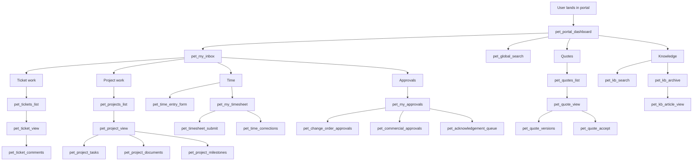

# PET Frontend Shortcodes Registry (Minimal Viable Portal)
Version: v1.0  
Status: Baseline-locked (Strategy A: Minimal viable portal)

This document is the **canonical registry** of **frontend shortcodes** for PET (Plan. Execute. Track) under **Strategy A**: only the minimum surfaces required for daily operations.

## Non‑negotiable safety rules

### Immutability & corrections
- Immutable records **must not be edited** via frontend shortcodes (accepted quotes, submitted time, events, SLA outcomes).
- Corrections are **additive** only (e.g., compensating time entries, change orders, commercial adjustments).

### Scoping & segregation
- All frontend shortcodes must enforce:
  - **Authentication required** (except login/reset).
  - **Tenant scoping** (no cross-customer leakage).
  - **Role/capability gating** (Customer / Staff / Manager).
  - **Object-level authorization** via domain policy checks (UI may not decide business logic).

### Read-only by default
- Unless explicitly marked as **Mutating**, a shortcode surface is **read-only**.

---

## 1) Registry index

Legend:
- **Audience**: Customer | Staff | Manager | Mixed
- **Mode**: RO (read-only) | MUT (mutating) | MIX (both RO+MUT)
- **Scope**: SELF (current user) | TEAM (manager’s teams) | CUSTOMER (current customer context) | GLOBAL (system-wide but permissioned)

| Shortcode | Audience | Mode | Scope | Primary purpose |
|---|---|---:|---|---|
| `[pet_portal_dashboard]` | Mixed | RO | SELF | Portal landing dashboard (widgets only, no mutation) |
| `[pet_portal_navigation]` | Mixed | RO | SELF | Portal navigation/menu container |
| `[pet_my_inbox]` | Mixed | RO | SELF | Unified inbox: assignments, mentions, escalations, approvals |
| `[pet_my_notifications]` | Mixed | RO | SELF | Notification list/center |
| `[pet_global_search]` | Mixed | RO | SELF | Global search input + filters |
| `[pet_search_results]` | Mixed | RO | SELF | Global search results surface |

| `[pet_login]` | Mixed | MUT | GLOBAL | Login form |
| `[pet_logout]` | Mixed | MUT | SELF | Logout action |
| `[pet_reset_password]` | Mixed | MUT | GLOBAL | Password reset flow |
| `[pet_account_dashboard]` | Mixed | RO | SELF | Account profile + preferences (non-domain) |

| `[pet_customers_list]` | Staff/Manager | RO | GLOBAL | List customers permitted to viewer |
| `[pet_customer_view]` | Mixed | RO | CUSTOMER | Customer summary (no edits) |
| `[pet_sites_list]` | Mixed | RO | CUSTOMER | Sites for current customer |
| `[pet_site_view]` | Mixed | RO | CUSTOMER | Site details (no edits) |
| `[pet_contacts_list]` | Mixed | RO | CUSTOMER | Contacts for customer/site |
| `[pet_contact_view]` | Mixed | RO | CUSTOMER | Contact details (no edits) |

| `[pet_tickets_list]` | Mixed | RO | CUSTOMER | Ticket list (scoped) |
| `[pet_ticket_view]` | Mixed | RO | CUSTOMER | Ticket detail read surface |
| `[pet_ticket_create]` | Customer/Staff | MUT | CUSTOMER | Create ticket (if enabled) |
| `[pet_ticket_comments]` | Mixed | MUT | CUSTOMER | Add comment (append-only) |
| `[pet_ticket_sla_status]` | Mixed | RO | CUSTOMER | SLA status + timers (visibility only) |
| `[pet_ticket_escalations]` | Staff/Manager | RO | CUSTOMER | Escalation visibility/history (no edits) |

| `[pet_projects_list]` | Mixed | RO | CUSTOMER | Project list |
| `[pet_project_view]` | Mixed | RO | CUSTOMER | Project overview |
| `[pet_project_milestones]` | Mixed | RO | CUSTOMER | Milestone list/status (no edits) |
| `[pet_project_tasks]` | Mixed | RO | CUSTOMER | Task list (visibility) |
| `[pet_task_view]` | Mixed | RO | CUSTOMER | Task detail (visibility; mutation is separate/explicit) |
| `[pet_comment_stream]` | Mixed | MUT | CUSTOMER | Append-only comments across objects (tickets/tasks/projects/quotes) |
| `[pet_project_documents]` | Mixed | RO | CUSTOMER | Document list/download (upload gated separately) |
| `[pet_project_timeline]` | Mixed | RO | CUSTOMER | Timeline/activity visualization |

| `[pet_quotes_list]` | Mixed | RO | CUSTOMER | Quotes list |
| `[pet_quote_view]` | Mixed | RO | CUSTOMER | Quote detail view |
| `[pet_quote_versions]` | Mixed | RO | CUSTOMER | Quote versions/history (immutable accepted versions) |
| `[pet_quote_accept]` | Customer | MUT | CUSTOMER | Accept quote (irreversible action UX) |
| `[pet_change_orders_list]` | Mixed | RO | CUSTOMER | Change orders list |
| `[pet_change_order_view]` | Mixed | RO | CUSTOMER | Change order detail |
| `[pet_commercial_adjustments_list]` | Staff/Manager | RO | CUSTOMER | Commercial adjustments (read-only visibility) |

| `[pet_time_entry_form]` | Staff | MUT | SELF | Add time entry (draft/working) |
| `[pet_time_entries_list]` | Staff | RO | SELF | List time entries |
| `[pet_my_timesheet]` | Staff | RO | SELF | Timesheet view (current period) |
| `[pet_timesheet_submit]` | Staff | MUT | SELF | Submit timesheet (locks entries) |
| `[pet_time_corrections]` | Staff | MUT | SELF | Create compensating/correction entries (no editing locked time) |

| `[pet_calendar_view]` | Mixed | RO | CUSTOMER | Customer-facing calendar view (project/ticket milestones) |
| `[pet_staff_calendar]` | Staff | RO | SELF | Staff personal schedule view |
| `[pet_team_calendar]` | Manager | RO | TEAM | Team schedule view |

| `[pet_kb_search]` | Mixed | RO | SELF | KB search |
| `[pet_kb_archive]` | Mixed | RO | SELF | KB archive/browse |
| `[pet_kb_article_view]` | Mixed | RO | SELF | KB article view |

| `[pet_my_approvals]` | Staff/Manager | RO | SELF | Approval queue (items requiring action) |
| `[pet_change_order_approvals]` | Manager | MUT | TEAM | Approve/reject change orders (evented) |
| `[pet_commercial_approvals]` | Manager | MUT | TEAM | Approve/reject commercial adjustments (evented) |
| `[pet_acknowledgement_queue]` | Mixed | MUT | SELF | Acknowledge announcements/policies |

| `[pet_activity_feed]` | Mixed | RO | CUSTOMER | Read-only feed projection |
| `[pet_email_log]` | Staff/Manager | RO | CUSTOMER | Read-only communications audit trail |

| `[pet_staff_directory]` | Staff/Manager | RO | GLOBAL | Staff directory (permissioned) |
| `[pet_staff_profile]` | Staff/Manager | RO | SELF/TEAM | Staff profile view (self + permitted others) |
| `[pet_staff_skills_list]` | Staff/Manager | RO | TEAM | Skills list/matrix (read-only exposure) |

---

## 2) Mutation surfaces and required protections

All mutation shortcodes MUST implement:
- CSRF protection / nonce validation
- Explicit capability checks (role + permission)
- Domain command handling (no direct DB updates from UI)
- Idempotency where applicable (esp. approvals)
- Immutable guardrails (submit locks, accept locks)

### Mutating shortcodes (authoritative list)
- Auth:
  - `[pet_login]`, `[pet_logout]`, `[pet_reset_password]`
- Tickets:
  - `[pet_ticket_create]`, `[pet_ticket_comments]`
- Comments:
  - `[pet_comment_stream]` (append-only)
- Quotes:
  - `[pet_quote_accept]` (irreversible)
- Time:
  - `[pet_time_entry_form]`, `[pet_timesheet_submit]`, `[pet_time_corrections]`
- Governance:
  - `[pet_change_order_approvals]`, `[pet_commercial_approvals]`, `[pet_acknowledgement_queue]`

---

## 3) Role-based surfaces (Strategy A)

### Customer (portal-safe)
- Primary daily flow: tickets, projects, documents, quotes, KB, dashboard, search.
- Customers MUST NOT see:
  - Other customers
  - Staff directory unless explicitly enabled and scoped
  - Commercial approval interfaces
  - Team calendars

### Staff (internal, can be embedded in portal with gating)
- Daily flow: inbox, work surfaces, comments, time entry, personal calendar, approvals (where relevant).

### Manager
- Daily flow: approvals, team calendar, staff/skills visibility, escalations visibility.

---

## 4) Daily workflow coverage map

---

## 5) Out of scope (explicitly excluded in Strategy A)

These are intentionally not in the registry:
- Purchasing & suppliers (POs, supplier performance)
- Full CRM sales pipeline (leads/opportunities) unless explicitly required for portal
- Advanced advisory/QBR reports
- Asset/configuration management
- Field-service check-in / mobile-specific workflows

