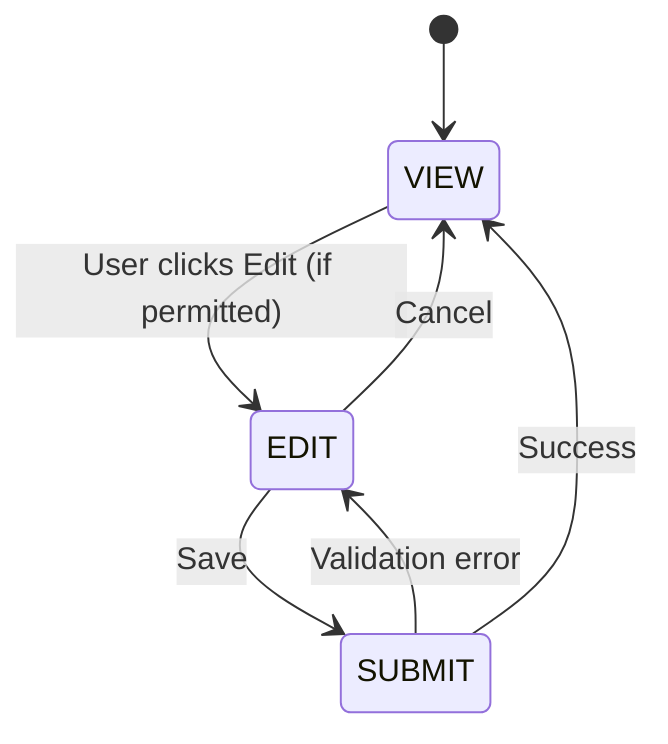
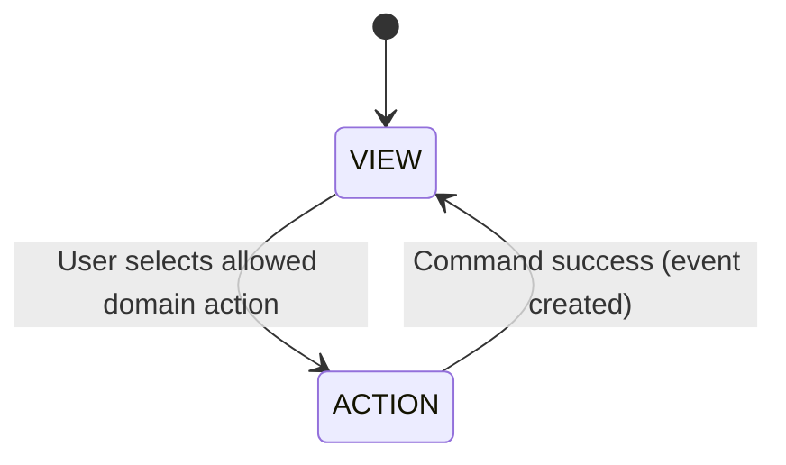
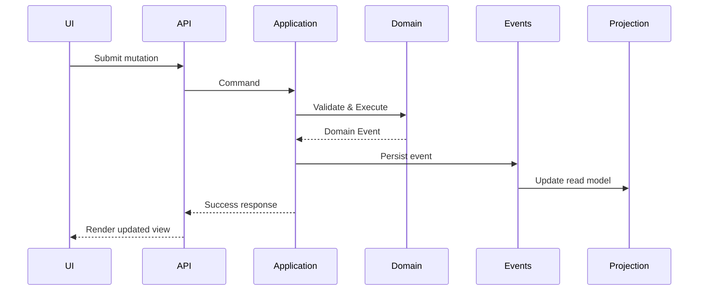
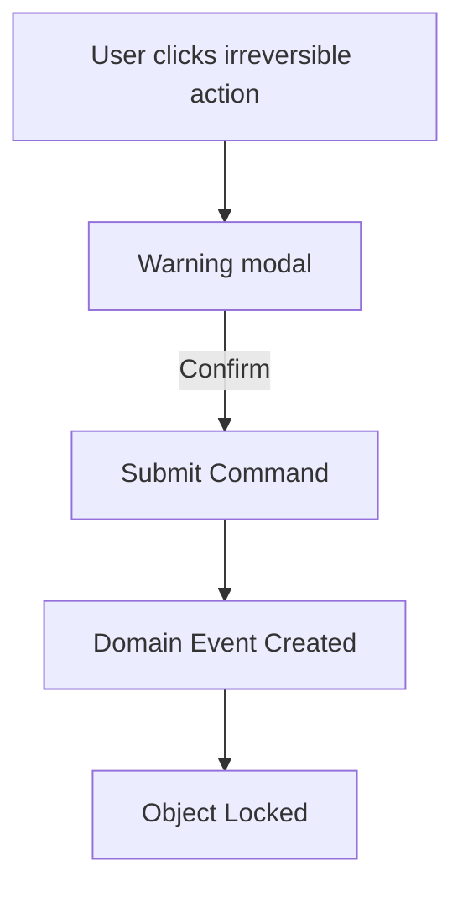

# PET Shortcode Contract Standard
Version: v1.0  
Status: Binding Frontend Contract (Strategy A – Minimal Portal)

This document defines the **mandatory behavioral contract** for all PET frontend shortcodes.

It governs:
- UI state behavior
- Mutation rules
- Immutability enforcement
- Permission gating
- Domain command interaction
- Audit requirements

This standard applies to ALL current and future shortcodes.

---

# 1. Core Principles

## 1.1 View by Default

All shortcodes MUST render in **VIEW mode by default**.

No shortcode may default into edit mode.

## 1.2 Mutation is Explicit

Mutation must be:
- Triggered by an explicit user action (Edit, Submit, Approve, Accept, etc.)
- Permission-checked
- Domain-command driven (never direct DB writes)
- Audited

## 1.3 Immutability First

If a domain object is immutable, the UI must NOT present “Edit”.

Instead, it must expose:
- Create Version
- Create Correction
- Create Compensating Entry
- Submit Approval/Decision

Never simulate edits on immutable objects.

---

# 2. Standard UI States

All mutable shortcodes must implement this state machine:

Immutable-domain shortcodes use:

---

# 3. Mutability Classification

Every field rendered by a shortcode must belong to one of these categories:

| Category | Editable? | Example |
|----------|----------|---------|
| PREFERENCE | Yes | Notification settings |
| PROFILE_MUTABLE | Yes (permissioned) | Staff phone number |
| PROFILE_RESTRICTED | Conditional | Job title (HR only) |
| VERSIONED | No (create new version) | Quotes |
| COMPENSATING | No (add correction) | Submitted time |
| EVENTED | No (append-only) | SLA history |
| APPROVAL_DRIVEN | No (approve/reject) | Change order |

Shortcodes must declare field classification in their contract documentation.

---

# 4. Domain Interaction Model

Shortcodes may never:

- Write directly to database tables
- Bypass domain invariants
- Mutate historical records

All mutations must map to:

- Application Command
- Domain Validation
- Domain Event
- Projection update

## Required Flow

---

# 5. Permission & Scope Enforcement

Every shortcode must enforce:

1. Authentication
2. Capability check (role-based)
3. Object-level policy check
4. Customer scoping
5. Team scoping (if applicable)

Permission checks must happen server-side.

---

# 6. Edit-in-Place Rules

Edit-in-place is allowed ONLY when:

- Underlying fields are mutable
- No immutable history is affected
- Permission is verified
- Audit logging is enabled

Edit-in-place is NOT allowed for:

- Accepted quotes
- Submitted timesheets
- SLA breach records
- Event logs
- Approval history

---

# 7. Irreversible Actions

Certain shortcodes trigger irreversible actions:

- Quote Accept
- Timesheet Submit
- Approval Decision
- Escalation Trigger

These must:

- Require explicit confirmation
- Display irreversible warning
- Generate domain event
- Lock subsequent mutation paths

---

# 8. Audit Requirements

All mutations must record:

- Actor
- Timestamp
- Object ID
- Command executed
- Resulting event ID

Audit must be queryable via read-only surfaces (activity feed, timeline).

