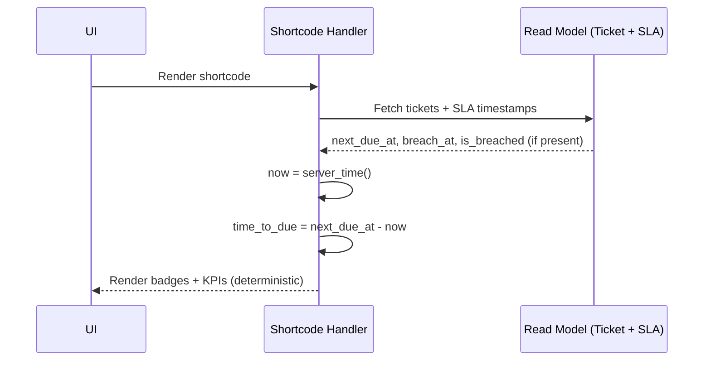
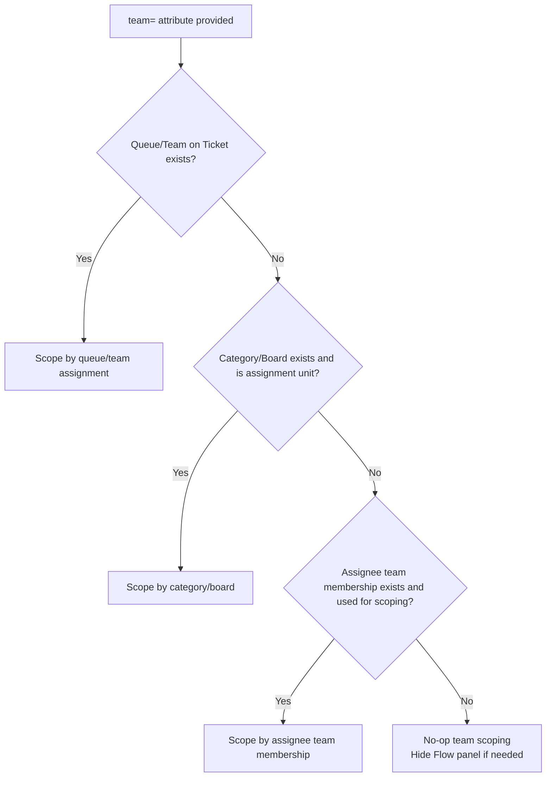
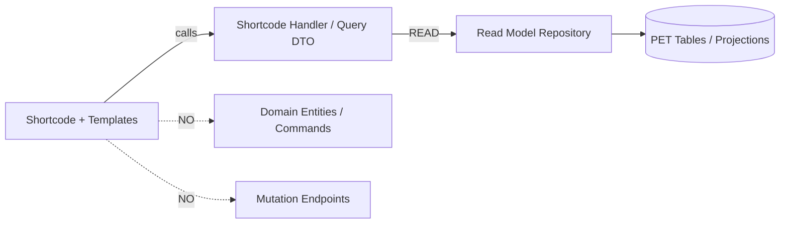

Where v1.1 conflicts with v1.0, v1.1 is authoritative.
# PET Helpdesk Overview — Additive Clarifications v1.1

**Date:** 2026-02-24  
**Status:** ADDITIVE CLARIFICATION (No breaking changes)  
**Applies to:**
- `PET_Helpdesk_Overview_Shortcode_Spec_v1_0.md`
- `PET_Helpdesk_Overview_UI_Contract_v1_0.md`
- `PET_Helpdesk_Overview_Data_Mapping_Checklist_v1_0.md`
- `PET_Helpdesk_Overview_Implementation_Checklist_v1_0.md`

This document introduces **clarifications only**. It does not redesign the feature and does not require schema changes.

---

## 1) Knowledge Boundary Lock (Non-negotiable)

The `[pet_helpdesk]` shortcode is **operational visibility only** over existing ticket and SLA **read models**.

It explicitly:

- Does **NOT** create knowledge base articles.
- Does **NOT** suggest or prompt “promote to KB” actions.
- Does **NOT** link, convert, or synchronise tickets into knowledge artifacts.
- Does **NOT** run summarisation, extraction, or advisory logic.
- Does **NOT** alter ticket workflow or state.

**Rationale:** Prevents scope creep and preserves separation between operational dashboards and governed knowledge workflows.

### Mermaid: Separation of concerns

```mermaid
flowchart LR
  A[Helpdesk Overview Shortcode\nOperational Read Models] -->|READ ONLY| R[(Ticket/SLA Projections)]
  A -.->|NO CREATE/NO PROMOTE| K[Knowledge System\n(System Help + Client KB)]
  K -->|Separate governed workflows| K2[KB Article Lifecycle]
```

---

## 2) Updated Definition: “Unassigned” (Binding)

A ticket is considered **Unassigned** when it has a valid **queue/team assignment** but has **no named individual owner**.

- `queue_id` (or equivalent queue/team assignment) is treated as **mandatory** for the purposes of this KPI.
- `owner_user_id` (or equivalent named assignee) is **nullable**.
- **Unassigned KPI** counts tickets where `owner_user_id IS NULL` **AND** `queue_id IS NOT NULL`.

If the current read model does not expose `queue_id` explicitly but exposes an equivalent team/queue concept, that equivalent is used.

If no queue/team concept exists at all, the **Unassigned KPI must be hidden** (do not guess).

### Mermaid: Unassigned classification

```mermaid
flowchart TD
  T[Ticket] --> Q{Has Queue/Team?}
  Q -- No --> H[Hide Unassigned KPI\n(no queue model available)]
  Q -- Yes --> O{Has Named Owner?}
  O -- Yes --> A[Assigned]
  O -- No --> U[Unassigned]
```

---

## 3) SLA Band Timebase (Canonical)

Where SLA banding requires calculating “time remaining” (e.g., `<30m`, `<2h`, `today`):

- All `(next_due_at - now)` calculations must use **server-canonical time**.
- UI must **not** use browser-local time for SLA risk calculations.
- Wallboard mode must behave deterministically across screens and devices.

**Note:** This does not allow recalculation of SLA policy. It only standardises the timebase for formatting and band classification using already-projected timestamps.

### Mermaid: SLA banding timebase



---

## 4) `team=` Attribute Resolution Order (No invention)

The `team=` attribute may be used to scope the overview to a team/queue concept **only if PET already has one**.

Resolution order (choose the first that exists in the current PET read model):

1. **Ticket assignment queue/team** (preferred): `queue_id` / `queue_slug` / `queue_key`
2. **Ticket category/board** that is already used operationally as the assignment unit
3. **Assignee team membership** (only if PET already uses this for ticket ownership scoping)

If none exist:
- `team=` becomes a **no-op**
- the shortcode must still render (without flow grouping)
- the Flow panel must be hidden when it cannot be grouped reliably

### Mermaid: team scoping resolution



---

## 5) Refresh Behaviour (v1 binding)

### Manager mode
- No auto-refresh unless `refresh` attribute is explicitly provided.
- If `refresh` is provided, **v1 may use full page refresh** (simple and deterministic).

### Wallboard mode
- Auto-refresh is enabled by default:
  - If `refresh` attribute is absent, treat as `refresh=60`.
- **v1 may use full page refresh**.
- XHR “soft refresh” (replace container HTML) is optional future enhancement, not required for v1.

### Mermaid: refresh control

```mermaid
flowchart TD
  M{mode} -->|manager| M1{refresh provided?}
  M1 -- No --> M2[No auto-refresh]
  M1 -- Yes --> M3[Full page refresh timer]

  M -->|wallboard| W1{refresh provided?}
  W1 -- No --> W2[Default refresh=60]
  W1 -- Yes --> W3[Use provided refresh]
  W2 --> W4[Full page refresh timer (v1)]
  W3 --> W4
```

---

## 6) Implementation Guardrails (Reinforced)

The following remain strictly enforced:

- No domain logic in shortcode layer.
- No recalculation of SLA policy.
- No mutation endpoints.
- No schema changes / migrations.
- Read-model only.
- No anonymous leakage of ticket metadata (refs, subjects, customer names).

### Mermaid: layer boundaries



---

## 7) Acceptance Criteria Additions (v1.1)

In addition to v1.0 acceptance criteria:

1. The shortcode must not render any “promote to KB” or knowledge creation UI.
2. Unassigned KPI must reflect: queue/team present + no named owner, otherwise hidden if queue/team absent.
3. SLA time-to-due calculations must use server-canonical time.
4. `team=` must follow explicit resolution order; if no suitable concept exists, it is a no-op.
5. Refresh behavior must match section 5 exactly (full refresh acceptable for v1).

---

## 8) Test Additions (v1.1)

Minimum additive tests:

- **Unassigned definition**:
  - queue present + owner null → counted
  - queue present + owner present → not counted
  - queue absent → KPI hidden
- **No knowledge UI**:
  - rendered HTML must not contain “KB”, “Knowledge”, “Promote”, “Create Article” strings (basic guard)
- **SLA timebase**:
  - with frozen server time, risk band classification is deterministic across renders
- **team= no invention**:
  - if no scoping concept exists, rendering succeeds and Flow hidden
