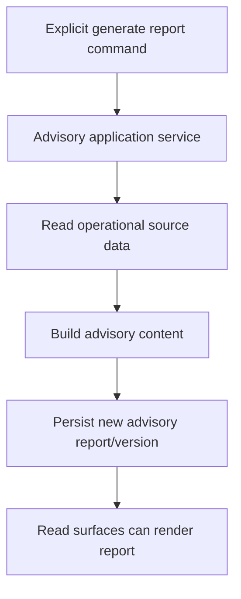
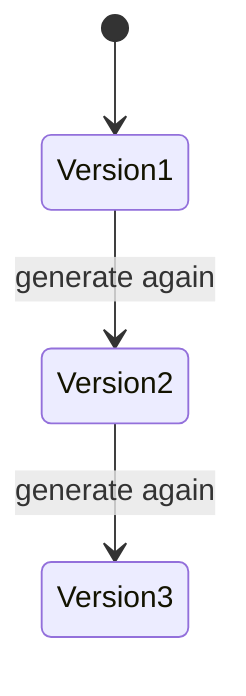
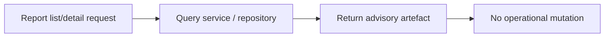

# PET Advisory Layer Outputs and Report Generation — Completion Specification v1

**Target location:** `plugins/pet/docs/ToBeMoved/PET_Advisory_Layer_Outputs_And_Report_Generation_v1.md`

## 0. Purpose

This document defines the next completion package for PET around the Advisory Layer, specifically:

- advisory outputs
- report generation
- visible manager/consulting surfaces
- operational-to-advisory derivation
- demo-ready advisory artefacts

This is a **completion package**, not a redesign.

The purpose is to make PET’s advisory layer visibly useful by turning existing operational truth into explicit advisory artefacts that can be viewed, generated, and discussed without mutating operational data.

This package must preserve PET principles:

- operational truth remains authoritative in source domains
- advisory outputs are derived, versioned, and additive
- advisory outputs must not overwrite operational records
- no business mutation from dashboards or reports
- no speculative AI behaviour outside explicitly documented scope
- backward compatibility
- forward-only migrations

---

# 1. Scope of This Work Package

## 1.1 Included

This package covers completion of:

1. advisory signal visibility
2. advisory report generation command path
3. advisory report read surfaces
4. advisory snapshot / summary surfaces for managers and consultants
5. demo seed support for meaningful advisory examples
6. tests for derivation safety, versioning, and read-side behaviour

## 1.2 Excluded

This package does **not** include:

- autonomous recommendations that mutate operations
- predictive ML models
- external LLM dependency requirements
- automatic customer-facing delivery workflows
- redesign of source operational entities
- editing advisory outputs after generation unless already supported as annotations in current design
- full QBR document export unless already clearly scaffolded

---

# 2. Structural Specification

## 2.1 Advisory model principle

Advisory artefacts must be **derived outputs** over existing operational truth.

Source domains may include:
- support
- SLA / escalation
- delivery
- people / resilience
- finance / billing
- queue / orchestration

The advisory layer must not replace those domains.

## 2.2 Canonical advisory entities

This package should support, at minimum, the following advisory concepts if they already exist or are clearly scaffolded:

- `AdvisorySignal`
- `AdvisoryReport`
- report sections / summary blocks if already implemented
- report generation run or version identity if already implemented or needed

TRAE must preserve existing entity names if already present and aligned.

## 2.3 Canonical advisory fields

### Advisory Signal
Expected fields or equivalent read fields:
- `id`
- `signal_type`
- `severity`
- `title`
- `summary`
- `source_entity_type` (nullable if aggregate-level)
- `source_entity_id` (nullable)
- `customer_id` (nullable)
- `site_id` (nullable)
- `status` if signal lifecycle exists
- `created_at`
- `metadata_json` or equivalent supporting payload

### Advisory Report
Expected fields or equivalent:
- `id`
- `report_type`
- `scope_type`
- `scope_id`
- `version_number` or equivalent version identity
- `title`
- `summary`
- `generated_at`
- `generated_by`
- `status` if current code uses one
- `content_json` or equivalent section payload
- `source_snapshot_metadata` or equivalent derivation trace if already supported

## 2.4 Invariants

### A. Derived-only truth
Advisory outputs must be derived from source data and must not become operational source-of-truth.

### B. Versioned reports
Generated reports must be versioned or otherwise additive.
A new generation run must not destructively overwrite prior advisory output history unless the current codebase already has an explicit replace-in-place model and that model is documented.

### C. No operational mutation
Generating or viewing an advisory output must not mutate tickets, projects, billing records, people data, or queue state.

### D. Explicit generation path
Advisory report generation must occur through an explicit command path, not via page render or summary endpoint side effects.

### E. Read-side safety
Viewing advisory signals, reports, summaries, and report history must perform no writes.

## 2.5 Lifecycle / state expectations

### Advisory signals
If signals already have lifecycle states, preserve them.
If no meaningful signal lifecycle exists yet, this package may treat signals as read-only derived records.

### Advisory reports
Expected lifecycle, minimally:
- generated / available
- prior versions remain historically visible

This package does **not** require editable draft workflows unless already implemented.

## 2.6 Events

Where current code already supports eventing, the following event semantics are required:

- advisory signal created / raised
- advisory report generated
- advisory report version created
- advisory snapshot refreshed if such eventing exists

Event class names may follow existing conventions.

## 2.7 Persistence

Preferred implementation order:

1. reuse existing advisory tables/entities if already present
2. complete additive report-generation persistence
3. add additive report versioning or metadata support only where required
4. keep source-domain persistence untouched except for normal event/projector interactions already in design

## 2.8 API

Expected API shape for this phase includes:

### Read
- list advisory signals
- list advisory reports
- view advisory report detail
- view latest advisory summary/snapshot for a scope
- view report history/versions where applicable

### Commands
- generate advisory report
- optionally refresh snapshot if already designed, but only via explicit command path

Exact route names may follow existing conventions, but command and read surfaces must remain separate.

---

# 3. Lifecycle Integration Contract

## 3.1 Render rules

Advisory surfaces render only when:
- advisory feature flags are enabled
- source data exists
- the requesting user has access to the relevant customer/team/scope
- the advisory artefact actually exists, unless the surface is an explicit “generate” action

Reports must not appear until they have been generated.

Signals must not be fabricated for presentation only.

## 3.2 Creation rules

Advisory signals may come into existence when:
- existing signal-generation logic derives them from operational conditions
- event/projector paths explicitly create them
- demo seed creates valid demo examples

Advisory reports may come into existence only when:
- an explicit generate-report command is executed
- demo seed creates valid generated examples

They must not be created:
- on page load
- on report list fetch
- on opening a dashboard
- on summary card render
- by read-side endpoints

## 3.3 Mutation rules

Advisory outputs may mutate only through explicit command paths already supported by the design.

Allowed mutation categories:
- generation of a new report version
- annotation/status updates only if already explicitly supported in current advisory design

Not allowed:
- read endpoint side effects
- report regeneration on page render
- operational domain mutation from advisory screens

## 3.4 Parent/source lifecycle relationship

Advisory outputs exist inside the lifecycle of the source operational truth but are not themselves the source truth.

Always ask:
- when does an advisory signal exist?
- when must it not exist?
- what explicitly triggers report generation?
- what operational truth is the report derived from?

---

# 4. Prohibited Behaviours

- Must not make advisory outputs the source of truth for operations.
- Must not overwrite prior report versions destructively if additive versioning is available or required.
- Must not generate reports on page render.
- Must not mutate operational records when generating or viewing advisory outputs.
- Must not place business legality in UI code.
- Must not fabricate signals or reports solely for dashboards when no derived record exists.
- Must not bypass feature-flag gating.
- Must not collapse multiple scopes into one ambiguous “global” report unless already explicitly designed.
- Must not silently replace report history.
- Must not rely on external AI/LLM services unless already present and explicitly part of the current codebase.

---

# 5. Completion Scope for This Work Package

## 5.1 Included

### A. Advisory report generation command path
Complete explicit generation command paths for advisory reports.

### B. Advisory report read surfaces
Complete read-side surfaces for:
- report list
- report detail
- latest summary/snapshot
- version/history view where applicable

### C. Advisory signal visibility
Complete list/detail/summary visibility for advisory signals that already exist or are naturally derived by current code.

### D. Versioning / additive generation safety
Ensure new report generations do not destroy prior report history.

### E. Demo seed
Seed meaningful advisory examples tied to real operational data.

### F. Tests
Add tests for:
- generation side-effect safety
- additive versioning
- read-side safety
- feature-flag-off behaviour
- scope visibility where applicable

## 5.2 Deferred

- autonomous recommendation engines
- AI-authored narrative generation outside current scaffold
- customer-facing publishing workflows
- PDF export unless already clearly scaffolded
- advanced analytics beyond current advisory scope

---

# 6. Stress-Test Scenarios

## 6.1 Generate report explicitly
Generating a report through the command path creates a new advisory report artefact and does not mutate operational source records.

## 6.2 Repeat generation
Generating a report again for the same scope creates a new version or additive artefact rather than silently overwriting the previous one.

## 6.3 Report read safety
Viewing report list, report detail, summary, or history performs zero writes.

## 6.4 Feature flag off
When advisory flags are off, advisory generation and advisory read surfaces produce no advisory side effects and remain unavailable as intended.

## 6.5 Signal visibility
Derived advisory signals appear in list/detail views only when they actually exist; UI does not fabricate them.

## 6.6 Scope isolation
A user without access to a scope/customer/team must not view advisory outputs for that scope.

## 6.7 Version history integrity
Earlier generated report versions remain retrievable and unchanged after later generations.

## 6.8 Operational independence
Generating or viewing an advisory output does not alter ticket status, SLA state, queue assignment, billing export status, or people/resilience records.

---

# 7. Demo Seed Contract

## 7.1 Required demo examples

Seed enough advisory artefacts to demonstrate:

- at least one advisory signal
- at least one advisory report
- at least one repeated generation/version history example if versioning exists
- advisory outputs linked to real operational source data

## 7.2 Recommended source coverage

Prefer seeded advisory examples derived from:
- support/SLA
- delivery
- people/resilience
- queue or escalation risk
where current codebase supports them

## 7.3 No fake advisory-only rows

Demo advisory data must either:
- be generated through real advisory generation paths, or
- clearly match the persisted advisory structures and scope rules

It must not be disconnected fake UI-only data.

---

# 8. Process Flow Diagrams

## 8.1 Generate advisory report

## 8.2 Additive versioning

## 8.3 Read-side safety

---

# 9. Implementation Notes for TRAE

TRAE must treat this document as binding.

This package is about making the advisory layer operationally visible and safe, not about inventing a new analytics system.

If current code already contains partial advisory entities, services, controllers, or UI surfaces, TRAE must:
- preserve what aligns
- identify real completion gaps
- implement only missing completion work

If ambiguity remains during planning, TRAE must stop and return bounded options before implementation.
