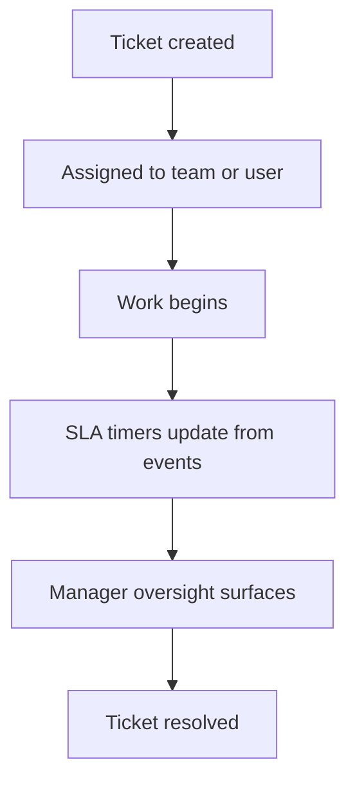

# PET Support / Helpdesk UX and Operational Completion — Specification v1

Target location:
plugins/pet/docs/31_support_helpdesk/PET_Support_Helpdesk_Operational_Completion_v1.md

## 0 Purpose

This package completes the operational and UX layer of PET's support/helpdesk workflow.

The objective is not to redesign the support domain, but to:

- make ticket handling clearer and safer
- improve assignment and queue visibility
- strengthen manager oversight
- ensure support surfaces align with PET architectural principles

Key principles preserved:

- tickets remain the source of support truth
- no mutation from dashboards or derived views
- history remains immutable where already defined
- UI contains no business logic
- server-side composition and enforcement of legality
- backward compatibility

This package focuses on **operational clarity and workflow completion**, not new domain invention.

---

# 1 Scope

## Included

1. Assignment and ownership clarity
2. Queue visibility improvements
3. Ticket lifecycle safety checks
4. Manager support oversight surfaces
5. Operational status indicators
6. Demo-ready support workflows
7. Tests for correctness and safety

## Excluded

- AI ticket resolution
- automated support agents
- external helpdesk integrations
- customer portal redesign
- SLA redesign

---

# 2 Support Operational Model

PET support already models:

- tickets
- SLA clocks
- assignments
- teams
- work queues

This package ensures those structures are **visible, consistent, and operationally safe**.

---

# 3 Assignment Model

## 3.1 Canonical assignment rule

Every ticket must always have exactly one operational owner:

Either:

- an **individual**
- a **team queue**

Never neither.

Assignment transitions must be explicit events.

## 3.2 Assignment structure

Assignment fields should resolve to:

- assignee_type: `user | team`
- assignee_id

The UI may present a unified dropdown, but the domain must keep explicit semantics.

---

# 4 Queue Visibility

Support staff must see queues determined by scope:

SELF  
TEAM  
MANAGERIAL  
ADMIN

Visibility must be determined server-side.

Queues must include:

- unassigned tickets
- team queue tickets
- tickets assigned to the user

Derived queue counts must be computed server-side.

---

# 5 Ticket Lifecycle Safety

The following safety checks must exist:

- ticket must have an assignment before work begins
- closed tickets cannot accept new time entries
- SLA timers must derive from persisted events only
- ticket state transitions must be validated in domain layer

UI must never bypass lifecycle rules.

---

# 6 Operational Indicators

Support staff and managers must see:

- SLA risk
- waiting customer response
- waiting internal response
- aging tickets
- workload distribution

Indicators must derive from persisted ticket state and events.

They must not fabricate state in UI.

---

# 7 Manager Support Oversight

Managers require aggregated visibility of support operations.

Panels should include:

- ticket distribution by team
- tickets at SLA risk
- backlog aging
- unresolved escalations
- workload per technician

These panels must derive from persisted truth or projections.

No mutation allowed.

---

# 8 API Surfaces

Expected read endpoints:

GET /pet/v1/support/queue  
GET /pet/v1/support/tickets/{id}  
GET /pet/v1/support/summary/team  

Commands remain domain commands such as:

- assign ticket
- change ticket status
- add comment
- add time entry

Read surfaces must never trigger commands.

---

# 9 Feature Flags

Support operational UX changes may be gated behind:

pet_support_operational_improvements_enabled

The flag must control:

- route registration
- UI surface visibility

---

# 10 Tests

Add tests ensuring:

- ticket assignment legality
- queue visibility enforcement
- SLA calculations remain read-only
- manager summary matches underlying truth
- feature flag disables surfaces safely

---

# 11 Demo Seed

Demo seed must generate:

- multiple tickets across teams
- mixed assignment states
- SLA timers running
- at least one escalation

This ensures demo dashboards show meaningful support operational insight.

---

# 12 Process Diagram

