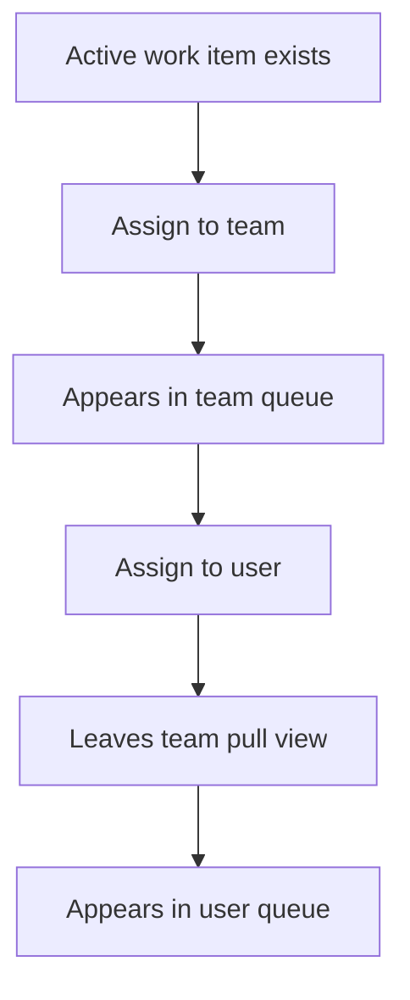
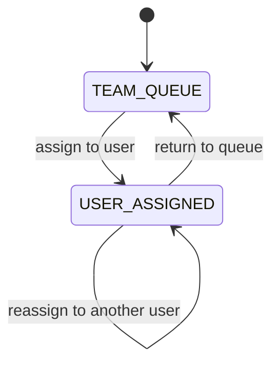
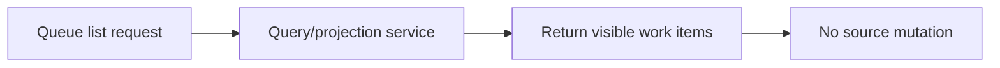

STATUS: SUPERSEDED
SUPERSEDED BY: PET_Work_Orchestration_Assignment_Routing_Queue_Visibility_v2.md
SUPERSESSION DATE: 2026-03-17
NOTES: Retained for historical traceability only. Use v2 for architectural and implementation guidance.
# PET Work Orchestration, Assignment Routing, and Queue Visibility — Completion Specification v1

**Target location:** `plugins/pet/docs/36_work_orchestration/PET_Work_Orchestration_Assignment_Routing_Queue_Visibility_v1.md`

## 0. Purpose

This document defines the next completion package for PET around:

- work orchestration
- assignment routing
- queue visibility

This is a **completion** package, not a redesign. It should strengthen PET’s operational core by making work assignment and queue visibility explicit, deterministic, and visible across support and delivery contexts.

The goal is to improve how PET answers these questions:

- What work exists right now?
- Who owns it?
- Who can pull or assign it?
- Which queue should it appear in?
- What should managers and coordinators see?
- What must never happen when routing or reassigning work?

This package must align with PET principles:

- domain rules in Domain layer
- immutable history where required
- additive corrections only
- explicit governance
- no UI-side business logic
- no mutation from dashboards
- backward compatibility

---

# 1. Scope of This Work Package

## 1.1 Included

This package covers completion of:

1. assignment routing rules for work items already present in PET
2. queue visibility rules for managers, teams, and individuals
3. operational assignment transitions and visibility surfaces
4. read-side views needed to show work by queue/owner/state
5. demo seed support for realistic orchestration views
6. tests for routing legality and queue visibility

## 1.2 Excluded

This package does **not** include:

- full capacity planning engine
- leave/capacity-aware automated balancing
- AI prioritization
- advisory scoring
- command palette
- redesign of existing ticket/project/task domain models
- mutation from dashboards
- per-object ad hoc sharing rules

---

# 2. Structural Specification

## 2.1 Work orchestration concept

PET must expose a unified operational view of work without erasing the source domain.

A work item in orchestration remains owned by its source domain, for example:

- support ticket
- delivery task
- project work item
- other existing operational item types already implemented

This package does **not** replace source entities with a new universal mutable entity.
Instead, it creates a deterministic orchestration/read model over existing source work.

## 2.2 Canonical orchestration fields

The queue/routing layer must be able to represent the following fields for each visible work item:

- `source_type`
- `source_id`
- `reference_code` or equivalent display identifier
- `title` or summary
- `customer_id` if applicable
- `site_id` if applicable
- `status`
- `priority`
- `assignment_mode`
- `assigned_team_id` (nullable)
- `assigned_user_id` (nullable)
- `queue_key`
- `created_at`
- `updated_at`
- `due_at` (nullable)
- `sla_state` if applicable
- `project_id` if applicable
- `visibility_scope`
- `routing_reason` (nullable derived explanatory field for read side)

These fields may come from source entities, projections, or existing repositories.
This package should not invent speculative persistence unless required.

## 2.3 Assignment mode

A work item must be in exactly one assignment mode at a time:

- `TEAM_QUEUE`
- `USER_ASSIGNED`
- `UNROUTED` only if source workflow explicitly allows it

## 2.4 Assignment invariants

### A. No dual assignment state
A work item must not simultaneously be:

- team-routed **and**
- individually assigned

### B. Team queue ownership is explicit
If assignment mode is `TEAM_QUEUE`:

- `assigned_team_id` must be populated
- `assigned_user_id` must be null

### C. Individual ownership is explicit
If assignment mode is `USER_ASSIGNED`:

- `assigned_user_id` must be populated
- `assigned_team_id` may remain populated only if the domain already requires team context, but it must not imply concurrent pull-queue ownership

### D. Unrouted work must be explicit
If assignment mode is `UNROUTED`, that must be a legal state for the source workflow.
This package must not invent unrouted status for source workflows that already require assignment.

### E. Routing changes are operational events
Assignment/routing changes must be recorded via explicit command paths and, where supported, feed/history projection.

## 2.5 Queue key concept

A queue is a deterministic operational grouping, not a new mutable domain object.

Examples:
- `support:team:{team_id}`
- `support:user:{user_id}`
- `delivery:team:{team_id}`
- `delivery:user:{user_id}`
- `unrouted:support`
- other existing source-appropriate queue keys

Queue keys are read-side identifiers used for filtering and rendering.

## 2.6 Visibility scope

Queue visibility must remain structural, not ad hoc.

Supported visibility scopes:

- `SELF`
- `TEAM`
- `MANAGERIAL`
- `ADMIN`

The actual visibility is derived from:
- user role
- team structure
- source domain access rules
- existing managerial relationships

This package must not introduce per-object discretionary sharing.

## 2.7 Events

Where eventing support already exists or is natural for the current codebase, the following event semantics are required:

- work routed to team
- work assigned to user
- work unassigned / returned to queue
- queue visibility projection refreshed

Event class names may follow existing codebase naming conventions.
This package does not require event renaming elsewhere.

## 2.8 Persistence

Preferred implementation order:

1. reuse existing source-domain fields and repositories where possible
2. add projection/query services for unified queue visibility
3. only add new persistence structures if existing schema cannot safely express routing history or queue visibility requirements

If a new projection table is required, it must be additive and read-oriented.

## 2.9 API

Expected API shape for this phase should include endpoints or equivalent handlers for:

### Read
- list visible work queues for current user
- list work items for a given queue
- list unassigned / unrouted items where permitted
- view queue summary counts

### Commands
- assign work item to team
- assign work item to user
- return work item to queue
- reassign work item

Exact route naming may follow existing conventions, but the command surface must be explicit and domain-safe.

---

# 3. Lifecycle Integration Contract

## 3.1 Render rules

Queue and assignment views must render only when:

- relevant feature flags are enabled
- the requesting user has visibility to the queue/work item
- the source work item actually exists
- the projection/query surface is populated from real source data

Queue views must not render fake work items.

Dashboards may show queue summaries, but they must remain read-only.

## 3.2 Creation rules

Queue-visible work items come into orchestration when:

- the source work item exists
- it is in a workflow state that should appear operationally
- routing/assignment data is available or explicitly absent in a legal way
- projection or query logic includes it according to source-domain rules

Queue-visible work items must not be created:

- on page render
- by opening a dashboard
- by calling a summary endpoint
- by speculative pre-seeding unrelated records

## 3.3 Mutation rules

Routing/assignment may change only by explicit command path.

Allowed mutation categories:

- assign to team
- assign to user
- return to queue
- reassign from one owner to another where legal

Not allowed:

- UI local state becoming source-of-truth
- direct dashboard mutation without command handling
- repository-side silent reassignment
- query endpoint side effects

## 3.4 Parent lifecycle relationship

Routing/assignment exists inside the lifecycle of the parent work item.

Always ask:

- when does assignment exist?
- when must it not exist?
- what triggers routing creation or change?

### Support tickets
Assignment/routing exists when tickets are operationally active and meant to be worked.

### Delivery work
Assignment/routing exists when delivery tasks/work items are active and actionable.

This package must not force the same lifecycle semantics onto all source types if current domains differ.

---

# 4. Prohibited Behaviours

- Must not create a brand-new universal mutable work domain as part of this package.
- Must not allow a work item to be both team-queued and individually assigned at the same time.
- Must not create or mutate work items during read-side rendering.
- Must not move business legality into React/UI code.
- Must not bypass source-domain permission rules.
- Must not introduce per-object sharing or discretionary visibility.
- Must not mutate source work from dashboards directly.
- Must not silently auto-assign to a random user.
- Must not invent `UNROUTED` state where the source workflow requires assignment.
- Must not duplicate queue items for the same source record in the same projection/surface.
- Must not lose assignment history when reassigning.
- Must not make queue summaries the source of truth.

---

# 5. Completion Scope for This Work Package

## 5.1 Included completion targets

### A. Assignment command surface
Complete missing explicit command paths for:
- assign to team
- assign to user
- return to queue
- reassign

### B. Queue visibility read surface
Complete or harden read-side surfaces for:
- my queue
- team queue
- manager view
- unassigned/unrouted view where legal

### C. Routing invariants
Enforce legal assignment mode transitions and prevent dual-state ownership.

### D. Projection/query completion
Complete whatever query/projection layer is needed to show unified visible work without mutating source records during reads.

### E. Demo seed
Provide realistic support + delivery examples so managers, coordinators, and users can see:
- team queue
- personal queue
- reassignment
- queue return flow

### F. Tests
Add integration and lifecycle tests around:
- visibility legality
- routing transitions
- read-side safety
- duplicate queue prevention

## 5.2 Explicitly deferred

- capacity-aware automatic assignment
- optimization / auto-balancing
- skill-based AI routing
- leave-aware routing
- SLA-advisory synthesis
- forecasting from orchestration workload

---

# 6. Stress-Test Scenarios

## 6.1 Team assignment
A new active support ticket is routed to a team queue.
It appears in the correct team queue and not in any user queue.

## 6.2 Pull/assign to user
A team-queued work item is assigned to a specific user.
It leaves the team pull queue and appears in that user’s queue according to the agreed model.

## 6.3 Reassign user to user
A user-assigned work item is reassigned to another valid user.
No duplicate queue item appears.
History/event evidence remains intact.

## 6.4 Return to queue
A user-assigned item is returned to its team queue.
It must no longer appear as user-owned.

## 6.5 Illegal dual state
Attempting to store both team queue and user-owned state as concurrent active assignment must be rejected.

## 6.6 Read-side safety
Viewing queue pages, summary cards, and queue counts must create no work records and must perform no routing mutation.

## 6.7 Visibility restriction
A non-manager must not see queues outside their permitted scope.

## 6.8 Managerial visibility
A manager may see team queues and subordinate work according to structural permissions, without needing per-object grants.

## 6.9 Duplicate prevention
The same source work item must not appear twice in the same effective queue surface due to projection or join errors.

## 6.10 Source lifecycle independence
Changing queue assignment must not illegally mutate unrelated source lifecycle state.

---

# 7. Demo Seed Contract

## 7.1 Required demo examples

Seed enough operational work to demonstrate:

- support team queue with multiple tickets
- one ticket assigned to an individual
- one ticket returned to queue
- delivery queue with active work items
- manager-visible cross-team summary
- at least one unrouted example only if the source workflow legally allows it

## 7.2 Required actor coverage

Seed at least:

- one manager
- two team members in the same team
- one second team for contrast
- customers/sites linked to work where appropriate

## 7.3 Assignment history realism

At least one seeded item must demonstrate:

- team assignment
- user assignment
- reassignment or return-to-queue history

## 7.4 No fake queues

Demo seed must derive queue visibility from real source work and legal assignment states, not from isolated fake dashboard-only rows.

---

# 8. Process Flow Diagrams

## 8.1 Team queue to individual assignment

## 8.2 Reassignment / return flow

## 8.3 Read-side safety

---

# 9. Implementation Notes for TRAE

TRAE must treat this document as binding.

This package is about **operational completion**, not conceptual reinvention.

If current code already contains partial routing/queue/orchestration structures, TRAE must:

- preserve what aligns
- identify real gaps
- implement only the missing completion work

If ambiguity remains during planning, TRAE must stop and return bounded options before implementation.
