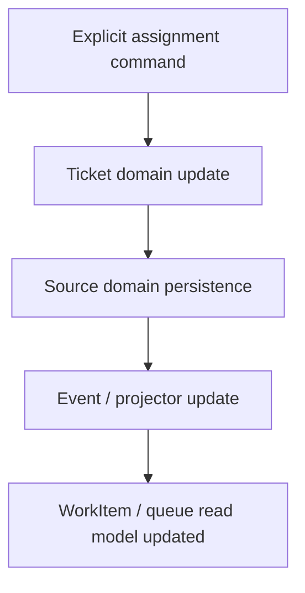

# PET Work Orchestration, Assignment Routing, and Queue Visibility — Completion Specification v2

**Target location:** `plugins/pet/docs/ToBeMoved/PET_Work_Orchestration_Assignment_Routing_Queue_Visibility_v2.md`

## 0. Purpose

This document updates the prior work orchestration completion draft by locking the department/team distinction and clarifying that projection/read models must never become the command-side truth.

This package completes:

- work orchestration
- assignment routing
- queue visibility

It remains a **completion package**, not a redesign.

---

# 1. Locked Architectural Decisions

## 1.1 WorkItem remains a read model

`pet_work_items` and related orchestration structures remain **read-side/projection models**.

They must not become the command-side source of truth for ticket-sourced work.

### Required flow
For ticket-sourced work:

No projection-mutation endpoint may be the primary assignment authority for ticket-sourced work.

## 1.2 Department and team are different concepts

The following distinction is authoritative for this work package:

- `department_id` = organisational department
- `assigned_team_id` = operational team

They must not be collapsed into one field.

## 1.3 Ticket domain remains assignment authority

For support ticket work:

- source-of-truth assignment lives in the Ticket domain
- orchestration exposes read-side visibility and command routing into the Ticket domain
- projection state follows source-domain change

## 1.4 Queue identity is derived, not a new mutable domain object

A queue is represented by a derived `queue_key`, not a new mutable domain entity.

Examples:
- `support:team:{assigned_team_id}`
- `support:user:{assigned_user_id}`
- `delivery:team:{assigned_team_id}`
- `delivery:user:{assigned_user_id}`
- `support:unrouted` only where legal

---

# 2. Structural Specification

## 2.1 Canonical orchestration fields

The queue/read layer must expose these canonical fields for each visible work item:

- `source_type`
- `source_id`
- `reference_code`
- `title`
- `customer_id` (nullable)
- `site_id` (nullable)
- `status`
- `priority`
- `assignment_mode`
- `department_id` (nullable organisational department)
- `assigned_team_id` (nullable operational team)
- `assigned_user_id` (nullable)
- `queue_key`
- `created_at`
- `updated_at`
- `due_at` (nullable)
- `sla_state` (nullable)
- `project_id` (nullable)
- `visibility_scope`
- `routing_reason` (nullable derived field)

These may be fully or partly derived by query/projection logic.
Do not add speculative write-side truth where safe derivation is possible.

## 2.2 Assignment mode

A work item must be in exactly one active assignment mode at a time:

- `TEAM_QUEUE`
- `USER_ASSIGNED`
- `UNROUTED` only if the source workflow explicitly permits it

## 2.3 Assignment invariants

### A. No dual active assignment state
A work item must not simultaneously be:

- team-queued
- user-assigned

### B. Team queue
If `assignment_mode = TEAM_QUEUE`:
- `assigned_team_id` must be populated
- `assigned_user_id` must be null

### C. User assigned
If `assignment_mode = USER_ASSIGNED`:
- `assigned_user_id` must be populated
- `assigned_team_id` may remain populated only if the source domain still needs team context, but it must not imply concurrent active team-pull ownership

### D. Unrouted legality
If `assignment_mode = UNROUTED`, that must be legal for the source workflow.
Do not invent unrouted states where the source domain requires assignment.

### E. Assignment history is additive
Assignment/routing transitions must be recorded via explicit command paths and supporting history/projection mechanisms where present.

## 2.4 Visibility scope

Visibility must remain structural and derived, not discretionary.

Supported scopes:
- `SELF`
- `TEAM`
- `MANAGERIAL`
- `ADMIN`

Derived from:
- role/permission
- team membership
- manager relationships
- source-domain access rules

## 2.5 Queue/read persistence

Preferred order:

1. reuse source-domain fields and repositories
2. enrich read-side projection/query services
3. add additive projection columns/tables only where necessary

If `pet_department_queues` is used, it must represent meaningful assignment history/current queue state, not stale queue rows left unchanged after assignment transitions.

## 2.6 API

### Read surfaces
Expected read API shape for this phase includes:
- list visible queues for current user
- queue summary counts
- items for a given queue
- unassigned/unrouted items where legal

### Command surfaces
Expected command surface includes explicit paths for:
- assign to team
- assign to user
- return to queue
- reassign

For ticket-sourced work, these commands must route through the Ticket domain, not mutate projection rows directly.

---

# 3. Lifecycle Integration Contract

## 3.1 Render rules

Queue and assignment views render only when:
- feature flags are enabled
- requesting user has visibility
- source work item exists
- data comes from real source/projection state

Queue views must not render fake dashboard-only rows.

## 3.2 Creation rules

Queue-visible orchestration entries arise from:
- existing source work
- legal operational state
- projection/query inclusion rules
- real routing/assignment state or legal absence thereof

They must not be created:
- on page render
- by opening dashboards
- by summary endpoints
- by speculative UI state

## 3.3 Mutation rules

Routing/assignment may change only by explicit command path.

Allowed mutation categories:
- assign to team
- assign to user
- return to queue
- reassign

Not allowed:
- projection-direct source-of-truth mutation
- query-side effects
- dashboard mutation
- UI-local business legality

## 3.4 Parent lifecycle relationship

Assignment exists inside the lifecycle of the parent work item.

For support tickets:
- Ticket domain is authoritative
- orchestration follows the ticket lifecycle

For delivery work:
- delivery domain remains authoritative
- orchestration follows delivery lifecycle once projection support exists

---

# 4. Prohibited Behaviours

- Must not create a new universal mutable work entity.
- Must not collapse department and team into one concept.
- Must not let `department_id` act as `assigned_team_id`.
- Must not allow dual active assignment state.
- Must not mutate projection rows as ticket assignment truth.
- Must not create or mutate work during read-side rendering.
- Must not move business legality into UI.
- Must not introduce ad hoc per-object sharing.
- Must not mutate from dashboards.
- Must not silently auto-assign random users.
- Must not duplicate queue items for the same source item in the same effective surface.
- Must not lose assignment history on reassignment or return-to-queue.
- Must not make queue summaries the source of truth.

---

# 5. Completion Scope for This Work Package

## 5.1 Included

### A. Remove or restrict projection-direct assignment mutation
Any projection-direct assign endpoint for ticket-sourced work must be removed, restricted, or made non-authoritative so that ticket commands remain the true command path.

### B. Complete assignment command surface
Complete explicit command paths for:
- assign to team
- assign to user
- return to queue
- reassign

### C. Complete queue/read surfaces
Complete read-side surfaces for:
- my queue
- team queue
- manager view
- queue counts
- unassigned/unrouted where legal

### D. Add required orchestration fields
Add or derive:
- assigned_team_id
- assignment_mode
- queue_key
- visibility_scope
- routing_reason
and any other missing canonical fields that are necessary for safe rendering

### E. Make department queue history meaningful
Ensure queue history/current queue logic reflects assignment transitions rather than stale creation-only rows.

### F. Delivery projection completion where already intended
If delivery projection hooks already exist, complete the projection into the same orchestration/read model without redesigning the delivery domain.

### G. Demo seed
Seed realistic support and delivery orchestration examples.

### H. Tests
Add integration and lifecycle tests for routing legality, visibility, read-side safety, and duplicate prevention.

## 5.2 Deferred

- capacity-aware balancing
- auto-routing optimization
- AI skill matching
- advisory synthesis
- forecast/load modelling beyond current orchestration scope

---

# 6. Stress-Test Scenarios

## 6.1 Team assignment
Active support ticket assigned to a team appears in the correct team queue and not in user queue.

## 6.2 Assign to user
Team-queued item assigned to a user leaves team pull view and appears in user queue.

## 6.3 Reassign user to user
User-owned item reassigned to another user appears once, with preserved history.

## 6.4 Return to queue
User-owned item returned to team queue no longer appears as user-owned.

## 6.5 Dual-state rejection
Attempt to persist both active team queue and active user assignment is rejected.

## 6.6 Read-side safety
Queue list, queue counts, and queue detail endpoints perform zero writes.

## 6.7 Visibility restriction
Non-manager cannot view queues outside permitted structural scope.

## 6.8 Manager visibility
Manager can view subordinate/team queues without per-object grants.

## 6.9 Duplicate prevention
Same source work item never appears twice in same effective queue surface.

## 6.10 Source lifecycle independence
Assignment changes must not illegally mutate unrelated source lifecycle state.

---

# 7. Demo Seed Contract

## 7.1 Required demo examples
Seed enough real operational work to show:
- support team queue with multiple tickets
- one ticket assigned to individual
- one ticket returned to queue
- delivery queue example if delivery projection is completed in this package
- manager-visible summary

## 7.2 Required actor coverage
Seed at least:
- one manager
- two team members in same team
- one second team for contrast

## 7.3 Assignment history realism
At least one item must demonstrate:
- team assignment
- user assignment
- reassignment or return-to-queue history

## 7.4 No fake queues
Queue visibility must derive from real source work and legal assignment state, not isolated dashboard-only rows.

---

# 8. Implementation Notes for TRAE

TRAE must treat this document as binding.

Implementation must preserve:
- WorkItem as read model
- Ticket domain as assignment authority
- department/team distinction
- read-side safety

If ambiguity remains during planning, TRAE must stop and return bounded options before implementation.
