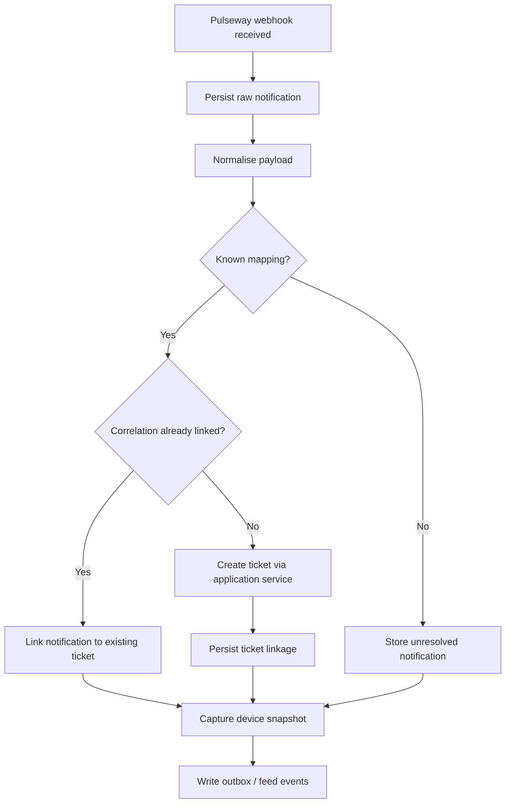
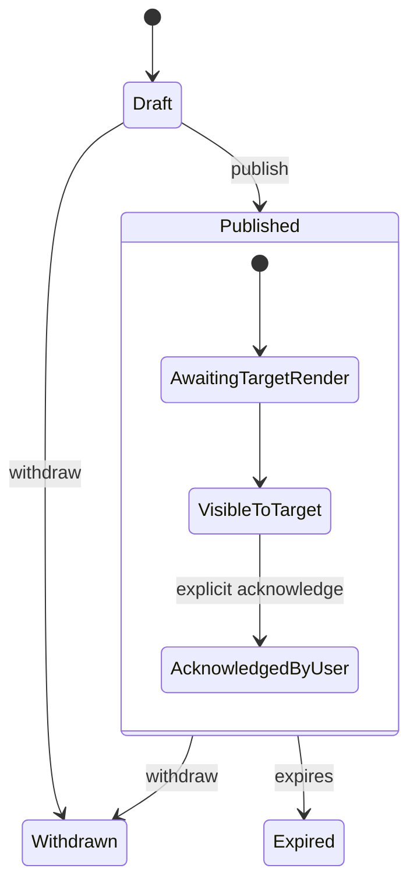
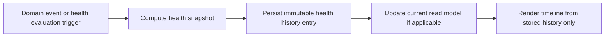
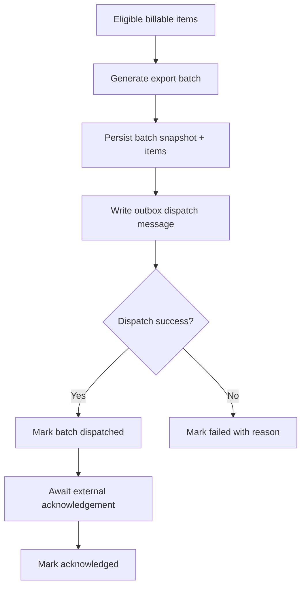
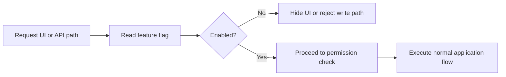
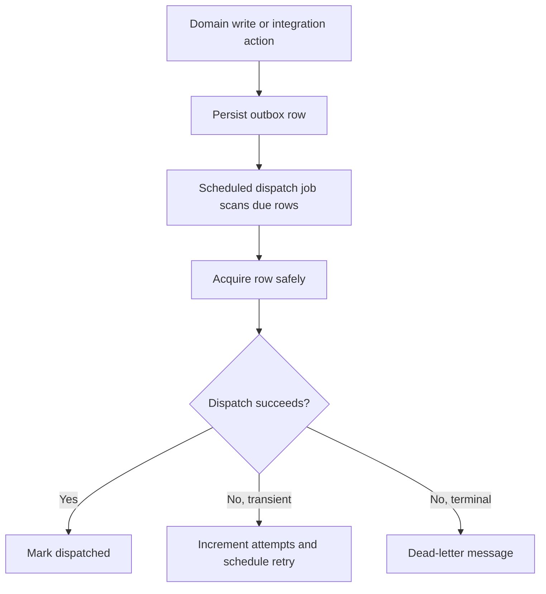
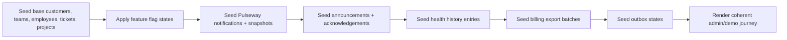

# PET Undocumented Code Recovery Pack v1

## Purpose

This document is the recovery specification for implemented-or-partially-implemented PET features that currently have thin, missing, or ambiguous documentation. It exists to make those features safe to maintain, extend, test, and demo.

This pack is intentionally documentation-first. It is designed to be copied into `docs/ToBeMoved` and treated as binding input for implementation recovery, documentation alignment, UI completion, and demo seed updates.

## Scope

This pack covers the undocumented or under-documented areas identified in the current PET assessments:

1. Pulseway RMM Integration
2. Announcement & Acknowledgement System
3. Health History Tracking
4. Billing Export System
5. Feature Flag Configuration
6. Outbox Dispatch Job / Reliability
7. Tier Transition Tracking — **recovery blocked pending bounded clarification**

The reports identify these as real code features with missing or thin documentation, and explicitly call them maintenance liabilities. Pulseway, announcements, tier transitions, health history, billing export, feature flag configuration, and outbox reliability are all named in the completion assessment as under-documented code that should be documented before further growth. fileciteturn2file1

## Recovery Principles

These rules apply to every subsystem in this pack:

- Documentation is authoritative.
- No read-side side effects.
- No implicit creation on render.
- No mutation that bypasses the domain.
- Demo seed must be idempotent.
- Integrations are event-triggered and idempotent.
- PET truth is authoritative; external systems and projections do not overwrite domain truth.
- If lifecycle integration rules are not explicit, implementation is not green-lit.
- If prohibited behaviours are not explicit, implementation is not green-lit.
- If a subsystem meaning is ambiguous, implementation must stop and request bounded clarification.

---

# 1. Pulseway RMM Integration

## 1.1 Structural Specification

### What it is

Pulseway RMM Integration is the inbound operational integration that ingests device or monitoring notifications from Pulseway, normalises them into PET-compatible integration records, optionally creates or links support tickets, and records device state snapshots for traceability.

The current reports identify the implemented services as:

- `NotificationIngestionService`
- `PulsewayTicketCreationService`
- `DeviceSnapshotService`

with documentation currently limited to brief mention only. fileciteturn2file1

### Fields

The exact code-level schema must be inventory-verified by TRAE in planning, but the recovered specification is:

#### PulsewayNotification
- `id`
- `external_event_id`
- `source_system` = `pulseway`
- `received_at`
- `customer_id` nullable
- `site_id` nullable
- `device_external_id`
- `device_name`
- `notification_type`
- `severity`
- `summary`
- `raw_payload_json`
- `normalised_payload_json`
- `ingestion_status`
- `correlation_key`
- `created_ticket_id` nullable
- `acknowledged_at` nullable
- `resolved_at` nullable

#### DeviceSnapshot
- `id`
- `customer_id` nullable
- `site_id` nullable
- `device_external_id`
- `device_name`
- `device_type` nullable
- `os_name` nullable
- `agent_version` nullable
- `last_seen_at` nullable
- `health_status` nullable
- `snapshot_payload_json`
- `captured_at`

### Invariants

- A Pulseway notification must be immutable after ingestion except for PET-owned processing metadata such as ingestion status, linked ticket id, acknowledgement markers, or resolution markers.
- `external_event_id` plus `source_system` must be idempotent.
- A notification may create at most one support ticket through the automatic ticket creation path.
- Device snapshots are append-only evidence, not mutable device truth.
- Missing customer/site mapping must not silently default to an arbitrary customer/site.
- Inbound notifications must not directly mutate an existing PET ticket except through explicit application services.

### State transitions

#### PulsewayNotification lifecycle
- `received` → `normalised`
- `normalised` → `linked`
- `normalised` → `ticket_created`
- `ticket_created` → `acknowledged`
- `ticket_created` → `resolved`
- `linked` → `acknowledged`
- `linked` → `resolved`
- failure branch: any pre-terminal state → `failed`

Terminality rule:
- `resolved` is terminal for the notification record.
- `failed` is terminal for the specific processing attempt, but reprocessing may create a later recovery event rather than mutating history.

### Events

- `PulsewayNotificationReceivedEvent`
- `PulsewayNotificationNormalisedEvent`
- `PulsewayTicketCreatedEvent`
- `PulsewayNotificationLinkedToTicketEvent`
- `PulsewayNotificationProcessingFailedEvent`
- `DeviceSnapshotCapturedEvent`

### Persistence

Expected persistence pattern:

- dedicated integration notification table or integration-inbox style table
- dedicated device snapshot table
- optional mapping table from external device identity to PET customer/site/asset context
- outbox entries for downstream processing outcomes

Persistence rules:

- raw payload must be retained for audit and replay
- normalised payload must be stored separately from raw payload
- device snapshots are append-only
- idempotency must be enforced at the database level where feasible

### API

Expected recovery API surface:

#### Admin / internal API
- `GET /integrations/pulseway/notifications`
- `GET /integrations/pulseway/notifications/{id}`
- `POST /integrations/pulseway/notifications/{id}/reprocess`
- `GET /integrations/pulseway/device-snapshots`
- `GET /integrations/pulseway/device-snapshots/{id}`

#### Inbound integration endpoint
- `POST /integrations/pulseway/webhook`

API recovery rules:

- inbound webhook is the only auto-create entry point
- admin reads are read-only
- reprocess is explicit and audited

## 1.2 Lifecycle Integration Contract

### Render rules

- Pulseway notifications render only when a notification record exists.
- Device snapshots render only when snapshot evidence exists.
- A support ticket may render Pulseway context only when a valid linkage exists.
- Pulseway UI must not render placeholder “device health” or fake alerts where no notification or snapshot record exists.

### Creation rules

- A Pulseway notification exists only after receipt of a valid inbound webhook or explicit demo seed creation.
- A device snapshot exists only after explicit snapshot capture during ingestion or explicit seeded demo evidence.
- Ticket creation from Pulseway occurs only through the application service that validates mapping, dedupe, and ticket creation rules.
- Rendering an integrations page must not create notifications, snapshots, mappings, or tickets.

### Mutation rules

- Notification processing status may advance only through application services.
- Device snapshots are append-only and must not be mutated in place.
- Ticket linkage may only be added explicitly by integration logic or an approved reconciliation path.
- Reprocessing must create new processing events or outbox entries, not erase prior failed attempts.

## 1.3 Prohibited Behaviours

- Must not auto-create tickets on page load.
- Must not silently map unknown devices to the wrong customer or site.
- Must not overwrite raw inbound payloads.
- Must not mutate a ticket directly from the webhook handler outside application services.
- Must not create duplicate tickets for the same deduped external event.
- Must not invent device snapshots when only a ticket exists.
- Must not treat a missing mapping as success.

## 1.4 Stress-Test Scenarios

1. Duplicate webhook delivery → one notification record, one ticket at most.
2. Webhook received for unmapped device → notification retained, ticket not auto-created, reconciliation required.
3. Ticket already exists for correlation key → notification links, no duplicate ticket.
4. Failed ticket creation then reprocess → second attempt recorded, history preserved.
5. Device snapshot captured twice in same run → two append-only snapshots or one deduped record only if explicitly defined; no silent overwrite.
6. Admin views Pulseway dashboard → no ingestion, no reconciliation, no ticket creation side effects.

## 1.5 Demo Seed Contract

### New seed data
- one mapped Pulseway customer/site/device set
- one healthy device snapshot history
- one critical alert linked to an auto-created ticket
- one unmapped device alert awaiting reconciliation
- one failed ingestion attempt with replayable raw payload

### Changes required to existing seed
- add device/customer/site mapping fixtures
- add at least one support ticket with Pulseway-origin metadata
- ensure seed reruns do not create duplicate notifications or duplicate tickets
- include feed events showing ingestion and ticket creation

## 1.6 Process Flow

---

# 2. Announcement & Acknowledgement System

## 2.1 Structural Specification

### What it is

The announcement system is PET’s internal broadcast mechanism for presenting operational or governance messages to targeted users and capturing explicit acknowledgements where required.

The reports identify implemented repositories:

- `SqlAnnouncementRepository`
- `SqlAnnouncementAcknowledgementRepository`

but state that there is no documentation and that triggers, targeting, and lifecycle are unclear. fileciteturn2file1

### Fields

#### Announcement
- `id`
- `title`
- `body_markdown` or `body_richtext`
- `announcement_type`
- `audience_type`
- `audience_target_json`
- `requires_acknowledgement`
- `published_at` nullable
- `expires_at` nullable
- `status`
- `created_by_employee_id`
- `created_at`
- `updated_at`

#### AnnouncementAcknowledgement
- `id`
- `announcement_id`
- `employee_id`
- `acknowledged_at`
- `acknowledged_version` nullable
- `source_channel` nullable

### Invariants

- An announcement must exist independently of acknowledgements.
- Acknowledgement is per employee per announcement version.
- If an announcement does not require acknowledgement, acknowledgement records must not be auto-created.
- Announcements must not target users implicitly without an explicit audience definition.
- Expiry hides future render eligibility but does not delete history.
- Published announcements must not be destructively edited in a way that invalidates prior acknowledgements without versioning.

### State transitions

#### Announcement lifecycle
- `draft` → `published`
- `published` → `expired`
- `published` → `withdrawn`
- `draft` → `withdrawn`

#### Acknowledgement lifecycle
- non-existent → `acknowledged`

Acknowledgement is effectively append-only. Re-acknowledgement requires either:
- a new announcement version, or
- a new acknowledgement rule tied to a changed published version.

### Events

- `AnnouncementCreatedEvent`
- `AnnouncementPublishedEvent`
- `AnnouncementWithdrawnEvent`
- `AnnouncementExpiredEvent`
- `AnnouncementAcknowledgedEvent`

### Persistence

- announcements table
- announcement acknowledgements table
- optional audience expansion table or runtime targeting resolver

Persistence rules:

- published content must remain auditable
- acknowledgements must be append-only evidence
- audience evaluation must be reproducible from stored targeting data

### API

Expected recovery API surface:

- `GET /announcements`
- `GET /announcements/{id}`
- `POST /announcements`
- `PATCH /announcements/{id}` for draft-only or version-safe fields
- `POST /announcements/{id}/publish`
- `POST /announcements/{id}/withdraw`
- `POST /announcements/{id}/acknowledge`
- `GET /announcements/{id}/acknowledgements`

## 2.2 Lifecycle Integration Contract

### Render rules

- Announcements render to a user only when published, unexpired, and targeted to that user.
- Acknowledgement UI renders only when the announcement requires acknowledgement and the user has not yet acknowledged the applicable version.
- Draft announcements must not render outside admin/authoring surfaces.

### Creation rules

- An announcement exists only when explicitly created by an authorised actor or seeded for demo.
- An acknowledgement exists only when a targeted user explicitly acknowledges an applicable announcement.
- Rendering a dashboard, widget, or bell icon must not create announcements or acknowledgements.

### Mutation rules

- Draft announcements may be edited before publication.
- Published announcements may only transition to withdrawn or expired, or create a new version if content materially changes.
- Acknowledgements are append-only; they must not be edited or deleted to fake compliance.

## 2.3 Prohibited Behaviours

- Must not auto-acknowledge on render.
- Must not publish by default on creation.
- Must not show announcements to users outside the explicit audience.
- Must not erase acknowledgement history.
- Must not silently convert a published announcement back to editable draft.
- Must not require acknowledgement for users who were never targeted.

## 2.4 Stress-Test Scenarios

1. Draft announcement exists → user widget must not render it.
2. Published targeted announcement requiring acknowledgement → visible to target, acknowledgement CTA visible.
3. Published targeted announcement not requiring acknowledgement → visible, no ack record auto-created.
4. Non-targeted employee visits dashboard → announcement absent, no acknowledgement record created.
5. Published announcement content change requiring re-ack → must create versioned path, not rewrite old evidence.
6. Expired announcement → hidden from current render surfaces but acknowledgement history preserved.

## 2.5 Demo Seed Contract

### New seed data
- one published announcement for all employees
- one manager-only announcement requiring acknowledgement
- one expired historical announcement
- acknowledgements for some but not all targeted employees

### Changes required to existing seed
- ensure at least one employee is pending acknowledgement
- add feed events for publish and acknowledgement
- ensure reruns do not duplicate acknowledgements

## 2.6 Process Flow

---

# 3. Health History Tracking

## 3.1 Structural Specification

### What it is

Health History Tracking records point-in-time health evaluations for PET entities so that PET can show not only current health but historical health movement, trend, and deterioration/recovery over time.

The reports identify a `HealthHistoryController` and repository, but note that there is no documented specification for metrics, thresholds, or how results surface. fileciteturn2file1

### Fields

#### HealthHistoryEntry
- `id`
- `entity_type`
- `entity_id`
- `health_dimension` or `metric_key`
- `health_status`
- `numeric_score` nullable
- `threshold_snapshot_json` nullable
- `reason_summary`
- `metadata_json`
- `captured_at`
- `source_event_type` nullable
- `source_event_id` nullable

### Invariants

- Health history is append-only.
- A health history entry is evidence of a health evaluation at a point in time, not mutable current state.
- Historical entries must not be recomputed in place when thresholds change later.
- A health entry must reference a concrete entity type and entity id.
- Derived trend views must not overwrite stored history.

### State transitions

Health history entries do not transition through mutable states; they are created as immutable records.

Possible health statuses are projection-defined, e.g.:
- `green`
- `amber`
- `red`
- `unknown`

### Events

- `HealthHistoryCapturedEvent`
- optional upstream triggers such as `ProjectHealthChangedEvent`, `TicketHealthChangedEvent`, `ResilienceRiskChangedEvent`

### Persistence

- health history table keyed by entity identity and captured time
- optional indexes by entity_type/entity_id/captured_at

Persistence rules:

- append-only
- threshold context should be snapshotted when feasible
- source linkage should be stored when driven by a domain event

### API

Expected recovery API surface:

- `GET /health-history`
- `GET /health-history/{entity_type}/{entity_id}`
- `GET /health-history/{entity_type}/{entity_id}/timeline`

## 3.2 Lifecycle Integration Contract

### Render rules

- Health history renders only when at least one history entry exists.
- Timeline or trend UI must not fabricate prior states from current health alone.
- Current health may render without history, but history/timeline components must remain hidden when no evidence exists.

### Creation rules

- A health history entry exists only when an explicit health evaluation is captured by an application or projection path, or when seeded for demo.
- Page render must not create or backfill history automatically.
- Recomputing dashboard widgets must not append history unless explicitly executing a health capture process.

### Mutation rules

- Stored history must not be updated in place.
- Corrections must be additive only.
- Threshold rule changes affect only future captures unless a documented rebuild/reprojection flow exists.

## 3.3 Prohibited Behaviours

- Must not infer full history from current health.
- Must not backfill history on page load.
- Must not rewrite prior health entries when thresholds change.
- Must not collapse multiple history points into one mutable row.
- Must not display trend arrows where no comparative evidence exists.

## 3.4 Stress-Test Scenarios

1. Entity has current health only, no history → current badge may render, timeline must not.
2. Two health captures with different states → timeline renders both in order.
3. Threshold rules changed after first capture → first entry remains unchanged.
4. Dashboard opened repeatedly → no new health history entries created.
5. Reprojection/rebuild process run → either additive rebuild path or explicit no-op; must not silently rewrite evidence.

## 3.5 Demo Seed Contract

### New seed data
- one project with green→amber→red health history
- one ticket with amber→green recovery history
- one entity with current health but no history to prove hidden timeline behaviour

### Changes required to existing seed
- ensure project and support cards can surface both current and historical health
- include feed events if health changes are part of the visible story
- reruns must not duplicate fixed historical seeds unless seed_run_id logic supports scoped re-creation

## 3.6 Process Flow

---

# 4. Billing Export System

## 4.1 Structural Specification

### What it is

Billing Export is PET’s outbound finance handoff layer that packages completed billable items into explicit export batches for downstream accounting or finance processing.

The reports identify:

- `BillingController`
- `SqlBillingExportRepository`

and note missing documentation for export format, reconciliation logic, and consumer integration. Finance exports and outbox logging are reported as present, while full QuickBooks sync remains scaffolded. fileciteturn2file4 fileciteturn2file1

### Fields

#### BillingExportBatch
- `id`
- `export_type`
- `status`
- `created_at`
- `created_by_employee_id`
- `target_system`
- `period_start` nullable
- `period_end` nullable
- `currency_code` nullable
- `item_count`
- `total_amount`
- `payload_json`
- `dispatched_at` nullable
- `acknowledged_at` nullable
- `failure_reason` nullable

#### BillingExportItem
- `id`
- `export_batch_id`
- `source_entity_type`
- `source_entity_id`
- `customer_id`
- `contract_id` nullable
- `description`
- `quantity`
- `unit_amount`
- `line_amount`
- `tax_code` nullable
- `billing_reference`
- `status`

### Invariants

- Export batches are immutable snapshots of what PET intended to export at a point in time.
- Once a batch is dispatched, it must not be destructively edited.
- A billable source item must not be included in duplicate open export batches unless explicitly allowed by a correction flow.
- Reconciliation outcomes must be additive and auditable.
- Export generation is explicit; rendering a billing screen must not generate a batch.

### State transitions

#### BillingExportBatch lifecycle
- `draft` → `ready`
- `ready` → `dispatched`
- `dispatched` → `acknowledged`
- `ready` → `failed`
- `dispatched` → `failed`

Corrections:
- failures or adjustments create compensating exports, not destructive batch rewrites

### Events

- `BillingExportGeneratedEvent`
- `BillingExportDispatchedEvent`
- `BillingExportAcknowledgedEvent`
- `BillingExportFailedEvent`

### Persistence

- billing export batch table
- billing export item table
- optional linkage table for source item export status
- outbox entries for outbound dispatch

Persistence rules:

- batch payload snapshot must be stored
- source linkage must prevent accidental duplicate export
- reconciliation must not overwrite historical export payloads

### API

Expected recovery API surface:

- `GET /billing/exports`
- `GET /billing/exports/{id}`
- `POST /billing/exports/generate`
- `POST /billing/exports/{id}/dispatch`
- `POST /billing/exports/{id}/acknowledge`
- `GET /billing/exports/{id}/items`

## 4.2 Lifecycle Integration Contract

### Render rules

- Billing export list renders only existing export batches.
- Dispatch/reconciliation controls render only for applicable statuses.
- Source work items may show export linkage only when explicit linkage exists.

### Creation rules

- A billing export batch exists only after an explicit generation command or demo seed fixture.
- Export items exist only as part of a generated export batch.
- Rendering billing screens must not generate exports or mark items exported.

### Mutation rules

- Pre-dispatch metadata may advance through explicit commands.
- After dispatch, the batch payload is immutable.
- Acknowledgement/failure states are additive lifecycle progressions, not content rewrites.
- Corrections require compensating exports, not mutation of prior dispatched batches.

## 4.3 Prohibited Behaviours

- Must not auto-generate exports on page load.
- Must not include the same billable item in multiple active export batches unless a documented corrective flow allows it.
- Must not mutate a dispatched payload.
- Must not silently mark items exported without batch creation.
- Must not reconcile by overwriting prior export evidence.

## 4.4 Stress-Test Scenarios

1. Billing screen viewed with eligible items → no export batch created.
2. Generate export once, retry same request → idempotent behaviour or explicit duplicate prevention.
3. Dispatch fails after outbox write → failure recorded, payload preserved, no silent rollback.
4. Same billable line eligible after successful export → blocked unless compensating logic applies.
5. Historical export viewed after downstream failure → original snapshot still intact.

## 4.5 Demo Seed Contract

### New seed data
- one ready export batch
- one dispatched and acknowledged export batch
- one failed export batch
- linked billable items from project and support work

### Changes required to existing seed
- ensure some completed billable work is marked as export-eligible
- ensure at least one item is already exported to prove duplicate prevention
- reruns must not duplicate batches unless seed ids make re-creation explicit

## 4.6 Process Flow

---

# 5. Feature Flag Configuration

## 5.1 Structural Specification

### What it is

Feature Flag Configuration is PET’s runtime activation layer for selectively enabling or disabling subsystems, endpoints, UI surfaces, and automation behaviour.

The reports note that `FeatureFlagService` already controls Pulseway, escalation engine, and helpdesk activation, but that flag names, configuration method, and activation states are not documented. fileciteturn2file1

### Fields

#### FeatureFlag
- `key`
- `label`
- `description`
- `default_state`
- `current_state`
- `scope` (`global`, `environment`, `demo`, or explicitly documented alternative)
- `changed_at` nullable
- `changed_by_employee_id` nullable

### Invariants

- Flags control availability; they are not substitutes for permissions.
- A disabled feature must be inert, not partially active.
- Flag reads must be side-effect free.
- Unknown flags must fail closed by default unless explicitly documented otherwise.
- Flag changes must be auditable.

### State transitions

- `disabled` ↔ `enabled`

Optional extended model if already present in code:
- `disabled`
- `enabled_demo_only`
- `enabled`

TRAE must inventory current implementation before formalising any extended state set.

### Events

- `FeatureFlagChangedEvent`

### Persistence

Expected patterns:

- WP option storage and/or dedicated config table
- in-memory service access via `FeatureFlagService`

Persistence rules:

- persistent source of truth required
- boot defaults must be explicit
- change history should be evented or logged

### API

Expected recovery API surface:

- `GET /settings/feature-flags`
- `PATCH /settings/feature-flags/{key}`

## 5.2 Lifecycle Integration Contract

### Render rules

- A flagged UI surface renders only when the corresponding flag is enabled and permissions allow access.
- Disabled feature surfaces must not appear as interactive if the underlying feature is inert.
- Read-only settings pages may render flag state, but must not mutate state without explicit command.

### Creation rules

- Flag entries exist through configuration bootstrap or explicit settings registration.
- Viewing a feature page must not auto-create missing flags with silent defaults unless the bootstrap path is explicitly defined.

### Mutation rules

- Flags change only through explicit settings mutation paths or controlled bootstrap/migration.
- Changing a flag must not mutate unrelated domain data.
- A disabled feature must stop new writes, but historical records remain visible where documentation allows.

## 5.3 Prohibited Behaviours

- Must not treat missing flags as enabled.
- Must not expose enabled UI for disabled write paths.
- Must not use flags as a replacement for permissions.
- Must not create hidden defaults on render.
- Must not leave endpoints half-gated.

## 5.4 Stress-Test Scenarios

1. Feature flag off → UI hidden and API write path inert.
2. Flag turned on → feature becomes available without migration-time data corruption.
3. Flag off with historical records present → records remain viewable only if explicitly allowed; no new writes.
4. Missing flag key in config → fail closed.
5. Concurrent reads during flag toggle → deterministic behaviour, no partial write path leakage.

## 5.5 Demo Seed Contract

### New seed data
- demo-appropriate explicit flag states for helpdesk, escalation, advisory/resilience if applicable

### Changes required to existing seed
- document which flags the demo relies on
- ensure seed or setup step can deterministically apply demo flag states
- reruns must not drift flag values unpredictably

## 5.6 Process Flow

---

# 6. Outbox Dispatch Job / Reliability

## 6.1 Structural Specification

### What it is

The Outbox Dispatch Job is the reliability mechanism that takes durable outbox records generated by domain and integration actions and dispatches them to external or downstream handlers in a retry-safe, observable way.

The reports state that the outbox pattern exists, and that an `OutboxDispatchJob` runs every 5 minutes, but that the schema, retry strategy, idempotency guarantees, and dead-letter handling are not documented. fileciteturn2file1

### Fields

#### OutboxMessage
- `id`
- `topic`
- `payload_json`
- `status`
- `attempt_count`
- `first_attempted_at` nullable
- `last_attempted_at` nullable
- `next_attempt_at` nullable
- `dispatched_at` nullable
- `failed_at` nullable
- `dead_lettered_at` nullable
- `correlation_id` nullable
- `dedupe_key` nullable
- `error_message` nullable
- `created_at`

### Invariants

- Outbox records are durable before dispatch attempt.
- Dispatch attempts are idempotent from PET’s perspective.
- Message payloads must not be destructively edited after creation.
- Retry state may advance, but prior attempts must remain auditable.
- Dead-lettering is terminal for automatic retries.
- The job must be safe to run multiple times.

### State transitions

- `pending` → `in_progress`
- `in_progress` → `dispatched`
- `in_progress` → `retry_scheduled`
- `retry_scheduled` → `in_progress`
- `in_progress` → `dead_lettered`

Alternative reduced state sets are acceptable only if the same semantics are preserved.

### Events

- `OutboxDispatchAttemptedEvent`
- `OutboxDispatchedEvent`
- `OutboxRetryScheduledEvent`
- `OutboxDeadLetteredEvent`

### Persistence

- outbox table
- optional dispatch log / run log table

Persistence rules:

- durable insert before background dispatch
- row-level concurrency safety required
- retry metadata must persist across job runs

### API

Expected recovery API surface:

- `GET /ops/outbox`
- `GET /ops/outbox/{id}`
- `POST /ops/outbox/{id}/retry`
- `GET /ops/outbox/dead-letter`

## 6.2 Lifecycle Integration Contract

### Render rules

- Outbox operational views render only existing messages and runs.
- Retry controls render only for retryable or dead-lettered states as documented.
- Normal business UI must not expose outbox internals unless explicitly part of an admin/ops surface.

### Creation rules

- An outbox message exists only as part of a write-side domain or integration action, or demo seed fixture.
- Viewing integration or admin pages must not create outbox messages.
- Job execution must not create duplicate outbox rows for the same underlying domain event.

### Mutation rules

- Dispatch status and retry metadata advance through the job or explicit retry command.
- Message payload remains immutable.
- Dead-letter is terminal for automatic retry.

## 6.3 Prohibited Behaviours

- Must not dispatch before durable persistence.
- Must not mutate message payload on retry.
- Must not lose failed messages silently.
- Must not create duplicate downstream actions when the job reruns.
- Must not auto-retry dead-lettered messages without explicit operator action.
- Must not create outbox messages from read-only pages.

## 6.4 Stress-Test Scenarios

1. Same job triggered twice concurrently → one dispatch outcome, no duplicate side effect.
2. Downstream transient failure → retry scheduled, message retained.
3. Repeated permanent failure → message dead-lettered, not silently dropped.
4. Manual retry of dead-lettered message → explicit new attempt recorded, payload unchanged.
5. Admin views outbox screen repeatedly → no new messages created.

## 6.5 Demo Seed Contract

### New seed data
- one pending outbox message
- one successfully dispatched message
- one retry-scheduled message
- one dead-lettered message with correlation id

### Changes required to existing seed
- ensure at least one visible feed or integration event traces back to outbox evidence
- ensure reruns do not multiply operational examples without deterministic ids

## 6.6 Process Flow

---

# 7. Tier Transition Tracking

## Status: Blocked Pending Clarification

The current reports identify a `SqlTierTransitionRepository` but explicitly state that the meaning of “tier” is unclear — customer tier, SLA tier, contract tier, or something else. That ambiguity is too fundamental to responsibly document as authoritative behaviour. fileciteturn2file1

Accordingly, implementation or documentation finalisation for this subsystem must stop until one bounded option is selected.

## Required bounded clarification

Choose one:

- **Option A (recommended): `TierTransition` tracks customer commercial/service tier changes over time.**
- Option B: `TierTransition` tracks SLA service tier changes for tickets/contracts.
- Option C: `TierTransition` tracks contract/agreement tier changes.
- Option D: It is a legacy or abandoned construct and should be documented as deprecated.

Recommendation basis:

- Option A is the safest default because it can be modelled as a long-lived parent-entity history without entangling ticket lifecycle rules or contract versioning until proven otherwise.
- Options B and C have materially different parent lifecycle rules and would produce different invariants, render logic, and seed stories.
- Option D is valid only if the code is genuinely dead or not part of the intended product surface.

No green light should be given for Tier Transition implementation or repair until this ambiguity is resolved.

---

# 8. Cross-System Demo Seed Plan

## Objectives

The demo seed must do two things:

1. surface the undocumented systems clearly in the product story
2. prove lifecycle rules and negative guarantees through visible seeded examples

## Additions required

### New demo artifacts
- Pulseway mapped/unmapped notifications and snapshots
- Announcements with partial acknowledgement coverage
- Health history timelines across at least project and ticket contexts
- Billing export batches in multiple statuses
- Feature flag baseline state for demo-critical modules
- Outbox messages in pending / retry / dead-letter / dispatched states

### Changes required to old seed
- existing tickets should include at least one Pulseway-origin example
- existing dashboard stories should include one entity with current health but no history, to prove hidden timeline behaviour
- existing finance demo should include one already-exported item and one export-ready item
- existing employee demo set should include targeted and non-targeted announcement recipients
- existing ops/admin surfaces should include outbox operational examples

## Seed idempotency rules

- every seed path must be rerunnable without duplication
- examples that should remain singleton must be keyed by deterministic seed identity
- historical examples must either:
  - be inserted once and protected by deterministic identity, or
  - be grouped by `seed_run_id` with explicit run scoping

## Demo Story Flow

---

# 9. TRAE Execution Guardrails

TRAE must not proceed straight to code changes from this document.

For each subsystem above, TRAE must first produce a planning package that explicitly confirms:

1. current code inventory
2. parent lifecycle and ownership
3. render rules
4. creation rules
5. mutation rules
6. prohibited behaviours
7. stress-test plan
8. demo seed plan
9. blockers and ambiguities

If any subsystem lacks these sections, implementation is not green-lit.

---

# 10. Summary of Green / Amber / Red Status

| Subsystem | Status | Reason |
|---|---|---|
| Pulseway RMM Integration | Amber | Implemented services exist, documentation missing |
| Announcement & Acknowledgement | Amber | Repositories exist, lifecycle undocumented |
| Health History | Amber | Controller/repository exist, history semantics undocumented |
| Billing Export | Amber | Repo/controller exist, export contract undocumented |
| Feature Flags | Amber | Service exists, activation contract undocumented |
| Outbox Dispatch Job | Amber | Job exists, retry/idempotency/dead-letter semantics undocumented |
| Tier Transition Tracking | Red | Meaning of “tier” is fundamentally ambiguous |

